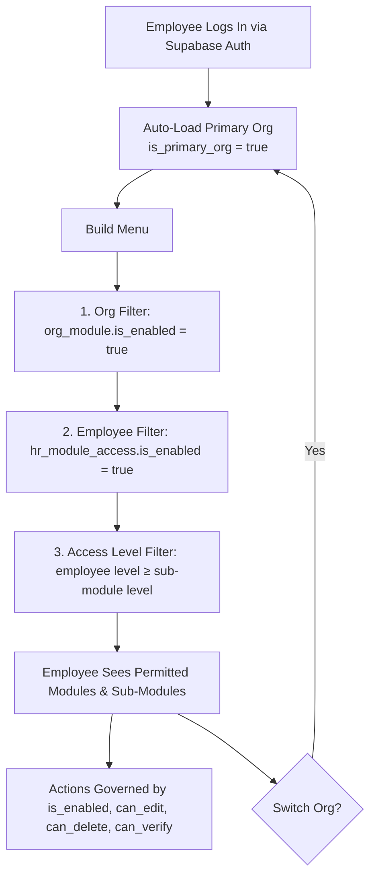

# User Access & Module Visibility Flow

This document describes what happens at runtime when a user logs in — how they authenticate, select an organization, and see only the modules and sub-modules they are authorized to access.

> **Prerequisite:** The organization, modules, employee, and module access must already be provisioned. See [01_org_provisioning.md](20260408000001_org_provisioning.md) for setup steps.

---

### Access Control Model: Multi-Layered Access Control (Hybrid RBAC/ABAC)

This system combines three distinct access control mechanisms:

| Layer | Model | What it controls |
|-------|-------|-----------------|
| **Feature Toggling** | Org-level switches | Organization admins enable or disable entire modules and sub-modules for their org. Disabled features are invisible to all users regardless of role. |
| **Role-Based Access Control (RBAC)** | Hierarchical access levels (1–5) | Each employee is assigned an access level (employee, team_lead, manager, admin, owner). Sub-modules define a minimum access level. Employees can only see sub-modules at or below their level. Higher roles inherit all visibility of lower roles. |
| **Attribute-Based Access Control (ABAC)** | Per-employee, per-module permissions | Each employee has individual permission flags per module (`is_enabled`, `can_edit`, `can_delete`, `can_verify`) that control what actions they can perform on records within that module. |

---

## 1. Tables Involved

| Table | Type | Purpose |
|-------|------|---------|
| `org_module` | Org | Org-scoped module toggles with custom display name and order |
| `org_sub_module` | Org | Org-scoped sub-module toggles with custom display name, order, and access level |
| `hr_employee` | HR | Employee record with `sys_access_level_name`, `user_id` for auth, and `is_primary_org` for default org on login |
| `hr_module_access` | HR | Maps employee to modules with permissions (`is_enabled`, `can_edit`, `can_delete`, `can_verify`) |
| `auth.users` | Auth | Supabase Auth — handles login credentials and session |

---

## 2. Login Flow

### Step 1 — Authentication

The user logs in via Supabase Auth (email/password or Single Sign-On (SSO)). This identifies the user by their `auth.users` account.

### Step 2 — Organization Selection

The system looks up all `hr_employee` records linked to the user's `auth.users.id`.

The org where `hr_employee.is_primary_org = true` is auto-loaded. For single-org users, their only record has `is_primary_org = true` by default. For multi-org users, one record is always marked as primary. The user can switch to other orgs from the menu at any time.

The selected `org_id` is stored in the user's session for the duration of their login. All subsequent data queries are filtered by this organization.

### Step 3 — Menu Rendering

The application builds the user's menu by applying three filters in order:

1. **Organization filter** — Only modules where `org_module.is_enabled = true` for this organization.
2. **Employee module filter** — Of those, only modules where `hr_module_access.is_enabled = true` for this employee.
3. **Access level filter** — Within each visible module, only sub-modules where:
   - `org_sub_module.is_enabled = true` for this organization, **AND**
   - The employee's access level number is **greater than or equal to** the sub-module's required access level number.

### Step 4 — Record-Level Permissions

Once inside a module, the employee's actions are governed by their `hr_module_access` permissions:

| Permission | What it allows |
|------------|---------------|
| `is_enabled` | Module is visible and accessible to the employee |
| `can_edit` | Create and update records |
| `can_delete` | Soft-delete records |
| `can_verify` | Mark records as verified |

### Step 5 — Organization Switching

At any point during their session, the user can switch to a different organization (if they belong to more than one). This reloads their menu based on the new organization's module configuration and their access level within that organization.

---

## 3. Example

| Setting | Value |
|---------|-------|
| Organization | Hawaii Farming |
| Employee | Michael (Manager, level 3) |
| Module: Inventory | org enabled, Michael has access (`is_enabled`, `can_edit` = true; `can_delete`, `can_verify` = false) |
| Sub-module: Vendors (level 1) | Visible — Michael's level 3 ≥ 1 |
| Sub-module: Items (level 1) | Visible — Michael's level 3 ≥ 1 |
| Sub-module: Purchase Orders (level 3) | Visible — Michael's level 3 ≥ 3 |
| Sub-module: Reorder Settings (level 5) | Hidden — Michael's level 3 < 5 (owner only) |
| Module: HR | org enabled, but Michael has no `hr_module_access` record | Hidden entirely |

---

## 4. Summary of Access Control Layers

| Layer | Who controls it | What it does |
|-------|----------------|--------------|
| Org module/sub-module toggles | Admin | Controls what is available to the entire organization |
| Employee module access | Admin | Controls which modules each employee can see |
| Record-level permissions | Admin | Controls what actions (edit, delete, verify) each employee can perform per module |
| Access level on sub-modules | Admin (inherited from system) | Controls which sub-modules are visible based on the employee's role |
| Employee access level | Admin | Assigned per employee; determines sub-module visibility |

---

## 5. Flow Diagram

