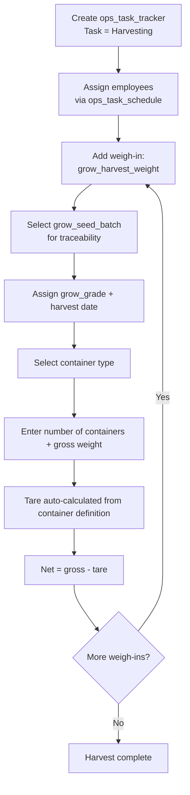

# Grow Harvesting Workflow

This document describes the harvesting activity flow using `ops_task_tracker` directly as the header. Harvest data (seeding batch, grade, date, container weigh-ins) is recorded in `grow_harvest_weight`.

> **Prerequisite:** The "Harvesting" task must be provisioned in `ops_task`. See [01_org_provisioning.md](20260408000001_org_provisioning.md) for setup steps.

---

## Tables Involved

| Table | Purpose |
|-------|---------|
| `ops_task_tracker` | Activity header — captures who, when, where |
| `grow_harvest_weight` | Individual weigh-ins with seeding link, grade, harvest date, and container details |
| `grow_harvest_container` | Container definitions with tare weight (per variety/grade) |
| `grow_seed_batch` | Source batch being harvested (traceability link) |
| `grow_grade` | Harvest quality grade assignment |
| `ops_task_schedule` | Employees assigned to this activity with individual start/stop times |

---

## Flow

1. Create an `ops_task_tracker` activity with task = "Harvesting"
   - If templates are linked to the "Harvesting" task via `ops_task_template`, they are presented for completion
2. Assign employees working on this harvesting via `ops_task_schedule` (one row per employee)
3. For each weigh-in, create a `grow_harvest_weight` record:
   - Select the seeding batch (`grow_seed_batch_id`) — only batches with status `transplanted` or `harvesting` are available
   - Optionally assign a harvest grade (`grow_grade_id`)
   - Enter the harvest date
   - Select a container type (`grow_harvest_container_name`)
   - Enter number of containers and gross weight
   - Tare weight is calculated on the fly from `grow_harvest_container.tare_weight × number_of_containers`
   - Net weight = gross weight minus calculated tare
4. Multiple weigh-ins per harvest are supported (e.g. 20 totes + 2 pallets)

---

## Notes

- There is no separate harvest header table — same pattern as scouting, spraying, and fertigation. The `ops_task_tracker` captures the activity metadata, and `grow_harvest_weight` carries the harvest-specific fields (seeding batch, grade, date) alongside each weigh-in.
- Harvest totals (total gross, total net, total containers) are derived by summing across `grow_harvest_weight` rows.
- Container tare weights can be specific to variety and grade via `grow_harvest_container`. The app resolves the most specific match when auto-calculating tare.

---

## Flow Diagram

