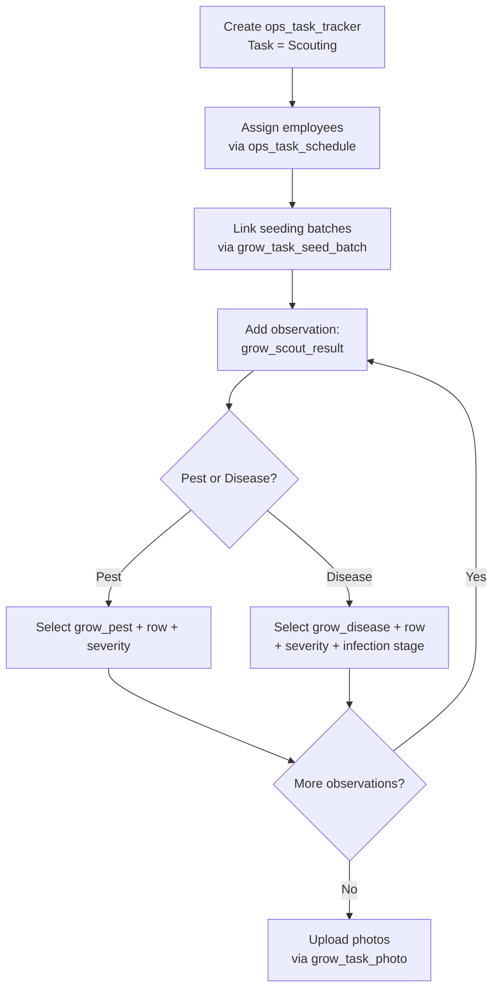

# Grow Scouting Workflow

This document describes the scouting activity flow using `ops_task_tracker` directly as the header — no separate scouting header table is needed since all header data (site, date, notes) is already on the tracker.

> **Prerequisite:** The "Scouting" task must be provisioned in `ops_task`. See [01_org_provisioning.md](20260408000001_org_provisioning.md) for setup steps.

---

## Tables Involved

| Table | Purpose |
|-------|---------|
| `ops_task_tracker` | Activity header — captures org, farm, site, date, start/stop time, notes |
| `grow_task_seed_batch` | Join table — which seeding batches were inspected |
| `grow_scout_result` | Individual pest or disease finding with severity, infection stage, and affected row |
| `grow_task_photo` | Photos taken during the scouting event with optional captions |
| `grow_pest` | Standardized pest names (lookup) |
| `grow_disease` | Standardized disease names (lookup) |
| `org_site` | Growing rows (category = row) referenced by observation site_id |
| `ops_task_schedule` | Employees assigned to this activity with individual start/stop times |

---

## Flow

1. Create an `ops_task_tracker` activity with task = "Scouting" (captures farm, site, date, start/stop time)
   - If templates are linked to the "Scouting" task via `ops_task_template`, they are presented for completion
2. Assign employees working on this scouting via `ops_task_schedule` (one row per employee)
3. App snapshots active seeding batches present in the site via `grow_task_seed_batch` (batches with status `transplanted` or `harvesting`) — this records which batches were in the site at the time of scouting
4. For each pest or disease found, create a `grow_scout_result` record:
   - Set `observation_type` to `pest` or `disease`
   - Select the pest (`grow_pest_name`) or disease (`grow_disease_name`) from the lookup — enforced by CHECK constraint
   - Select the specific growing row (`site_id` referencing org_site where category = row)
   - Set severity level (`low`, `moderate`, `high`, `severe`)
   - For diseases, set infection stage (`early`, `mid`, `late`, `advanced`)
   - If the same pest/disease is found in multiple rows, create one observation per row
5. Upload photos via `grow_task_photo` linked to the activity (one row per photo with optional caption)

---

## Notes

- There is no separate scouting header table. The `ops_task_tracker` serves as the header since scouting has no additional header-level business fields beyond what the tracker already captures.
- Growing rows are `org_site` children (category = `row`) under the parent growing site. Each observation references one row — multiple affected rows = multiple observation records.
- Seed batch association is at the activity level via `grow_task_seed_batch`, not on individual observations. This snapshots which batches were present during the scouting event.
- Photos are stored as individual rows (not JSONB) because each photo can have its own caption.

---

## Flow Diagram

