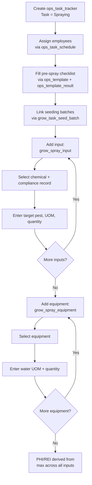

# Grow Spraying Workflow

This document describes the spraying activity flow using `ops_task_tracker` directly as the header — no separate spraying header table is needed. The pre-spray safety checklist is handled via the existing ops checklist system (`ops_template` → `ops_template_question` → `ops_template_result`).

> **Prerequisite:** The "Spraying" task must be provisioned in `ops_task`. See [01_org_provisioning.md](20260408000001_org_provisioning.md) for setup steps.

---

## Tables Involved

| Table | Purpose |
|-------|---------|
| `ops_task_tracker` | Activity header — captures org, farm, site, date, start/stop time, notes |
| `ops_template` | Pre-spray safety checklist template attached to the tracker |
| `ops_template_result` | Checklist responses for the pre-spray safety check |
| `grow_task_seed_batch` | Join table — which seeding batches were treated |
| `grow_spray_input` | Individual chemical/fertilizer applied with quantity and compliance link |
| `grow_spray_equipment` | Equipment used with water UOM and quantity per piece |
| `grow_spray_compliance` | Chemical label registry — provides PHI/REI for safety interval calculation |
| `grow_spray_restriction` (view) | Derived daily NE/NH restriction calendar per site from completed spray events |
| `invnt_item` | The chemical or fertilizer product |
| `org_equipment` | The spraying equipment (e.g. foggers) |
| `ops_task_schedule` | Employees assigned to this activity with individual start/stop times |

---

## Flow

1. Create an `ops_task_tracker` activity with task = "Spraying" (captures farm, site, date, start/stop time)
2. Assign employees working on this spraying via `ops_task_schedule` (one row per employee)
3. If templates are linked to the "Spraying" task via `ops_task_template`, the app presents them for completion (e.g. pre-spray safety checklist) — responses are recorded via `ops_template_result`
4. Link the seeding batches being treated via `grow_task_seed_batch` (one row per batch) — only batches with status `transplanted` or `harvesting` are available
5. For each chemical or fertilizer applied, create a `grow_spray_input` record:
   - Select from the active compliance records (`grow_spray_compliance_id`) — only compliant products are available (filtered by `effective_date <= today` and `expiration_date IS NULL OR >= today`)
   - The inventory item is derived from the compliance record (no separate item selection)
   - Enter the target pest/disease, application UOM, and quantity applied
   - The app enforces that `application_quantity` does not exceed the compliance record's `maximum_quantity_per_acre`
6. For each piece of equipment used, create a `grow_spray_equipment` record:
   - Select the equipment (`equipment_name`)
   - Enter water UOM and quantity

---

## Safety Interval Calculation

PHI (Pre-Harvest Interval) and REI (Restricted Entry Interval) safety intervals are **not stored** on the spraying record. They are derived on the fly:

1. For each `grow_spray_input` row, look up the linked `grow_spray_compliance` record
2. Read `phi_days` and `rei_hours` from the compliance record
3. Take the **maximum** across all inputs:
   - `maximum_phi_days = MAX(phi_days)` across all inputs
   - `maximum_rei_hours = MAX(rei_hours)` across all inputs
4. Calculate stop datetimes:
   - `phi_stop_datetime = spraying_stop_time + maximum_phi_days`
   - `rei_stop_datetime = spraying_stop_time + maximum_rei_hours`

This ensures that if any input has a longer safety interval, it governs the entire spraying event.

### Restriction Calendar

The `grow_spray_restriction` view generates a daily restriction calendar for each completed spray event:

- **NE (No Entry)** — workers cannot enter the site until REI expires. One row per calendar day from spray stop to REI expiry.
- **NH (No Harvest)** — cannot harvest from the site until PHI expires. One row per calendar day from spray stop to PHI expiry.

**Example:** Sprayed on 3/27 at 3:00 PM, max REI = 12 hours, max PHI = 7 days:

| Type | Date | Start | End |
|------|------|-------|-----|
| NE | 3/27 | 3:00 PM | 11:59 PM |
| NE | 3/28 | 12:00 AM | 3:00 AM |
| NH | 3/27 | 3:00 PM | 11:59 PM |
| NH | 3/28 | 12:00 AM | 11:59 PM |
| NH | ... | ... | ... |
| NH | 4/3 | 12:00 AM | 3:00 PM |

The frontend can display these restrictions on a calendar or block harvesting/entry for affected sites.

---

## Notes

- There is no separate spraying header table — same reasoning as scouting. The `ops_task_tracker` captures all header-level data (site, date, notes, start/stop time).
- The pre-spray safety checklist uses the existing ops checklist system. The org admin creates an `ops_template` with the required safety questions, and it is attached to the spraying task.
- Multiple chemicals can be applied in a single spraying event — each gets its own `grow_spray_input` row.
- Multiple pieces of equipment can be used — each gets its own `grow_spray_equipment` row with independent water quantities.

---

## Flow Diagram

