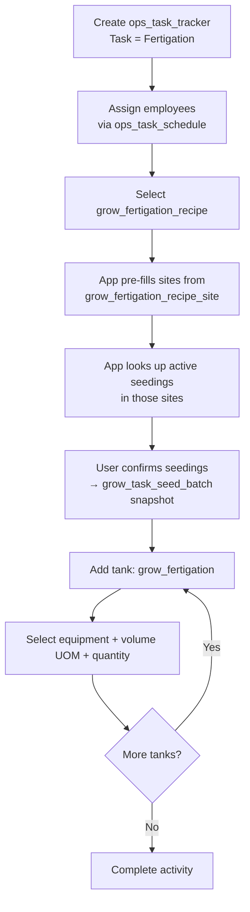

# Grow Fertigation Workflow

This document describes the fertigation activity flow using `ops_task_tracker` directly as the header. Recipes are reusable and define the fertilizer mix and target sites.

> **Prerequisite:** The "Fertigation" task must be provisioned in `ops_task`. See [01_org_provisioning.md](20260408000001_org_provisioning.md) for setup steps.

---

## Tables Involved

| Table | Purpose |
|-------|---------|
| `ops_task_tracker` | Activity header — captures org, farm, date, start/stop time, notes |
| `grow_fertigation_recipe` | Reusable recipe — can be a fertilizer mix, flush water, or top-up water |
| `grow_fertigation_recipe_item` | Items in the recipe with quantities |
| `grow_fertigation_recipe_site` | Sites that receive this recipe (configuration) |
| `grow_task_seed_batch` | Snapshot — which seedings were fertigated on this event + recipe link |
| `grow_fertigation` | Tanks used with volume applied per tank |
| `ops_task_schedule` | Employees assigned to this activity with individual start/stop times |

---

## Recipe Types

A recipe is not limited to fertilizer mixes. The fertigation sequence typically involves multiple recipes applied as separate events:

| Recipe | Example name | Has items? | Description |
|--------|-------------|-----------|-------------|
| Fertilizer mix | "Veg Stage Mix" | Yes | Contains fertilizer items with quantities from `grow_fertigation_recipe_item` |
| Flush water | "Flush Water" | No | Plain water run through the system to clear fertilizer residue from lines |
| Top-up water | "Top Up Water" | No | Extended water run to ensure even distribution across all sites |

Each recipe type is created as a standard `grow_fertigation_recipe` record. Flush water and top-up water recipes simply have no items in `grow_fertigation_recipe_item`.

### Why Flush and Top-Up Are Separate Recipes (Not Header Fields)

In the legacy system, flush water and top-up hours were columns on the fertigation header, repeated on every event. This was problematic because:

1. **The values rarely change** — flush water volume and top-up duration are configuration, not event-specific data
2. **They are their own activities** — flush water and top-up water are distinct steps in the fertigation sequence, each with their own start/stop time, tank volumes, and affected seedings
3. **Treating them as recipes** means they are reusable, configurable per farm, and linked to specific sites — just like any fertilizer mix

### Example: Full Fertigation Sequence

A typical fertigation session creates 3 separate `ops_task_tracker` activities:

| Order | Activity | Recipe | Tanks | Duration |
|-------|----------|--------|-------|----------|
| 1 | Fertigation | Veg Stage Mix | Tank 1: 50 gal, Tank 2: 50 gal | 30 min |
| 2 | Fertigation | Flush Water | Tank 1: 100 gal, Tank 2: 100 gal | 15 min |
| 3 | Fertigation | Top Up Water | Tank 1: 200 gal | 2 hours |

Each activity records its own seedings snapshot, tank volumes, and timing independently.

---

## Flow

1. Create an `ops_task_tracker` activity with task = "Fertigation"
   - If templates are linked to the "Fertigation" task via `ops_task_template`, they are presented for completion
2. Assign employees working on this fertigation via `ops_task_schedule` (one row per employee)
3. Select the recipe (`grow_fertigation_recipe`)
4. App pre-fills sites from `grow_fertigation_recipe_site`
5. App looks up active seedings in those sites (`grow_seed_batch.status IN ('transplanted', 'harvesting')`)
6. User confirms — seedings are recorded in `grow_task_seed_batch` as a point-in-time snapshot
7. For each tank used, create a `grow_fertigation` record:
   - Select the equipment (`equipment_id`)
   - Enter volume UOM and quantity applied
8. Complete the activity (stop time)

---

## Design Decision: Recipe ID on Tank Table

The `grow_fertigation_recipe_id` is stored on `grow_fertigation` rather than on `grow_task_seed_batch` or `ops_task_tracker`. This keeps the unified `grow_task_seed_batch` table clean (no activity-specific columns) and `ops_task_tracker` module-agnostic. The recipe link lives on the fertigation-specific tank table where it belongs — each tank row says "this tank delivered this recipe's mix."

To query which recipe was used for a fertigation event:
```sql
SELECT DISTINCT grow_fertigation_recipe_id
FROM grow_fertigation
WHERE ops_task_tracker_id = ?
```

---

## Notes

- Recipes are reusable across multiple fertigation events. The recipe defines what gets mixed; the event records when and where it was applied.
- `grow_fertigation_recipe_item.invnt_item_id` is nullable for one-off fertilizers not tracked in inventory. `item_name` is always set for display.
- Seedings are filtered to `transplanted` or `harvesting` status only.

---

## Flow Diagram


