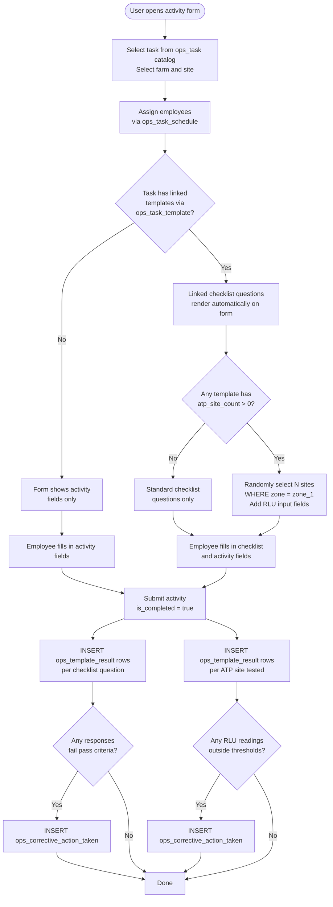

# Ops Template Workflow

This document describes how checklist templates are filled out during any task activity. Templates are linked to tasks and auto-loaded when a user creates an activity. This is the foundation for food safety checklists, pre-spray safety checks, post-ops inspections, and any other configurable checklist.

> **Prerequisite:** Tasks must be provisioned in `ops_task` and templates linked via `ops_task_template`. See [01_org_provisioning.md](20260408000001_org_provisioning.md) for setup steps.

---

## Tables Involved

| Table | Role |
|-------|------|
| `ops_task` | Catalog of available tasks (e.g. Seeding, Harvesting, Pre-Op, House Inspection) |
| `ops_task_tracker` | Activity header — one per event; links task, site, farm, and timing |
| `ops_task_template` | Many-to-many link between tasks and templates; determines which checklists auto-load |
| `ops_task_schedule` | Employees assigned to the activity with individual start/stop times |
| `ops_template` | Checklist template definition with module assignment |
| `fsafe_lab_test` | Test definitions including ATP configuration (atp_site_count, RLU thresholds) |
| `ops_template_question` | Individual checklist questions within a template |
| `ops_template_result` | All responses for an activity — checklist answers, ATP readings, and equipment inspections; targets either a site or equipment |
| `ops_corrective_action_choice` | Predefined corrective action options |
| `ops_corrective_action_taken` | Corrective actions raised against any failing response |

---

## Flow

### 1. Create the Activity

The user creates an `ops_task_tracker` record:

| Field | Description |
|-------|-------------|
| Task | Selected from the `ops_task` catalog |
| Farm | The farm this activity belongs to |
| Site | The site where the activity is taking place |
| Start time | When the activity began |

### 2. Assign Employees

Assign employees working on this activity via `ops_task_schedule` (one row per employee with individual start/stop times).

### 3. Auto-Load Linked Templates

When the user selects a task, the app queries `ops_task_template` to find all templates linked to that task:

```sql
SELECT ops_template_name
FROM ops_task_template
WHERE ops_task_name = ?
  AND is_deleted = false
```

If templates are found, their questions render automatically on the same form. Multiple templates can be linked to a single task — all are presented together. If no templates are linked, the form shows activity fields only.

### 4. Complete the Checklist

Questions are loaded from `ops_template_question` for each linked template, ordered by `display_order`. Each question has a defined response type:

| Response Type | How the Employee Answers |
|--------------|--------------------------|
| Boolean | Yes / No toggle |
| Numeric | Number input (e.g. temperature, count) |
| Enum | Select from a predefined list of options |

Each question carries its pass criteria. When a response fails, a corrective action is automatically created.

### 5. ATP Surface Testing (When Required)

ATP testing is configured on `fsafe_lab_test` via `atp_site_count` and RLU thresholds (`minimum_value`, `maximum_value`).

When an ATP test is linked to the activity, the system randomly selects `atp_site_count` sites where `zone = 'zone_1'` (food contact surfaces) within the farm and adds a numeric RLU input field for each one. The employee swabs each surface and enters the RLU reading.

Pass/fail is evaluated against the `fsafe_lab_test` thresholds. Results are stored in `fsafe_result` linked to the `ops_task_tracker`.

> **Note:** Each `ops_template_result` targets either a site (`site_id`) or equipment (`equipment_name`), never both. ATP readings have `site_id` populated and `ops_template_question_id = null`. Equipment inspections have `equipment_name` populated. Standard checklist rows have `ops_template_question_id` populated with both `site_id` and `equipment_name` null.

### 6. Submit the Activity

On submission:

| What | Table | Key Fields |
|------|-------|------------|
| Activity closed | `ops_task_tracker` | `stop_time`, `is_completed = true` |
| One row per checklist question | `ops_template_result` | `ops_task_tracker_id`, `ops_template_question_id`, response value |
| One row per ATP site tested | `ops_template_result` | `ops_task_tracker_id`, `response_numeric`, `site_id` |
| One row per failing response | `ops_corrective_action_taken` | `ops_template_result_id` |

### 7. Corrective Actions

When a response fails its pass criteria (or an ATP reading falls outside thresholds), an `ops_corrective_action_taken` record is automatically created. It tracks:

- What action needs to be taken (from `ops_corrective_action_choice` or free text)
- Who is responsible (`assigned_to`)
- Due date
- Resolution (`is_resolved`)
- Verification once resolved (`verified_at/by`)

---

## Quick Fill (No Pre-Created Activity)

In some situations an employee may want to fill out a checklist directly — without creating a full activity first. For example, a supervisor completing a daily log who just wants to pick a template and start answering questions.

The frontend handles this by silently creating the `ops_task_tracker` record on submission:

- `start_time` and `stop_time` are both set to the submission timestamp
- `is_completed` is set to `true`
- All `ops_template_result` rows are written as normal

From the user's perspective: select template → answer questions → submit. The database still holds a complete tracker record for every set of responses.

---

## Flow Diagram


