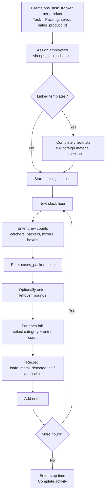

# Pack Productivity Workflow

This document describes how pack line productivity is tracked hourly, including crew assignments, product output, and fail tracking.

> **Prerequisite:** The "Packing" task must be provisioned in `ops_task`. Fail categories must be configured in `pack_productivity_fail_category`. See [01_org_provisioning.md](20260408000001_org_provisioning.md).

---

## Tables Involved

| Table | Purpose |
|-------|---------|
| `ops_task_tracker` | Activity header — task = "Packing", one per product being packed (product identified by sales_product_id) |
| `pack_productivity_hour` | One row per clock hour per activity with crew counts by role, cases packed, leftover pounds, and metal detection flag |
| `pack_productivity_hour_fail` | Fail counts per category per hour |
| `pack_productivity_fail_category` | Lookup — defines available fail categories |
| `sales_product` | Referenced for derived metrics (pack_per_case, case_net_weight) |
| `ops_task_template` | Links templates to the Packing task; determines which checklists auto-load |
| `ops_template` | Checklist template (e.g. foreign material inspection, pre-pack safety check) |
| `ops_template_question` | Individual checklist questions |
| `ops_template_result` | Checklist responses for this packing session |
| `ops_task_schedule` | Employees assigned to this activity with individual start/stop times |

---

## Flow

1. **Create one activity per product** — user creates an `ops_task_tracker` per product being packed, with task = "Packing", selects the farm, product (`sales_product_id`), and start time
2. **Assign employees** working on this packing session via `ops_task_schedule` (one row per employee)
3. **Complete linked templates** — if templates are linked to the "Packing" task via `ops_task_template`, they are presented for completion (e.g. foreign material inspection, pre-pack safety check). See [09_ops_template_workflow.md](20260408000009_ops_template_workflow.md) for template details.
4. **Log each hour** — at the end of each clock hour during the packing session:
   - Enter crew counts: catchers, packers, mixers, boxers
   - Enter cases packed (delta — just this hour, not cumulative)
   - Optionally enter leftover pounds
   - For each fail that occurred, select the fail category and enter the count
   - Toggle metal detected if applicable
   - Add notes (e.g. "Start LW at 10:20", "Fixing Proseal at 2:20-2:30")
5. **Complete the activity** — enter stop time, mark as complete

---

## Derived Metrics

These values are calculated on-the-fly from the stored data, not stored in the database:

| Metric | Formula | Source |
|--------|---------|--------|
| Total trays (per hour) | cases_packed × sales_product.pack_per_case | pack_productivity_hour + sales_product (via ops_task_tracker.sales_product_id) |
| Trays per packer per minute | total_trays / (packers × 60) | Derived from above + pack_productivity_hour.packers |
| Packed pounds (per hour) | cases_packed × sales_product.case_net_weight | pack_productivity_hour + sales_product (via ops_task_tracker.sales_product_id) |
| Total fails (per hour) | SUM(fail_count) | pack_productivity_hour_fail |
| Shift totals | SUM across all hours for the ops_task_tracker | Aggregation of hourly rows |

---

## Provisioning

The "Packing" task and fail categories (e.g. film, tray, printer, leaves, ridges, unexplained) should be provisioned during org onboarding. Templates for pack-related checklists (e.g. foreign material inspection) should be linked to the Packing task via `ops_task_template`.

---

## Flow Diagram

