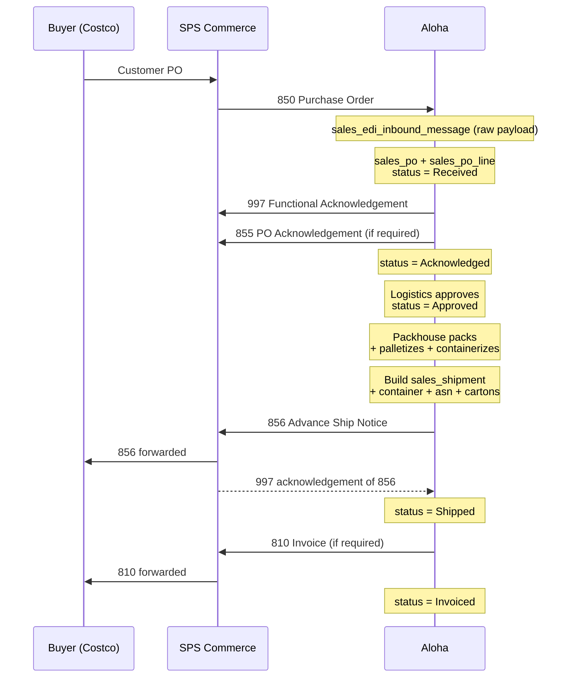
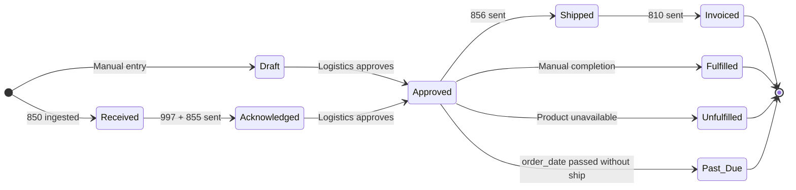

# SPS Commerce EDI Integration

This document describes how the Hawaii Farming exchanges EDI documents with retail trading partners (Costco, Safeway, etc.) through SPS Commerce. The flow inbounds buyer Purchase Orders (850), outbounds Advance Ship Notices (856) and Invoices (810), and round-trips Functional Acknowledgements (997).

The schema additions for this integration live at migrations `20260401000112` through `20260401000132`.

---

## 0. Implementation Status (as of 2026-05-06)

Inbound 850 is partially built; outbound flows and the SFTP transport are still pending. What lives where:

### Built and committed

| Layer | File | Notes |
|---|---|---|
| Schema | `supabase/migrations/20260401000112…0132` | All seven EDI tables + `sales_po`/`sales_po_line` extensions are live in the dev DB |
| 850 XML parser | `aloha-app/app/lib/edi/parse-850.server.ts` | Pure function — XML → typed `Parsed850Document` (header + lines + addresses keyed by ST/BT/VN) |
| 850 applier | `aloha-app/app/lib/edi/apply-850.server.ts` | Upserts `sales_po` + replaces `sales_po_line` rows; idempotent on `(org_id, sales_trading_partner_id, po_number)`; pre-loads buyer-part lookups and fails atomically if any line is unmapped |
| Inbound receiver | `aloha-app/app/lib/edi/inbound-850-receiver.server.ts` | Archives raw XML to `sales_edi_inbound_message`, resolves the trading partner, then runs parse + apply. Records `parse_error` on failure so the row stays available for replay. Caller passes `orgId` directly — no shared-secret auth |
| Test fixtures | `aloha-app/app/lib/edi/__fixtures__/{safeway,costco}-850.xml` | Real PO payloads SPS sent during onboarding |

The active branch is `dev-michael` on `aloha-app`. There is **no** public HTTP route in front of these modules — the SFTP poller will call them directly.

### Pending

| Item | Why blocking | Owner |
|---|---|---|
| SPS SFTP poller worker | Only entry point into the inbound flow. On each tick: (a) download new files from `SPS_SFTP_INBOUND_DIR`, (b) call `archiveInbound850()` for each, (c) sweep `sales_edi_inbound_message` for `parsed_at IS NULL` rows and retry — so master-data fixes auto-replay without human input | Engineering |
| Master data: trading partners | Without these, every 850 arrives as `parse_error: No sales_trading_partner row found…` | Operations / data entry |
| Master data: buyer-part mappings | Without these, the parse fails before any `sales_po` row is created | Operations / data entry |
| Outbound 997 functional acknowledgement | Mandatory within 24h of receiving any document; SPS will escalate without it | Engineering, after poller |
| Outbound 855 PO acknowledgement | Required only for partners with `acknowledgement_required = true` | Engineering, after 997 |
| Outbound 856 ASN | Section 5 design is complete; nothing built | Engineering, after inbound is stable |
| Outbound 810 invoice | Section 6 design is complete; nothing built | Engineering, after 856 |

### Master data needed for the two onboarded buyers

The `dev-michael` branch ships parser + applier but no seeded partners. Add these before the first poller run:

| `sales_trading_partner.sps_partner_id` | Buyer | Buyer SKUs that need `sales_product_buyer_part` rows |
|---|---|---|
| `768ALLJTLFARMIN` | Safeway | `84360025`, `84360023` |
| `065ALLHAWAIIFAR` | Costco | `1791845` |

The applier reads `sales_product_buyer_part` by `(sales_customer_id, buyer_part_number)`, so each buyer SKU needs a row pointing at the matching `sales_product_id`.

### Environment variables needed for the next step

None of these exist in `.env` yet — they get added when the SFTP poller is built. Real values for the Hawaii Farming mailbox are kept in `.env` (gitignored); SPS may rotate them on request.

| Var | What it is | Example value |
|---|---|---|
| `SPS_SFTP_HOST` | hostname of the SPS SFTP mailbox | `sftp.spscommerce.com` |
| `SPS_SFTP_PORT` | TCP port — SPS uses a non-standard port, do not assume 22 | `10022` |
| `SPS_SFTP_USERNAME` | the account SPS assigned during onboarding | `hawaiifarm` |
| `SPS_SFTP_PASSWORD` | password auth — what SPS issued for Hawaii Farming. Mutually exclusive with `SPS_SFTP_PRIVATE_KEY` | (in `.env`) |
| `SPS_SFTP_PRIVATE_KEY` | SSH private key (PEM) — alternative if SPS reissues the account with key auth. Mutually exclusive with `SPS_SFTP_PASSWORD` | — |
| `SPS_SFTP_INBOUND_DIR` | remote folder SPS drops 850s into. **Named from SPS's perspective:** their "out" = outgoing-to-vendor = our inbound | `/u01/ftp/vendor/hawaiifarm/out` |
| `SPS_SFTP_OUTBOUND_DIR` | remote folder we drop 997s/856s/810s into. SPS's "in" = incoming-from-vendor = our outbound | `/u01/ftp/vendor/hawaiifarm/in` |
| `SPS_ORG_ID` | which `org` row in our DB this mailbox belongs to — passed to `archiveInbound850` as `orgId` | (org_id from `org` table) |

**Naming gotcha:** the SPS-side directory names (`/in` and `/out`) read from their perspective, not ours. Our "inbound" maps to SPS's `out` directory and vice versa. The env-var names above use *our* perspective so the code reads naturally.

**Auth mode:** the poller should accept either password or private key — populate exactly one. SPS currently issues password auth for Hawaii Farming; future onboardings may use SSH keys.

No HMAC secret, no webhook signing key — SFTP-pull is private by construction.

---

## 1. Document Lifecycle

End-to-end document exchange between buyer, SPS, and Aloha:



### Status state machine (`sales_po.status`)

The same column carries both the manual-entry flow and the EDI flow; manual orders skip Received/Acknowledged and EDI orders skip Fulfilled/Unfulfilled/Past Due.



---

## 2. Document Reference

| X12 Set | Direction | Purpose | Stored In |
|---------|-----------|---------|-----------|
| 850 | Inbound | Purchase Order | `sales_edi_inbound_message` (raw) → `sales_po`, `sales_po_line` (parsed) |
| 855 | Outbound | PO Acknowledgement | (transient — sent immediately on parse) |
| 856 | Outbound | Advance Ship Notice | `sales_shipment` + `sales_shipment_container` + `sales_po_asn` + `sales_po_asn_carton` |
| 810 | Outbound | Invoice | (built on demand from `sales_po` + `sales_po_asn`) |
| 860 | Inbound | PO Change | `sales_edi_inbound_message` → updates existing `sales_po` |
| 997 | Both | Functional Acknowledgement | Inbound: `sales_edi_inbound_message.acknowledgement_*` columns. Outbound: sent immediately on parse. |

---

## 3. Trading Partner Setup

Onboarding a new buyer requires three records before the first 850 can be ingested:

1. `sales_customer` — the buyer as a regular customer in our app
2. `sales_trading_partner` — the EDI bridge: `sps_partner_id`, `sps_vendor_number`, plus flags for which document flows are required (`asn_required`, `invoice_required`, `acknowledgement_required`)
3. `sales_product_buyer_part` rows — one per (buyer, our product) pair, mapping the buyer's part number to our `sales_product`. Without this row, inbound 850 line items will not resolve and the parse will fail.

`sales_trading_partner.sps_partner_id` is the routing key. The inbound parser uses it to find the right trading partner row from the buyer code in the 850 envelope.

---

## 4. Inbound 850 Flow

1. SPS delivers the 850 (X12 or SPS XML) via SFTP / API.
2. Worker writes the raw payload to `sales_edi_inbound_message` with `document_type = '850'`, `parsed_at = NULL`.
3. Parser reads each unparsed message:
   - Looks up `sales_trading_partner` by `sps_partner_id` from the envelope.
   - Creates one `sales_po` row with `sales_trading_partner_id` set, `status = 'Received'`, snapshot of all `ship_to_*` / `bill_to_*` / `buyer_*` / `carrier_*` / `requested_*_date` / `payment_terms_net_days` fields from the 850 segments.
   - For each PO line, looks up `sales_product_buyer_part` by `(sales_customer_id, buyer_part_number)` to resolve `sales_product_id`. Creates `sales_po_line` with the snapshot of `buyer_part_number`, `buyer_description`, `buyer_uom`, `buyer_line_sequence`, `gtin_case`.
   - On success, sets `parsed_at = now()` and `sales_po_id = <new PO id>`.
   - On failure, sets `parse_error` and leaves `parsed_at` NULL.
4. Worker sends the 997 Functional Acknowledgement back to SPS within 24h (mandatory). Result is recorded on `sales_edi_inbound_message.acknowledgement_status` / `acknowledgement_sent_at`.
5. If `sales_trading_partner.acknowledgement_required = true`, worker also sends an 855 PO Acknowledgement confirming acceptance/rejection per line.

**Failure modes and recovery:**
- Unknown `sps_partner_id` → parse fails. Add the trading partner row, then replay (set `parsed_at = NULL` and re-process).
- Unknown `buyer_part_number` → parse fails. Add the missing `sales_product_buyer_part` row, then replay.
- Bad XML / X12 → parse fails with descriptive `parse_error`. Often an SPS-side issue; reach out via SPS support and reference `sps_message_id`.

---

## 5. Outbound 856 ASN Flow

The 856 is generated when a PO ships. The hierarchy splits booking, container, and per-document state:

```
sales_shipment                  (booking — carrier, BOL, ship_date)
  └─ sales_shipment_container   (each physical container/trailer — number, seal, type)
      └─ sales_po_asn           (one per PO per container — 856 envelope, sent_at, acknowledgement)
          └─ sales_po_asn_carton (cartons with SSCC labels)
```

Real-world examples this models:
- **Young Brothers ocean booking, two reefers** — one `sales_shipment` row (carrier YOBR, master BOL, booking_number); two `sales_shipment_container` rows (one cucumber reefer, one lettuce reefer, each with its own container_number and seal). POs in the cucumber reefer get ASN rows tied to that container; POs in the lettuce reefer tie to the other.
- **Trucking to Costco DC** — one `sales_shipment` row (carrier SCAC, BOL); one `sales_shipment_container` row (the trailer); multiple `sales_po_asn` rows under that container if several POs ride the truck.
- **PO split across two containers** — two `sales_po_asn` rows for the same PO, one per container.

Workflow:
1. Warehouse marks `sales_po.status = 'Shipped'` (typically when the truck or barge departs).
2. Worker checks `sales_trading_partner.asn_required`. If true:
   - Find or create the `sales_shipment` row for this booking (carrier_scac, BOL, booking_number, ship_date).
   - Find or create the `sales_shipment_container` row for the container the goods are loaded in (container_number, seal_number, sales_container_type_id, optional reefer setpoint).
   - Insert a `sales_po_asn` row referencing the container. The `(sales_shipment_container_id, sales_po_id)` UNIQUE constraint prevents duplicate ASNs for a PO on the same container.
   - Insert one `sales_po_asn_carton` row per physical carton with the GS1 SSCC-18 barcode (the UCC-128 label barcode).
   - For pallet-level grouping (Tare → Pack hierarchy), use `parent_carton_id` on the case rows pointing at a Tare-type pallet row. Flat case-only ASNs leave `parent_carton_id` NULL.
   - Build the 856 X12 / XML (joining shipment + container + asn + cartons), transmit to SPS, set `sent_at` on the ASN and store the verbatim payload in `raw_outbound`.
3. SPS returns a 997 acknowledging receipt. Worker updates `acknowledged_at` and `status = 'Acknowledged'` on the ASN (or `Rejected` on functional failure). Each PO's 856 is acknowledged independently.

**SSCC notes:**
- SSCC-18 is globally unique and must NEVER be reused, even if the shipment is cancelled. The `uq_sales_po_asn_carton_sscc` UNIQUE constraint enforces this at the DB level.
- The SSCC is what the buyer scans on receipt. Mismatch between physical label and 856 SN1/MAN segment means the carton gets refused at the dock.

**Catch-weight cartons:**
- `actual_net_weight` + `weight_uom` are required only when `sales_product.is_catch_weight = true`. Fixed-weight products use the `sales_product` defaults and leave these NULL.

---

## 6. Outbound 810 Invoice Flow

1. Triggered from a finalized `sales_po_asn` (we don't invoice unshipped POs).
2. Worker checks `sales_trading_partner.invoice_required`. Some partners self-invoice from receipt and skip 810 — for those, skip this step.
3. Build the 810 from `sales_po` (header — `po_number`, `payment_terms_net_days`, `bill_to_*`) + `sales_po_line` (lines — `buyer_part_number`, `buyer_line_sequence`, `gtin_case`, `price_per_case`) + `sales_po_asn` → `sales_shipment_container` → `sales_shipment` (container number, BOL reference).
4. Transmit, then set `sales_po.status = 'Invoiced'`.

The 810 is built on demand and not persisted to its own table; the source data is fully captured on `sales_po` + lines + ASN, so re-rendering is deterministic.

---

## 7. Schema Reference

### New tables (slot 145–153)
- `sales_trading_partner` — EDI bridge from `sps_partner_id` to `sales_customer`. Declares which doc flows are required.
- `sales_product_buyer_part` — `(sales_customer_id, buyer_part_number)` → `sales_product_id` lookup. Required for 850 line resolution.
- `sales_edi_inbound_message` — raw archive of every inbound document. Audit trail and replay source.
- `sales_shipment` — booking / voyage record. Carrier, BOL, booking_number, ship_date, ETA. One row per booking.
- `sales_shipment_container` — physical container / trailer in a booking. Container number, seal, container type, reefer setpoint. One row per box; ocean bookings have several, trucking has one.
- `sales_po_asn` — outbound 856 header. One row per PO per container; FKs to `sales_shipment_container`.
- `sales_po_asn_carton` — carton-level detail with SSCC-18 labels. Self-referencing for pallet→case nesting.

### Extended tables
- `sales_po` (slot 114): EDI fields baked in — `sales_trading_partner_id`, `buyer_department`, `buyer_division`, `buyer_contact_*`, `ship_to_*`, `bill_to_*`, `carrier_scac`, `carrier_routing`, `requested_ship_date`, `requested_delivery_date`, `payment_terms_net_days`. The existing `po_number` column carries the buyer's PO number from 850 BEG for EDI orders. Status CHECK includes EDI lifecycle states `Received`, `Acknowledged`, `Shipped`, `Invoiced` alongside the manual-flow states.
- `sales_po_line` (slot 115): buyer_part fields baked in — `buyer_part_number`, `buyer_description`, `buyer_uom`, `buyer_line_sequence`, `gtin_case`. All snapshots at PO receipt — once captured here, edits to `sales_product_buyer_part` won't retroactively rewrite history.

Every SPS-only column on `sales_po` and `sales_po_line` carries an `EDI-only.` prefix in its `COMMENT ON COLUMN` so the EDI provenance is visible from `\d+ sales_po` / `\d+ sales_po_line` in psql.

---

## 8. Security & RLS

All seven new tables follow the standard RLS pattern: `org_id IN (SELECT public.get_user_org_ids())` for SELECT to `authenticated`, no INSERT/UPDATE/DELETE policy (mutations flow through the service-role key in server-side workers). The same convention applies as the rest of the schema — see `supabase/migrations/20260401000200_sys_rls_policies.sql`.

The EDI worker runs server-side with the service-role key; browser clients never write to these tables directly.
