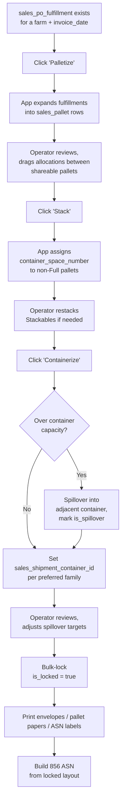

# Sales Palletization & Containerization Workflow

This document describes how PO fulfillments are physically arranged into pallets, stacked into container spaces, and loaded into shipping containers. It is a downstream-of-pack, upstream-of-shipment process that produces the physical layout the warehouse builds and the EDI 856 ASN describes.

> **Prerequisite:** PO lines must be fulfilled (`sales_po_fulfillment` rows exist linking lots to lines). For SPS partners, the trading partner setup must be complete — see [20260429000001_sps_edi_integration.md](20260429000001_sps_edi_integration.md).

---

## Tables Involved

| Table | Purpose |
|-------|---------|
| `sales_pallet` | Physical pallet. One row per pallet, scoped per `(farm_id, target_invoice_date)`. Carries `pallet_type`, `capacity_utilization`, `is_locked`, `is_spillover`. |
| `sales_pallet_allocation` | Line items on a pallet. Each row = a slice of a `sales_po_fulfillment` riding on a pallet, with `allocated_quantity`. |
| `sales_po_fulfillment` | Upstream — which production lots fulfill which order lines. Pallet allocations FK to this. |
| `sales_shipment` | The booking/voyage (e.g. one Young Brothers booking with one master BOL). |
| `sales_shipment_container` | Each physical container on the booking. The cucumber reefer and the lettuce reefer are separate rows under the same booking. |
| `sales_container_type` | Lookup — declares `maximum_spaces` per container family (cucumber=18, lettuce=18, box=10). |
| `sales_product` | Referenced for `maximum_case_per_pallet` (max), `full_pallet` (labeling threshold). |

The pallet/container chain at runtime:

```
sales_po_fulfillment
  └─ sales_pallet_allocation
       └─ sales_pallet
            └─ sales_shipment_container
                 └─ sales_shipment
```

---

## The Three-Step Workflow

The user runs three buttons in order. Each step writes specific columns; later steps don't disturb earlier results unless the pallet is unlocked. Logic lives in app code; the DB is a passive store.

### 1. Palletize

Expand fulfillments into pallets. Scoped per `(farm_id, target_invoice_date)`.

- **Filter:** off-island only — exclude FOB = `Farm` or `Local Delivery`.
- **Group** by `(customer_name, po_number, product_code)` and walk pack dates oldest first.
- **Pack** onto a pallet up to `sales_product.maximum_case_per_pallet`. Crossing the `full_pallet` threshold does NOT close the pallet — it stays open and accepts top-offs from later pack dates until physically at max.
- **Smart split** for Costco group + KW/JW products at qty 84/78/72: take 60 (or 54 for 72) on the first pallet and force-close so the next pallet starts fresh. Produces a balanced split (84 → 60+24) that matches Costco's preferred receiving layout.
- **Label at close time:**
  - `Full` if running >= `full_pallet`
  - `Stackable` for Costco / Sam's groups (partials get stacked vertically)
  - `Shareable` for other customers' partials (multiple PO lines for the same customer can share)
- **Number** with prefix per container family: `CP01..CPnn` (cucumber), `LP01..LPnn` (lettuce), `BP01..BPnn` (box-truck). Shareables use `{customer}_01..{customer}_10` so the user can drag allocations between a customer's shareable pallets in the UI.
- **Container hint:** infer the preferred container from product farm (`Cuke` → cucumber container) or FOB (HNL/Kawaihae and 119 Maui/640 Kauai → box-truck). Stored as `sales_shipment_container_id` if a container is already provisioned for the run; otherwise filled at step 3.

Writes: `sales_pallet` rows + `sales_pallet_allocation` rows.

### 2. Stack

Group non-Full pallets into container spaces. Each Stackable pallet sits at one space; multiple Stackables can share a space (vertical stack).

- For each non-Full pallet, assign `container_space_number` 1..N where N = container's `sales_container_type.maximum_spaces`.
- Initial assignment is sequential by sort order (customer → group priority → product).
- **User can drag** a Stackable pallet to a different space in the UI — that's a single `UPDATE sales_pallet SET container_space_number = ...`.

Writes: `sales_pallet.container_space_number`.

### 3. Containerize

Finalize container assignments and handle spillover.

- **Default:** each pallet's `sales_shipment_container_id` is the container matching its product family (cucumber pallets → cucumber container, etc.).
- **Spillover** when a container exceeds capacity: the highest-numbered cucumber spaces overflow into the lettuce container, then into the box-truck container if lettuce is also full. Pallets that follow are marked `is_spillover = true` so the operator sees they're out of their preferred container.
- **Atomic moves:** all pallets sharing a `pallet_number` move together — splitting a pallet's allocations across two containers would mean physically packing the same product in two trucks.

Writes: `sales_pallet.sales_shipment_container_id`, `sales_pallet.is_spillover`, may renumber `container_space_number` under the new container.

### 4. Lock

Once the run is finalized, the operator bulk-sets `is_locked = true` on every pallet in scope. Subsequent re-runs of Palletize/Stack/Containerize for the same `(farm_id, target_invoice_date)` skip locked pallets and rebuild only unlocked ones. New POs added after lock-in flow into freshly created pallets without disturbing the locked layout.

Individual pallets can be unlocked if a manual edit is needed.

---

## User Interactions

The bin-packing logic generates a starting point; operators routinely refine it. Three edit gestures:

| Gesture | What changes |
|---------|--------------|
| Drag pallet between container spaces | `sales_pallet.container_space_number` |
| Drag allocation between pallets (whole row) | `sales_pallet_allocation.sales_pallet_id` |
| Split allocation (e.g. 60 cases → 45 + 15 across two pallets) | Decrement original `allocated_quantity` to 45; insert new row with 15 on the target pallet for the same `sales_po_fulfillment_id` |

After each edit, the app validates: `SUM(allocations.allocated_quantity WHERE fulfillment_id = X) == sales_po_fulfillment.fulfilled_quantity`. Any mismatch surfaces as a warning ("pallet allocations sum to 45 but fulfillment has 60 cases — 15 unaccounted for").

---

## Lot Identity Through Moves

Each `sales_pallet_allocation` carries a `sales_po_fulfillment_id`, and fulfillment carries `pack_lot_id`. This means a Shareable pallet holding cases from two different lots (e.g. 4/25 lot + 4/26 lot) has **two allocation rows**, one per lot. When the 856 ASN cartons are built, each carton gets the correct `pack_lot_id` for FSMA traceability — no inference, no FIFO at ASN time.

---

## Bin-Packing Rules Reference

The algorithm is documented in `org_business_rule` so it's queryable from tooltips and AI:

| Rule ID | Type |
|---------|------|
| `sales_pallet_workflow` | Workflow |
| `sales_pallet_capacity_expansion` | Calculation |
| `sales_pallet_costco_smart_split` | Calculation |
| `sales_container_spillover` | Calculation |
| `sales_pallet_locking` | Business Rule |

Query: `SELECT * FROM org_business_rule WHERE id LIKE 'sales_pallet%' OR id = 'sales_container_spillover' ORDER BY display_order`.

---

## Print Documents

After containerization, three print outputs are generated from `sales_pallet` + `sales_pallet_allocation`:

- **Envelopes** — one per customer with their pallet manifest
- **Pallet papers** — one per pallet showing contents (allocations) and destination
- **ASN labels** — UCC-128 barcodes for SPS partners (see [SPS EDI doc](20260429000001_sps_edi_integration.md))

Sort order for all three: container family (cuke → lettuce → box), then `container_space_number`, then non-spillover before spillover.

---

## Flow Diagram



---

## Regeneration Behavior

When the operator clicks Palletize/Stack/Containerize a second time within the same `(farm_id, target_invoice_date)` scope:

- **Locked pallets and their allocations are preserved as-is.**
- **Unlocked pallets are wiped** (CASCADE delete from `sales_pallet` removes their allocations) and rebuilt from current fulfillment data.
- **New fulfillments** added since the previous run flow into freshly created pallets.

Net effect: the operator can lock yesterday's finalized run, then re-run Palletize after morning's new POs come in, and only the new POs get fresh pallets — yesterday's settled layout is untouched.
