# Grow Schema

Tables for managing crop varieties, harvest grades, seed mix recipes, and seeding batches. These are farm-scoped tables used across seeding, growing, harvest, and sales modules.

> **Standard audit fields:** Every table includes `created_at` (TIMESTAMPTZ, default now), `created_by` (TEXT), `updated_at` (TIMESTAMPTZ, default now), `updated_by` (TEXT), and `is_deleted` (BOOLEAN, default false). These are omitted from the column listings below for brevity.

## Entity Relationship Diagram

```mermaid
erDiagram
    org ||--o{ org_farm : operates
    org_farm ||--o{ org_site : contains
    org_farm ||--o{ grow_variety : grows
    org_farm ||--o{ grow_grade : grades
    org_farm ||--o{ grow_trial_type : defines
    org_farm ||--o{ grow_seed_mix : recipes
    org_farm ||--o{ grow_harvest_container : defines
    grow_seed_mix ||--o{ grow_seed_mix_item : contains
    invnt_item ||--o{ grow_seed_mix_item : uses
    invnt_lot ||--o{ grow_seed_mix_item : lot_tracked
    invnt_lot ||--o{ grow_lettuce_seed_batch : lot_tracked
    invnt_lot ||--o{ grow_cuke_seed_batch : lot_tracked
    invnt_lot ||--o{ grow_spray_input : lot_tracked
    org_farm ||--o{ grow_lettuce_seed_batch : seeds
    org_farm ||--o{ grow_cuke_seed_batch : seeds
    org_site ||--o{ grow_lettuce_seed_batch : located
    org_site ||--o{ grow_cuke_seed_batch : located
    ops_task_tracker ||--o{ grow_lettuce_seed_batch : tracks
    ops_task_tracker ||--o{ grow_cuke_seed_batch : tracks
    grow_trial_type ||--o{ grow_lettuce_seed_batch : classifies
    grow_trial_type ||--o{ grow_cuke_seed_batch : classifies
    grow_seed_mix ||--o{ grow_lettuce_seed_batch : blends
    invnt_item ||--o{ grow_lettuce_seed_batch : uses
    invnt_item ||--o{ grow_cuke_seed_batch : uses
    ops_task_tracker ||--o{ grow_harvest_weight : weighs
    grow_lettuce_seed_batch ||--o{ grow_harvest_weight : harvests
    grow_cuke_seed_batch ||--o{ grow_harvest_weight : harvests
    org_site ||--o{ grow_harvest_weight : located
    grow_grade ||--o{ grow_harvest_weight : grades
    grow_harvest_container ||--o{ grow_harvest_weight : uses
    grow_cycle_pattern ||--o{ grow_lettuce_seed_batch : follows
    ops_task_tracker ||--o{ grow_task_seed_batch : covers
    grow_lettuce_seed_batch ||--o{ grow_task_seed_batch : linked
    grow_cuke_seed_batch ||--o{ grow_task_seed_batch : linked
    org_site_gh_row ||--o{ grow_cuke_gh_row_planting : planted
    grow_variety ||--o{ grow_cuke_gh_row_planting : primary
    grow_variety ||--o{ grow_cuke_gh_row_planting : secondary
    ops_task_tracker ||--o{ grow_task_photo : documents
    ops_task_tracker ||--o{ grow_scout_result : finds
    grow_pest ||--o{ grow_scout_result : identified
    grow_disease ||--o{ grow_scout_result : identified
    org_site ||--o{ grow_scout_result : row
    invnt_item ||--o{ grow_spray_compliance : regulated
    ops_task_tracker ||--o{ grow_spray_input : applies
    grow_spray_compliance ||--o{ grow_spray_input : regulates
    ops_task_tracker ||--o{ grow_spray_equipment : uses
    org_equipment ||--o{ grow_spray_equipment : assigned
    org_farm ||--o{ grow_fertigation_recipe : defines
    grow_fertigation_recipe ||--o{ grow_fertigation_recipe_item : contains
    org_equipment ||--o{ grow_fertigation_recipe_item : tank
    invnt_item ||--o{ grow_fertigation_recipe_item : uses
    grow_fertigation_recipe ||--o{ grow_fertigation_recipe_site : feeds
    org_site ||--o{ grow_fertigation_recipe_site : receives
    grow_fertigation_recipe ||--o{ grow_fertigation : applied
    ops_task_tracker ||--o{ grow_fertigation : uses
    org_equipment ||--o{ grow_fertigation : assigned
    org_farm ||--o{ grow_monitoring_metric : defines
    ops_task_tracker ||--o{ grow_monitoring_result : records
    org_site ||--o{ grow_monitoring_result : located
    grow_monitoring_metric ||--o{ grow_monitoring_result : measures
```

---

## Table Overview

| Table | Purpose |
|-------|---------|
| grow_variety | Crop varieties with short codes for quick reference during data entry. Farm-scoped. |
| grow_grade | Harvest quality grades with short codes, applied during harvest and carried through to sales. Farm-scoped. |
| grow_trial_type | Lookup defining types of seeding trials (e.g. new lot, new variety). Farm-scoped. |
| grow_seed_mix | Named seed blend recipes. Items and percentages defined in grow_seed_mix_item. Farm-scoped. |
| grow_seed_mix_item | Individual seed items within a mix recipe with their proportion. |
| grow_lettuce_seed_batch | Lettuce seeding batch linked to an ops activity. Either a single seed item or a seed mix, never both. Formerly grow_seed_batch; cuke seeding moved to grow_cuke_seed_batch. |
| grow_cuke_seed_batch | Cuke seeding cycle record. One row per variety per greenhouse per seeding event. Snapshot fields (rows_4_per_bag, rows_5_per_bag, seeds) are frozen at seeding time from the plant map. |
| grow_cuke_gh_row_planting | Cuke planting assignment per physical GH row with two scenarios per row (current, planned). |
| grow_cycle_pattern | Defines growing cycle patterns per farm (e.g. 18/17/17 harvest pattern). |
| grow_harvest_container | Container definitions with tare weight, optionally specific to variety and grade. |
| grow_harvest_weight | Individual weigh-in per container type. Links directly to seeding batch for traceability. Tare auto-calculated from container definition. |
| grow_task_seed_batch | Unified join table linking any grow activity to seeding batches. Activity type derived from ops_task_tracker → ops_task_id. |
| grow_task_photo | Unified photo table for any grow activity (scouting, monitoring) with optional caption. Replaces the 2 individual photo tables. |
| grow_scout_result | Individual pest or disease finding within a scouting event with side and severity. |
| grow_spray_compliance | Chemical label registry with REI, PHI, application rates, and regulatory info per product. |
| grow_spray_input | Individual chemical/fertilizer applied per spraying activity with quantity and compliance link. |
| grow_spray_equipment | Equipment used per spraying activity with water UOM and quantity. |
| grow_fertigation_recipe | Reusable fertigation recipe. Can be a fertilizer mix, flush water, or top-up water. |
| grow_fertigation_recipe_item | Items in the recipe with quantities. invnt_item_id nullable for one-off products. |
| grow_fertigation_recipe_site | Sites that receive this recipe (configuration). |
| grow_fertigation | Tanks used per event with volume applied. |
| grow_monitoring_metric | Defines what to measure per farm + site category with UOM, thresholds, and optional formula. |
| grow_monitoring_result | Individual measurement per monitoring event per point per station. |
| grow_spray_restriction (view) | Derived daily restriction calendar per site after each spray event. NE (No Entry) rows span from spray stop to REI expiry. NH (No Harvest) rows span from spray stop to PHI expiry. |

---

## grow_variety

Crop varieties grown on a specific farm, each with a short code for quick reference during data entry. Used across seeding, growing, and harvest modules.

| Column | Type | Constraints | Description |
|--------|------|-------------|-------------|
| id | TEXT | PK | Human-readable identifier derived from variety name (lowercase trimmed) |
| org_id | TEXT | NOT NULL, FK → org(id) | |
| farm_id | TEXT | NOT NULL, FK → org_farm(id) | |
| code | TEXT | NOT NULL | |
| name | TEXT | NOT NULL | |
| description | TEXT | nullable | |

Unique constraints on `(farm_id, code)` and `(farm_id, name)`.

---

## grow_grade

Harvest quality grades for a specific farm, each with a short code. Applied during harvest logging and carried through to product definition, packing, and sales.

| Column | Type | Constraints | Description |
|--------|------|-------------|-------------|
| id | TEXT | PK | Human-readable identifier derived from grade name (lowercase trimmed) |
| org_id | TEXT | NOT NULL, FK → org(id) | |
| farm_id | TEXT | NOT NULL, FK → org_farm(id) | |
| code | TEXT | NOT NULL | |
| name | TEXT | NOT NULL | |

Unique constraints on `(farm_id, code)` and `(farm_id, name)`.

---

## grow_trial_type

Lookup table defining types of seeding trials (e.g. new lot, new variety, new seed source). Farm-scoped.

| Column | Type | Constraints | Description |
|--------|------|-------------|-------------|
| id | TEXT | PK | Human-readable identifier derived from name |
| org_id | TEXT | NOT NULL, FK → org(id) | |
| farm_id | TEXT | NOT NULL, FK → org_farm(id) | |
| name | TEXT | NOT NULL | |
| description | TEXT | nullable | |

Unique constraint on `(org_id, farm_id, name)`.

---

## grow_seed_mix

Named seed blend recipes (e.g. Spring Blend, Mixed Version 1). Farm-scoped. Items and percentages are defined in grow_seed_mix_item.

| Column | Type | Constraints | Description |
|--------|------|-------------|-------------|
| id | TEXT | PK | Human-readable identifier derived from mix name |
| org_id | TEXT | NOT NULL, FK → org(id) | |
| farm_id | TEXT | NOT NULL, FK → org_farm(id) | |
| name | TEXT | NOT NULL | |
| description | TEXT | nullable | |

Unique constraint on `(org_id, farm_id, name)`.

---

## grow_seed_mix_item

Individual seed items within a mix recipe with their proportion. Each row defines one seed and its percentage in the blend.

| Column | Type | Constraints | Description |
|--------|------|-------------|-------------|
| id | UUID | PK, default gen_random_uuid() | |
| org_id | TEXT | NOT NULL, FK → org(id) | |
| farm_id | TEXT | NOT NULL, FK → org_farm(id) | |
| grow_seed_mix_id | TEXT | NOT NULL, FK → grow_seed_mix(id) | |
| invnt_item_id | TEXT | NOT NULL, FK → invnt_item(id) | |
| invnt_lot_id | TEXT | FK → invnt_lot(id), nullable | Sourced from invnt_lot filtered by the selected invnt_item_id |
| percentage | NUMERIC | NOT NULL | Proportion in the mix (e.g. 0.6 for 60%); all items in a mix should sum to 1.0 |

Unique constraint on `(grow_seed_mix_id, invnt_item_id)`.

---

## grow_lettuce_seed_batch

Lettuce seeding batch linked to an ops activity. Either a single seed item or a seed mix, never both — enforced by a CHECK constraint. Formerly `grow_seed_batch`; cuke seeding moved to `grow_cuke_seed_batch`.

| Column | Type | Constraints | Description |
|--------|------|-------------|-------------|
| id | UUID | PK, default gen_random_uuid() | |
| org_id | TEXT | NOT NULL, FK → org(id) | |
| farm_id | TEXT | NOT NULL, FK → org_farm(id) | |
| site_id | TEXT | FK → org_site(id), nullable | Filtered to org_site where category = growing (subcategory: nursery, greenhouse, or pond) |
| ops_task_tracker_id | UUID | FK → ops_task_tracker(id), nullable | |
| batch_code | TEXT | NOT NULL | System-generated traceability code; carries through to harvesting; editable |
| grow_cycle_pattern_id | TEXT | FK → grow_cycle_pattern(id), nullable | Describes the cycle pattern (e.g. 18/17/17 harvest pattern); does not drive calculations |
| grow_trial_type_id | TEXT | FK → grow_trial_type(id), nullable | Null if not a trial; set when testing a new lot, variety, or seed source |
| grow_seed_mix_id | TEXT | FK → grow_seed_mix(id), nullable | Set when seeding a mix; null when seeding a single variety. Mutually exclusive with invnt_item_id |
| invnt_item_id | TEXT | FK → invnt_item(id), nullable | Set when seeding a single seed item; null when seeding a mix. Mutually exclusive with grow_seed_mix_id |
| invnt_lot_id | TEXT | FK → invnt_lot(id), nullable | Only when invnt_item_id is set; sourced from invnt_lot filtered by the selected item |
| seeding_uom | TEXT | NOT NULL, FK → sys_uom(code) | Unit for number_of_units (e.g. board, flat, tray) |
| number_of_units | INTEGER | NOT NULL | |
| seeds_per_unit | INTEGER | NOT NULL | |
| number_of_rows | INTEGER | NOT NULL | |
| seeding_date | DATE | NOT NULL | |
| transplant_date | DATE | NOT NULL | Planned or actual transplant date |
| estimated_harvest_date | DATE | NOT NULL | User-selected estimated harvest date |
| status | TEXT | NOT NULL, default 'planned', CHECK | Auto-set: planned (seeding_date > today), seeded (seeding_date <= today < transplant_date), transplanted (transplant_date <= today < estimated_harvest_date), harvesting (estimated_harvest_date <= today), harvested (manually set when complete) |
| notes | TEXT | nullable | |

Unique constraint on `(org_id, batch_code)`.

CHECK constraint: exactly one of `invnt_item_id` or `grow_seed_mix_id` must be set.

---

## grow_cycle_pattern

Defines growing cycle patterns per farm (e.g. 18/17/17 harvest pattern). Used to classify seeding batches by their growth cycle.

| Column | Type | Constraints | Description |
|--------|------|-------------|-------------|
| id | TEXT | PK | |
| org_id | TEXT | NOT NULL, FK → org(id) | |
| farm_id | TEXT | NOT NULL, FK → org_farm(id) | |
| name | TEXT | NOT NULL | |
| description | TEXT | nullable | |

Unique constraint on `(org_id, farm_id, name)`.

---

## grow_harvest_container

Harvest container definitions with tare weight per container type, optionally specific to variety and grade. Used to auto-calculate tare during weigh-ins.

| Column | Type | Constraints | Description |
|--------|------|-------------|-------------|
| id | TEXT | PK | |
| org_id | TEXT | NOT NULL, FK → org(id) | |
| farm_id | TEXT | NOT NULL, FK → org_farm(id) | |
| name | TEXT | NOT NULL | |
| grow_variety_id | TEXT | FK → grow_variety(id), nullable | Tare weight can vary by variety; null means any variety |
| grow_grade_id | TEXT | FK → grow_grade(id), nullable | Tare weight can vary by grade; null means any grade |
| weight_uom | TEXT | NOT NULL, FK → sys_uom(code) | |
| tare_weight | NUMERIC | NOT NULL | Weight of one empty container; multiplied by number_of_containers in grow_harvest_weight |

Unique constraint on `(org_id, farm_id, name, grow_variety_id, grow_grade_id)`.

---

## grow_harvest_weight

Individual weigh-in for a harvest. One row per container type weighed. Links directly to the seeding batch for traceability. Tare is calculated on the fly from grow_harvest_container.tare_weight × number_of_containers.

| Column | Type | Constraints | Description |
|--------|------|-------------|-------------|
| id | UUID | PK, default gen_random_uuid() | |
| org_id | TEXT | NOT NULL, FK → org(id) | |
| farm_id | TEXT | NOT NULL, FK → org_farm(id) | |
| site_id | TEXT | FK → org_site(id), nullable | Growing site being harvested; pre-filled from the seeding batch site_id |
| ops_task_tracker_id | UUID | FK → ops_task_tracker(id), nullable | |
| grow_lettuce_seed_batch_id | UUID | FK → grow_lettuce_seed_batch(id), nullable | The lettuce seeding batch being harvested. Populated when farm_id = lettuce; null for cuke |
| grow_cuke_seed_batch_id | UUID | FK → grow_cuke_seed_batch(id), nullable | The cuke seeding batch being harvested. Populated when farm_id = cuke; null for lettuce |
| grow_grade_id | TEXT | FK → grow_grade(id), nullable | Grade assigned to this harvest (e.g. Grade A, Grade B) |
| harvest_date | DATE | NOT NULL | |
| grow_harvest_container_id | TEXT | NOT NULL, FK → grow_harvest_container(id) | Container type used for this weigh-in; drives tare weight calculation |
| number_of_containers | INTEGER | NOT NULL | |
| weight_uom | TEXT | NOT NULL, FK → sys_uom(code) | Pre-filled from grow_harvest_container.weight_uom; editable |
| gross_weight | NUMERIC | NOT NULL | Total weight on the scale including containers |
| net_weight | NUMERIC | NOT NULL | Auto-calculated: gross_weight minus (grow_harvest_container.tare_weight × number_of_containers) |

---

## grow_task_seed_batch

Unified join table linking any grow activity (scouting, spraying, fertigation, monitoring) to one or more seeding batches. Activity type is derived from `ops_task_tracker` → `ops_task_id`.

| Column | Type | Constraints | Description |
|--------|------|-------------|-------------|
| id | UUID | PK, default gen_random_uuid() | |
| org_id | TEXT | NOT NULL, FK → org(id) | |
| farm_id | TEXT | NOT NULL, FK → org_farm(id) | |
| ops_task_tracker_id | UUID | NOT NULL, FK → ops_task_tracker(id) | |
| grow_lettuce_seed_batch_id | UUID | FK → grow_lettuce_seed_batch(id), nullable | Populated when farm_id = lettuce; null for cuke |
| grow_cuke_seed_batch_id | UUID | FK → grow_cuke_seed_batch(id), nullable | Populated when farm_id = cuke; null for lettuce |

CHECK constraint: exactly one of `grow_lettuce_seed_batch_id` or `grow_cuke_seed_batch_id` must be set.

Unique partial indexes on `(ops_task_tracker_id, grow_lettuce_seed_batch_id)` and `(ops_task_tracker_id, grow_cuke_seed_batch_id)`.

---

## grow_scout_result

Individual pest or disease finding within a scouting event. Either a pest or disease, enforced by CHECK constraint.

| Column | Type | Constraints | Description |
|--------|------|-------------|-------------|
| id | UUID | PK, default gen_random_uuid() | |
| org_id | TEXT | NOT NULL, FK → org(id) | |
| farm_id | TEXT | NOT NULL, FK → org_farm(id) | |
| ops_task_tracker_id | UUID | NOT NULL, FK → ops_task_tracker(id) | |
| site_id | TEXT | FK → org_site(id), nullable | The specific growing row (org_site where category = row); one observation per row per pest/disease |
| observation_type | TEXT | NOT NULL, CHECK | pest, disease |
| grow_pest_id | TEXT | FK → grow_pest(id), nullable | Shown when observation_type is pest; null when disease |
| grow_disease_id | TEXT | FK → grow_disease(id), nullable | Shown when observation_type is disease; null when pest |
| disease_infection_stage | TEXT | nullable, CHECK | early, mid, late, advanced; shown when observation_type is disease; null when pest |
| severity_level | TEXT | NOT NULL, CHECK | low, moderate, high, severe |
| notes | TEXT | nullable | |

CHECK constraint: `observation_type = pest` requires `grow_pest_id` set and `grow_disease_id` null, and vice versa.

---

## grow_task_photo

Unified photo table for any grow activity (scouting, monitoring). One row per photo with optional caption. Replaces the 2 individual tables: `grow_scout_photo` and `grow_monitoring_photo`.

| Column | Type | Constraints | Description |
|--------|------|-------------|-------------|
| id | UUID | PK, default gen_random_uuid() | |
| org_id | TEXT | NOT NULL, FK → org(id) | |
| farm_id | TEXT | NOT NULL, FK → org_farm(id) | |
| ops_task_tracker_id | UUID | NOT NULL, FK → ops_task_tracker(id) | |
| photo_url | TEXT | NOT NULL | |
| caption | TEXT | nullable | |

---

## grow_spray_compliance

Chemical label registry storing regulatory information per product. One row per chemical/fertilizer item with REI, PHI, label rates, and application restrictions.

| Column | Type | Constraints | Description |
|--------|------|-------------|-------------|
| id | UUID | PK, default gen_random_uuid() | |
| org_id | TEXT | NOT NULL, FK → org(id) | |
| farm_id | TEXT | NOT NULL, FK → org_farm(id) | |
| invnt_item_id | TEXT | NOT NULL, FK → invnt_item(id) | The chemical or fertilizer product this compliance record applies to |
| epa_registration | TEXT | NOT NULL | EPA registration number from the product label |
| phi_days | INTEGER | NOT NULL | Pre-Harvest Interval in days; minimum days between last application and harvest |
| rei_hours | INTEGER | NOT NULL | Restricted Entry Interval in hours; minimum hours before workers can re-enter treated area |
| application_method | JSONB | NOT NULL, default [] | JSON array of allowed application methods from the label (e.g. ["spray", "drench", "granular"]) |
| target_pest_disease | JSONB | NOT NULL, default [] | JSON array of pests/diseases this product is labeled to treat |
| application_uom | TEXT | NOT NULL, FK → sys_uom(code) | |
| maximum_quantity_per_acre | NUMERIC | NOT NULL | Maximum label rate per acre per application; app enforces this limit on grow_spray_input |
| burn_uom | TEXT | NOT NULL, FK → sys_uom(code) | Smallest consumption unit for this product (e.g. oz, ml, g) |
| application_per_burn | NUMERIC | NOT NULL | Application rate expressed in burn units; used for inventory deduction |
| label_date | DATE | NOT NULL | Date printed on the product label |
| effective_date | DATE | NOT NULL | Date this compliance record becomes active; only the active record is shown for selection |
| expiration_date | DATE | nullable | Date this compliance record expires; null means no expiry |
| external_label_url | TEXT | NOT NULL | URL to the full product label PDF for reference |

---

## grow_spray_input

Individual chemical or fertilizer applied during a spraying event. One row per input product. The compliance record is the source of truth — only compliant products can be sprayed, and the app enforces label rate limits via maximum_quantity_per_acre.

| Column | Type | Constraints | Description |
|--------|------|-------------|-------------|
| id | UUID | PK, default gen_random_uuid() | |
| org_id | TEXT | NOT NULL, FK → org(id) | |
| farm_id | TEXT | NOT NULL, FK → org_farm(id) | |
| ops_task_tracker_id | UUID | NOT NULL, FK → ops_task_tracker(id) | |
| grow_spray_compliance_id | UUID | NOT NULL, FK → grow_spray_compliance(id) | |
| invnt_item_id | TEXT | NOT NULL, FK → invnt_item(id) | Pre-filled from grow_spray_compliance.invnt_item_id |
| invnt_lot_id | TEXT | FK → invnt_lot(id), nullable | Sourced from invnt_lot filtered by the selected invnt_item_id |
| target_pest_disease | JSONB | NOT NULL, default [] | Pre-filled from grow_spray_compliance.target_pest_disease; editable |
| application_uom | TEXT | NOT NULL, FK → sys_uom(code) | Pre-filled from grow_spray_compliance.application_uom; editable |
| application_quantity | NUMERIC | NOT NULL | |

---

## grow_spray_equipment

Equipment used during a spraying event with the water quantity per piece of equipment.

| Column | Type | Constraints | Description |
|--------|------|-------------|-------------|
| id | UUID | PK, default gen_random_uuid() | |
| org_id | TEXT | NOT NULL, FK → org(id) | |
| farm_id | TEXT | NOT NULL, FK → org_farm(id) | |
| ops_task_tracker_id | UUID | NOT NULL, FK → ops_task_tracker(id) | |
| equipment_id | TEXT | NOT NULL, FK → org_equipment(id) | Filtered to org_equipment where type IN (fogger, bag_pack_sprayer) |
| water_uom | TEXT | NOT NULL, FK → sys_uom(code) | |
| water_quantity | NUMERIC | NOT NULL | |

Unique constraint on `(ops_task_tracker_id, equipment_id)`.

---

## grow_spray_restriction (view)

Derived daily restriction calendar per site after each spray event. Generates one row per calendar day per restriction type (NE or NH) per spray event. Fully computed from `ops_task_tracker`, `grow_spray_input`, and `grow_spray_compliance` — no stored data.

| Column | Source | Description |
|--------|--------|-------------|
| ops_task_tracker_id | ops_task_tracker.id | Which spray event |
| org_id | ops_task_tracker.org_id | |
| farm_id | ops_task_tracker.farm_id | |
| site_id | ops_task_tracker.site_id | Site that was sprayed |
| restriction_type | Derived | NE (No Entry — REI) or NH (No Harvest — PHI) |
| restriction_date | Derived | Calendar date for this row |
| start_time | Derived | Restriction start for this day (spray_stop on first day, midnight on subsequent) |
| end_time | Derived | Restriction end for this day (midnight on intermediate, exact stop on last day) |
| spray_stop | ops_task_tracker.stop_time | When the spray event ended |
| restriction_stop | Computed | Full REI or PHI expiry timestamp |
| restriction_value | Computed | Hours (REI) or days (PHI) — max across all inputs |

---

## grow_fertigation_recipe

Reusable fertigation recipe. Can be a fertilizer mix, flush water, or top-up water — each is a separate recipe. Items are defined in grow_fertigation_recipe_item. Sites are linked via grow_fertigation_recipe_site.

| Column | Type | Constraints | Description |
|--------|------|-------------|-------------|
| id | TEXT | PK | |
| org_id | TEXT | NOT NULL, FK → org(id) | |
| farm_id | TEXT | NOT NULL, FK → org_farm(id) | |
| name | TEXT | NOT NULL | |
| description | TEXT | nullable | |

Unique constraint on `(org_id, farm_id, name)`.

---

## grow_fertigation_recipe_item

Individual fertilizer items within a recipe. invnt_item_id is nullable for products not stored in-house; item_name is always set for display.

| Column | Type | Constraints | Description |
|--------|------|-------------|-------------|
| id | UUID | PK, default gen_random_uuid() | |
| org_id | TEXT | NOT NULL, FK → org(id) | |
| farm_id | TEXT | NOT NULL, FK → org_farm(id) | |
| grow_fertigation_recipe_id | TEXT | NOT NULL, FK → grow_fertigation_recipe(id) | |
| equipment_id | TEXT | NOT NULL, FK → org_equipment(id) | |
| invnt_item_id | TEXT | FK → invnt_item(id), nullable | |
| item_name | TEXT | NOT NULL | Pre-filled from invnt_item.name when invnt_item_id is set; editable |
| application_uom | TEXT | NOT NULL, FK → sys_uom(code) | |
| application_quantity | NUMERIC | NOT NULL | |
| burn_uom | TEXT | FK → sys_uom(code), nullable | Pre-filled from grow_spray_compliance.burn_uom when a compliance record exists; editable |
| application_per_burn | NUMERIC | nullable | Pre-filled from grow_spray_compliance.application_per_burn when a compliance record exists; editable |
| notes | TEXT | nullable | |

---

## grow_fertigation_recipe_site

Sites that receive this fertigation recipe. Used to pre-fill site selection and look up active seedings during a fertigation event.

| Column | Type | Constraints | Description |
|--------|------|-------------|-------------|
| id | UUID | PK, default gen_random_uuid() | |
| org_id | TEXT | NOT NULL, FK → org(id) | |
| farm_id | TEXT | NOT NULL, FK → org_farm(id) | |
| grow_fertigation_recipe_id | TEXT | NOT NULL, FK → grow_fertigation_recipe(id) | |
| site_id | TEXT | NOT NULL, FK → org_site(id) | |

Unique constraint on `(grow_fertigation_recipe_id, site_id)`.

---

## grow_fertigation

Tanks used during a fertigation event with the volume applied per tank.

| Column | Type | Constraints | Description |
|--------|------|-------------|-------------|
| id | UUID | PK, default gen_random_uuid() | |
| org_id | TEXT | NOT NULL, FK → org(id) | |
| farm_id | TEXT | NOT NULL, FK → org_farm(id) | |
| ops_task_tracker_id | UUID | NOT NULL, FK → ops_task_tracker(id) | |
| grow_fertigation_recipe_id | TEXT | NOT NULL, FK → grow_fertigation_recipe(id) | Pre-filled from grow_fertigation_recipe_site based on selected sites; editable |
| equipment_id | TEXT | NOT NULL, FK → org_equipment(id) | Filtered to org_equipment where type = tank; pre-filled from grow_fertigation_recipe_item.equipment_id; editable |
| volume_uom | TEXT | NOT NULL, FK → sys_uom(code) | |
| volume_applied | NUMERIC | NOT NULL | |

Unique constraint on `(ops_task_tracker_id, equipment_id)`.

---

## grow_monitoring_metric

Defines what to measure per farm and site category. Direct points are entered manually; calculated points are derived from other points using a formula.

| Column | Type | Constraints | Description |
|--------|------|-------------|-------------|
| id | TEXT | PK | |
| org_id | TEXT | NOT NULL, FK → org(id) | |
| farm_id | TEXT | NOT NULL, FK → org_farm(id) | |
| site_category | TEXT | NOT NULL | Matches org_site.category to scope which metrics apply (e.g. greenhouse, nursery, pond) |
| name | TEXT | NOT NULL | |
| description | TEXT | nullable | |
| response_type | TEXT | NOT NULL, default 'numeric', CHECK | boolean, numeric, enum |
| reading_uom | TEXT | FK → sys_uom(code), nullable | |
| minimum_value | NUMERIC | nullable | Reading below this value auto-sets grow_monitoring_result.is_out_of_range to true; null if not numeric |
| maximum_value | NUMERIC | nullable | Reading above this value auto-sets grow_monitoring_result.is_out_of_range to true; null if not numeric |
| enum_options | JSONB | nullable | JSON array of allowed values when response_type is enum; null if not enum |
| enum_pass_options | JSONB | nullable | Subset of enum_options that are acceptable; values outside this set auto-set is_out_of_range to true |
| is_calculated | BOOLEAN | NOT NULL, default false | |
| formula | TEXT | nullable | Expression for calculated points (e.g. (drain_ml / (drip_ml * drippers)) * 100); null when is_calculated = false |
| input_point_ids | JSONB | nullable | JSON array of grow_monitoring_metric IDs that feed into this calculation; null when is_calculated = false |
| is_required | BOOLEAN | NOT NULL, default true | When true, an out-of-range reading triggers corrective action creation; when false, the metric is informational only |
| corrective_actions | JSONB | NOT NULL, default [] | JSON array of corrective action options shown when reading is out of range; selected value stored in grow_monitoring_result.corrective_action |
| display_order | INTEGER | NOT NULL, default 0 | |

Unique constraint on `(org_id, farm_id, site_category, name)`.

---

## grow_monitoring_result

Individual measurement recorded during a monitoring event. One row per point per station. Calculated points store the computed result for historical record.

| Column | Type | Constraints | Description |
|--------|------|-------------|-------------|
| id | UUID | PK, default gen_random_uuid() | |
| org_id | TEXT | NOT NULL, FK → org(id) | |
| farm_id | TEXT | NOT NULL, FK → org_farm(id) | |
| site_id | TEXT | NOT NULL, FK → org_site(id) | |
| ops_task_tracker_id | UUID | NOT NULL, FK → ops_task_tracker(id) | |
| grow_monitoring_metric_id | TEXT | NOT NULL, FK → grow_monitoring_metric(id) | |
| monitoring_station | TEXT | nullable | |
| reading | NUMERIC | nullable | Auto-calculated from grow_monitoring_metric.formula when point_type is calculated |
| reading_boolean | BOOLEAN | nullable | |
| reading_enum | TEXT | nullable | Selected from grow_monitoring_metric.enum_options when response_type is enum |
| is_out_of_range | BOOLEAN | NOT NULL, default false | Auto-set by comparing reading against grow_monitoring_metric min/max values or enum_pass_options |
| corrective_action | TEXT | nullable | Pre-filled from grow_monitoring_metric.corrective_actions when is_out_of_range is true; editable |
| notes | TEXT | nullable | |

Unique constraint on `(ops_task_tracker_id, grow_monitoring_metric_id, monitoring_station)`.

---

## grow_cuke_seed_batch

Cuke seeding cycle record. One row per variety per greenhouse per seeding event. Holds historical and forward-planned cycles. Snapshot fields (`rows_4_per_bag`, `rows_5_per_bag`, `seeds`) are frozen at seeding time from the plant map and not recomputed. Formerly cuke subset of `grow_seed_batch`.

| Column | Type | Constraints | Description |
|--------|------|-------------|-------------|
| id | UUID | PK, default gen_random_uuid() | |
| org_id | TEXT | NOT NULL, FK → org(id) | |
| farm_id | TEXT | NOT NULL, FK → org_farm(id) | |
| site_id | TEXT | FK → org_site(id), nullable | Greenhouse being seeded; filtered to org_site where subcategory = greenhouse |
| ops_task_tracker_id | UUID | FK → ops_task_tracker(id), nullable | |
| grow_trial_type_id | TEXT | FK → grow_trial_type(id), nullable | Null if not a trial; set when testing a new lot, variety, or seed source |
| invnt_item_id | TEXT | FK → invnt_item(id), nullable | Specific seed cultivar used for this cycle (e.g. delta_star_minis_rz). Variety (k/j/e) is derivable via invnt_item.grow_variety_id |
| invnt_lot_id | TEXT | FK → invnt_lot(id), nullable | Lot number for the cultivar. References invnt_lot filtered by invnt_item_id |
| seeding_date | DATE | NOT NULL | Actual planting date. For future cycles this is the planned date. Dashboard derives ISO week from this |
| transplant_date | DATE | NOT NULL | Planned or actual date transplant crew moves seedlings into the greenhouse |
| next_bag_change_date | DATE | nullable | Scheduled bag-swap date for this cycle. Null if not yet scheduled |
| rows_4_per_bag | INTEGER | NOT NULL, default 0 | Snapshot: number of physical GH rows at 4 plants per bag for this variety this cycle. Populated from the plant map at seeding time. -1 indicates historical data imported before the snapshot was tracked |
| rows_5_per_bag | INTEGER | NOT NULL, default 0 | Snapshot: number of physical GH rows at 5 plants per bag for this variety this cycle. Populated from the plant map at seeding time. -1 indicates historical data imported before the snapshot was tracked |
| seeds | INTEGER | NOT NULL | Total seeds sown for this variety this cycle. Calculated at seeding time |
| status | TEXT | NOT NULL, default 'planned', CHECK | Auto-set: planned (seeding_date > today), seeded (seeding_date <= today < transplant_date), transplanted, harvesting, harvested (manually set when complete) |
| notes | TEXT | nullable | |

---

## grow_cuke_gh_row_planting

Cuke planting assignment per physical GH row. Two scenarios per row: `current` (live layout the transplant crew follows) and `planned` (proposed future layout). Rows are always planted to full capacity; split rows are always 50/50.

| Column | Type | Constraints | Description |
|--------|------|-------------|-------------|
| id | UUID | PK, default gen_random_uuid() | |
| org_id | TEXT | NOT NULL, FK → org(id) | |
| farm_id | TEXT | NOT NULL, FK → org_farm(id) | |
| org_site_gh_row_id | UUID | NOT NULL, FK → org_site_gh_row(id) | The physical row being planted |
| scenario | TEXT | NOT NULL, CHECK | current = live layout being followed by the transplant crew. planned = proposed future layout under review. Exactly one row per (org_site_gh_row_id, scenario) |
| grow_variety_id | TEXT | NOT NULL, FK → grow_variety(id) | Primary variety planted in this row. If grow_variety_id_2 is null, this variety fills all num_bags. If split, this variety occupies num_bags / 2 |
| grow_variety_id_2 | TEXT | FK → grow_variety(id), nullable | Second variety when the row is split 50/50. Null for non-split rows |
| plants_per_bag | INTEGER | NOT NULL, CHECK (4 or 5) | Plants per bag: 4 or 5. Applies uniformly across the entire row, including both varieties in a split |
| num_bags | INTEGER | nullable | Bags per row for this scenario. Total plants in this row under this scenario = num_bags * plants_per_bag. Populated from the plant map (Bags_per_row for current, Bags_per_row2 for planned) |
| notes | TEXT | nullable | |

Unique constraint on `(org_site_gh_row_id, scenario)`. Named FKs on `grow_variety_id` and `grow_variety_id_2` so PostgREST can disambiguate embedded selects.

---

## Notes for Michael

Non-obvious design choices made during the 2026-04-17 cuke split that
warrant review.

### 1. `grow_cuke_seed_batch` has no `batch_code`

Legacy cuke batch codes follow the format `{YY}{MM}{GH}{VARIETY}{P|T}` —
fully derivable from `seeding_date`, `site_id`, `invnt_item.grow_variety_id`,
and `grow_trial_type_id`. The `batch_code` column was removed since it's
redundant. Scripts that need to match legacy codes derive them on the fly
(see `migrations/20260401000025_grow_cuke_harvest.py` and `...032_grow_monitoring.py`).

The trial/production suffix (`P|T`) was also dropped — `grow_trial_type_id`
carries that signal and is the source of truth.

### 2. Stub seed batch creation in cuke harvest (removed)

Previous versions of `20260401000025_grow_cuke_harvest.py` auto-created
"stub" rows in `grow_seed_batch` for harvest records whose seeding cycle
wasn't already present (function `ensure_stub_batches`). That was wrong —
we should never invent a seeding event just because a harvest references
an unknown cycle. The stub path has been removed; unmatched cycles are
logged and the harvest weigh-in is skipped. If a cycle is legitimately
missing from the seeding source of truth, fix it there.

### 3. HK is one org_site with two physical structures

`org_site` has a single `hk` entry for the Hamakua + Kohala greenhouses,
but the plant-map sheet treats them as two GHs with their own row
numberings (Hamakua rows 1–40, Kohala rows 1–24, overlapping).

To keep `(site_id, row_num)` unique in `org_site_gh_row`:
- Hamakua rows go in with their original row_num (1–40)
- Kohala rows go in with `row_num = sheet_row_num + 100` (so 101–124)
- Each structure gets its own `org_site_gh_block` row: one with `name='Hamakua'`,
  one with `name='Kohala'`. The plant-map UI reads the block name to render
  each structure as a labelled section and subtracts the offset for display.

If you want `hk` split into separate `hamakua` and `kohala` rows in
`org_site` later, it's a clean migration: update `org_site_gh.site_id`,
update `org_site_gh_block.site_id`, and migrate the rows. Nothing external
depends on the `hk` identity beyond historical `grow_seed_batch` rows which
are already migrated.
