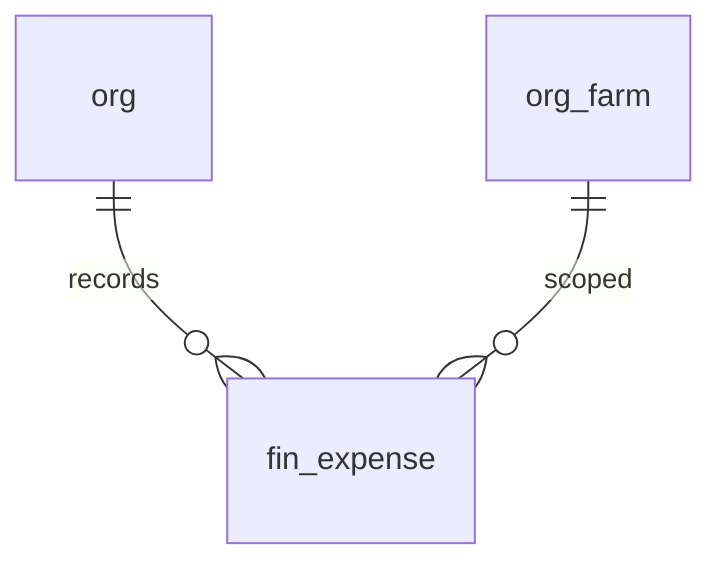

# Finance Schema

Financial transaction tables sourced from QuickBooks. For now, nightly-synced from the invoices/expense spreadsheet that is itself fed by QB. Later, we'll pull directly from the QB API and terminate the sheet middle-step.

> **Standard audit fields:** Every table includes `created_at` (TIMESTAMPTZ, default now), `created_by` (TEXT), `updated_at` (TIMESTAMPTZ, default now), `updated_by` (TEXT), and `is_deleted` (BOOLEAN, default false). These are omitted from the column listings below for brevity.

## Entity Relationship Diagram

---

## Table Overview

| Table | Purpose |
|-------|---------|
| fin_expense | QuickBooks expense line items (one row per line) |

---

## fin_expense

QuickBooks expense line-item transactions. Nightly-synced from the expense spreadsheet tabs (`expenses_2019-25`, `expense_2026`) today; moving to direct QB API later. One row per line item on a QB expense transaction.

| Column | Type | Constraints | Description |
|--------|------|-------------|-------------|
| id | UUID | PK, default gen_random_uuid() | |
| org_id | TEXT | NOT NULL, FK → org(id) | |
| farm_id | TEXT | FK → org_farm(id), nullable | Nullable — the expense spreadsheet does not currently carry a Farm column. Populated later when expenses are farm-tagged (likely derivable from class_name) |
| txn_date | DATE | NOT NULL | Transaction date from QB (Txn Date column in the expense sheet) |
| payee_name | TEXT | nullable | Free-text payee; Payee Ref.name from QB. Nullable since some expenses are line items without a distinct payee |
| description | TEXT | nullable | Line-item description from QB (Line Item.description) |
| account_name | TEXT | nullable | QB chart-of-accounts bucket (Line Item.account Name), e.g. "6. Office:Misc" or "3. R&M:Facilities" |
| account_ref | TEXT | nullable | Originating account / card identifier (Account Ref.name), e.g. "JPM,0388" or "JPM CC:JPM5660/6836,LF" |
| class_name | TEXT | nullable | QB class (Line Item.class Name), cost-center style tag. Often null |
| amount | NUMERIC | nullable | Raw line-item amount from QB (Line Item.amount), always positive |
| is_credit | BOOLEAN | NOT NULL, default false | True when the QB transaction is a credit/refund; from the "Creadit" (sic) column in the sheet |
| effective_amount | NUMERIC | nullable | Signed amount used by dashboards: equals amount when is_credit=false, equals -amount when is_credit=true. From the second "Amt" column in the sheet (pre-computed there) |
| macro_category | TEXT | nullable | Top-level QB account category (Macro), e.g. "3. R&M", "6. Office", derived from account_name |
| notes | TEXT | nullable | |

### fin_expense_v (view)

`SELECT * FROM fin_expense WHERE is_deleted = false` plus derived columns: `year`, `month` (both `INT`, extracted from `txn_date`). Dashboards should query this view rather than the underlying table.
