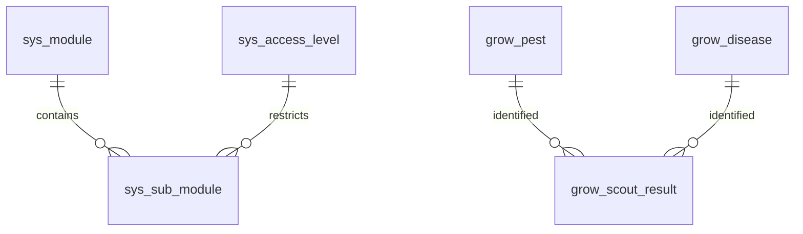

# System Schema

System-level lookup tables that define the application's structure and access control framework. These tables are provisioned once and do not belong to any organization. They serve as master templates for org-level configuration.

> **Standard audit fields:** Every table includes `created_at` (TIMESTAMPTZ, default now), `created_by` (TEXT), `updated_at` (TIMESTAMPTZ, default now), `updated_by` (TEXT), and `is_deleted` (BOOLEAN, default false). These are omitted from the column listings below for brevity.

## Entity Relationship Diagram

---

## Table Overview

| Table | Purpose |
|-------|---------|
| sys_uom | Standardized measurement units (kg, L, °C, etc.) shared across all organizations for consistent data entry and calculations. |
| sys_access_level | Defines the 5 hierarchical access tiers (employee, team_lead, manager, admin, owner) used for role-based visibility control. |
| sys_module | Master list of application modules available for access control (e.g. Inventory, HR, Operations). |
| sys_sub_module | Master list of sub-modules within each module, each with a minimum access level that determines visibility. |
| grow_pest | Standardized pest names for scouting observations. System-level, shared across all organizations. |
| grow_disease | Standardized disease names for scouting observations. System-level, shared across all organizations. |

---

## sys_uom

Standardized measurement units shared across all organizations for consistent data entry and calculations throughout the system.

| Column | Type | Constraints | Description |
|--------|------|-------------|-------------|
| code | TEXT | PK | |
| name | TEXT | NOT NULL, UNIQUE | |
| category | TEXT | NOT NULL | |

---

## sys_access_level

Defines the hierarchical access tiers used for role-based visibility control. The `level` integer is used to compare against sub-module access requirements — higher number means more access.

| Column | Type | Constraints | Description |
|--------|------|-------------|-------------|
| name | TEXT | PK, UNIQUE | |
| level | INTEGER | NOT NULL, UNIQUE | |
| description | TEXT | nullable | |
| display_order | INTEGER | NOT NULL, default 0 | |

---

## sys_module

Master list of application modules. Copied into `org_module` for each organization during provisioning.

| Column | Type | Constraints | Description |
|--------|------|-------------|-------------|
| name | TEXT | PK, UNIQUE | |
| description | TEXT | nullable | |
| display_order | INTEGER | NOT NULL, default 0 | |

---

## sys_sub_module

Master list of sub-modules within each module. Each sub-module defines a minimum access level required for visibility. Copied into `org_sub_module` for each organization during provisioning.

| Column | Type | Constraints | Description |
|--------|------|-------------|-------------|
| sys_module_name | TEXT | NOT NULL, FK → sys_module(name) | |
| name | TEXT | PK | |
| description | TEXT | nullable | |
| sys_access_level_name | TEXT | NOT NULL, FK → sys_access_level(name) | Sourced from sys_access_level; defines the minimum access level required to view this sub-module |
| display_order | INTEGER | NOT NULL, default 0 | |

Unique constraint on `(sys_module_name, name)`.

---

## grow_pest

Standardized pest names for scouting observations. System-level, shared across all organizations.

| Column | Type | Constraints | Description |
|--------|------|-------------|-------------|
| name | TEXT | PK | |
| description | TEXT | nullable | |

---

## grow_disease

Standardized disease names for scouting observations. System-level, shared across all organizations.

| Column | Type | Constraints | Description |
|--------|------|-------------|-------------|
| name | TEXT | PK | |
| description | TEXT | nullable | |
