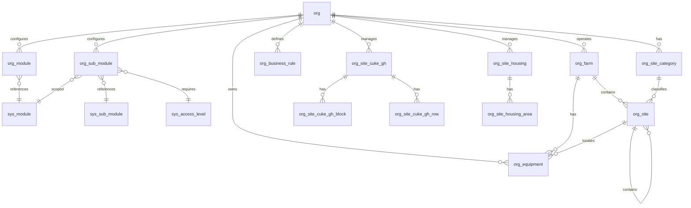

# Organization Schema

Organization-level tables that define the structure of each org — identity, module configuration, farms, sites, equipment, and crop definitions.

> **Standard audit fields:** Every table includes `created_at` (TIMESTAMPTZ, default now), `created_by` (TEXT), `updated_at` (TIMESTAMPTZ, default now), `updated_by` (TEXT), and `is_deleted` (BOOLEAN, default false). These are omitted from the column listings below for brevity.

## Entity Relationship Diagram



---

## Table Overview

| Table | Purpose |
|-------|---------|
| org | Root entity for multi-org support. Every org-scoped record traces back to this table. |
| org_module | Org-scoped copy of system modules. Admins toggle is_enabled and customize display names and ordering. |
| org_sub_module | Org-scoped copy of system sub-modules. Admins toggle is_enabled and adjust access levels per org. |
| org_farm | Crop/product lines within an org (e.g. Cuke Farm, Lettuce Farm) with weighing and growing UOM defaults. |
| org_site_category | Two-level site category hierarchy. Same pattern as invnt_category. |
| org_site | Site register for growing sites, packhouses, and food-safety zones. Supports parent-child hierarchy. Cuke greenhouses and housing facilities live in their own tables. |
| org_site_cuke_gh | Cuke greenhouse registry. One row per GH with layout and display config for the plant-map dashboard. **Standalone** — not FK-linked to org_site. |
| org_site_cuke_gh_block | Block definitions per cuke greenhouse. A block is a visually contiguous group of rows; sidewalks render between blocks. |
| org_site_cuke_gh_row | Physical cuke greenhouse row infrastructure. One row per physical GH row. |
| org_site_housing | Housing facility registry. One row per residence. Org-scoped, no farm linkage. **Standalone** — not FK-linked to org_site. |
| org_site_housing_area | Sub-areas within a housing facility (rooms, wings). |
| org_equipment | Equipment register for physical assets. Farm-level or shared (farm_name null). Site-level or mobile (site_id null). |
| org_business_rule | Org-scoped registry for business rules, workflows, calculations, requirements, and definitions. Exposed as tooltips and table view. |

---

## org

Root entity for multi-org support. Every org-scoped table references this. Stores org-level settings such as default currency.

| Column | Type | Constraints | Description |
|--------|------|-------------|-------------|
| id | TEXT | PK | Human-readable identifier derived from org name (lowercase, spaces replaced with underscores) |
| name | TEXT | NOT NULL, UNIQUE | |
| address | TEXT | nullable | |
| currency | TEXT | nullable | |

---

## org_module

Org-scoped copy of system modules. Seeded by a provisioning script when a new org is created. Org admins toggle `is_enabled` to control which modules are available to their users.

| Column | Type | Constraints | Description |
|--------|------|-------------|-------------|
| org_id | TEXT | NOT NULL, FK → org(id) | |
| sys_module_name | TEXT | NOT NULL, FK → sys_module(name) | Sourced from sys_module; identifies which system module this org copy represents |
| name | TEXT | PK | Pre-filled from sys_module.name at provisioning time; editable by org admins |
| is_enabled | BOOLEAN | NOT NULL, default true | Auto-set to true when provisioned; toggled by org admins to enable/disable the module |
| display_order | INTEGER | NOT NULL, default 0 | |

Unique constraint on `(org_id, sys_module_name)`.

---

## org_sub_module

Org-scoped copy of system sub-modules. Seeded by a provisioning script when a new org is created. Org admins toggle `is_enabled` and can adjust the access level per sub-module.

| Column | Type | Constraints | Description |
|--------|------|-------------|-------------|
| org_id | TEXT | NOT NULL, FK → org(id) | |
| sys_module_name | TEXT | NOT NULL, FK → sys_module(name) | Sourced from sys_sub_module.sys_module_name at provisioning time |
| sys_sub_module_name | TEXT | NOT NULL, FK → sys_sub_module(name) | Sourced from sys_sub_module; identifies which system sub-module this org copy represents |
| sys_access_level_name | TEXT | NOT NULL, FK → sys_access_level(name) | Pre-filled from sys_sub_module.sys_access_level_name at provisioning time; editable by org admins |
| name | TEXT | PK | Pre-filled from sys_sub_module.name at provisioning time; editable by org admins |
| is_enabled | BOOLEAN | NOT NULL, default true | Auto-set to true when provisioned; toggled by org admins to enable/disable the sub-module |
| display_order | INTEGER | NOT NULL, default 0 | |

Unique constraint on `(org_id, sys_module_name, sys_sub_module_name)`.

---

## org_farm

Represents a crop or product line within an organization (e.g. Cuke Farm, Lettuce Farm). Each farm has its own sites, varieties, grades, and products. Farm-level defaults reference units of measure for weighing and growing operations.

| Column | Type | Constraints | Description |
|--------|------|-------------|-------------|
| org_id | TEXT | NOT NULL, FK → org(id) | |
| name | TEXT | PK | |
| weighing_uom | TEXT | FK → sys_uom(code), nullable | Default weight unit for this farm; pre-fills grow_harvest_container.weight_uom and sales_product.weight_uom |
| growing_uom | TEXT | FK → sys_uom(code), nullable | Default growing unit for this farm; pre-fills grow_lettuce_seed_batch.seeding_uom |
| volume_uom | TEXT | FK → sys_uom(code), nullable | Default volume unit for this farm; pre-fills grow_spray_equipment.water_uom and grow_fertigation.volume_uom |

Unique constraint on `(org_id, name)`.

---

## org_site_category

Two-level site category hierarchy. Rows with `sub_category_name IS NULL` are top-level categories (e.g. growing, packing, storage, food_safety). Rows with `sub_category_name` set are subcategories (e.g. greenhouse, nursery, room under growing). Both `org_site_category_id` and `org_site_subcategory_id` on `org_site` reference this table. **Housing is NOT a category** — it lives in its own dedicated table (`org_site_housing`).

| Column | Type | Constraints | Description |
|--------|------|-------------|-------------|
| id | TEXT | PK | |
| org_id | TEXT | NOT NULL, FK → org(id) | |
| category_name | TEXT | NOT NULL | |
| sub_category_name | TEXT | nullable | NULL for top-level categories; set for subcategories under that category_name |
| display_order | INTEGER | NOT NULL, default 0 | |

Partial unique indexes: `(org_id, category_name)` where `sub_category_name IS NULL`; `(org_id, category_name, sub_category_name)` where `sub_category_name IS NOT NULL`.

---

## org_site

Site register for growing sites, packhouses, and food-safety zones. Supports a parent-child hierarchy via `site_id_parent` — top-level sites contain child sites (food-safety surfaces, pest traps). The category is determined by the `org_site_category_id` FK which drives which fields are relevant in the UI. **Cuke greenhouses and housing facilities live in their own dedicated tables** (`org_site_cuke_gh`, `org_site_housing`) — they are not in `org_site`.

**Example data:**

| id | org_id | farm_name | name | category | subcategory | site_id_parent | acres | monitoring_stations | zone | lat | lng | elev |
|---|---|---|---|---|---|---|---|---|---|---|---|---|
| jtl | hf | cuke | JTL | growing | | | | | | | | |
| 01 | hf | cuke | 01 | growing | greenhouse | jtl | 1 | [A, B] | | xxx | yyy | |
| row_01 | hf | cuke | Row 01 | growing | row | 01 | | | | xxx11 | yyy11 | |
| fert_jtl | hf | cuke | Fert JTL | growing | room | jtl | | | | | | |
| station_01 | hf | cuke | Station 01 | pest_trap | | 01 | | | | | | |
| harvest_cart | hf | cuke | Harvest Cart | food_safety | | 01 | | | zone_1 | xxx1 | yyy1 | zzz1 |
| bip | hf | cuke | BIP | growing | | | | | | | | |
| bip_ph | hf | cuke | BIP PH | packing | | bip | | | | | | |
| bip_breakroom | hf | cuke | BIP Breakroom | packing | room | bip_ph | | | | | | |
| bip_cold_storage_1 | hf | cuke | BIP Cold Storage #1 | storage | cold_storage | bip_ph | | | | | | |

**Hierarchy view:**
```
JTL (category: growing, farm: cuke)
  ├── 01 (category: growing, subcategory: greenhouse, 1 acre)
  │   ├── Row 01 (category: growing, subcategory: row)
  │   ├── Station 01 (category: pest_trap)
  │   └── Harvest Cart (category: food_safety, zone: zone_1)
  ├── Fert JTL (category: growing, subcategory: room)
  ├── Shop (category: growing, subcategory: room)
  └── Boneyard Containers (category: storage)

BIP (category: growing, farm: cuke)
  ├── KO (category: growing, subcategory: greenhouse)
  ├── NE (category: growing, subcategory: nursery)
  ├── Fert BIP (category: growing, subcategory: room)
  └── BIP PH (category: packing)
      ├── BIP Breakroom (category: packing, subcategory: room)
      ├── BIP Office (category: packing, subcategory: room)
      └── BIP Cold Storage #1 (category: storage, subcategory: cold_storage)

GH (category: growing, farm: lettuce)
  ├── P1 (category: growing, subcategory: pond)
  ├── Lettuce Germination Room (category: growing, subcategory: room)
  └── Lettuce PH (category: packing)
      ├── Lettuce Packing Room (category: packing, subcategory: room)
      ├── Lettuce PH Cold Storage (category: storage, subcategory: cold_storage)
      └── Lettuce Dry Side Storage (category: storage)
```

| Column | Type | Constraints | Description |
|--------|------|-------------|-------------|
| id | TEXT | PK | |
| org_id | TEXT | NOT NULL, FK → org(id) | |
| farm_name | TEXT | FK → org_farm(name), nullable | Inherited from parent org_farm when site is farm-scoped; null for org-wide sites |
| name | TEXT | NOT NULL | |
| org_site_category_id | TEXT | NOT NULL, FK → org_site_category(id) | References org_site_category rows where sub_category_name IS NULL |
| org_site_subcategory_id | TEXT | FK → org_site_category(id), nullable | References org_site_category rows where sub_category_name IS NOT NULL |
| site_id_parent | TEXT | FK → org_site(id), nullable | Null for top-level sites; set for child locations within a parent site |
| acres | NUMERIC | nullable | Only for growing sites with no subcategory, or subcategory greenhouse, pond, nursery; null for all other site types |
| monitoring_stations | JSONB | NOT NULL, default [] | JSON array of station names for monitoring; rendered as dropdown in grow_monitoring_result.monitoring_station |
| zone | TEXT | nullable, CHECK | zone_1 (food contact surface), zone_2, zone_3, zone_4, water; available on all sites regardless of category |
| latitude | NUMERIC | nullable | |
| longitude | NUMERIC | nullable | |
| elevation | NUMERIC | nullable | |
| notes | TEXT | nullable | |
| is_active | BOOLEAN | NOT NULL, default true | |
| display_order | INTEGER | NOT NULL, default 0 | |

Partial unique indexes: `(org_id, name)` where `farm_name IS NULL` for org-level sites; `(org_id, farm_name, name)` where `farm_name IS NOT NULL` for farm-level sites.

---

## org_equipment

Equipment register for all physical assets across the organization. Farm-level or shared (farm_name null).

| Column | Type | Constraints | Description |
|--------|------|-------------|-------------|
| name | TEXT | PK | Display name, globally unique (e.g. `Cucumber Clamco East`). Disambiguate per-farm duplicates by prepending the farm name. |
| org_id | TEXT | NOT NULL, FK → org(id) | |
| farm_name | TEXT | FK → org_farm(name), nullable | Inherited from parent org_farm when equipment is farm-scoped; null for org-wide equipment |
| type | TEXT | nullable, CHECK | vehicle, tool, machine, ppe, bag_pack_sprayer, fogger, tank |
| description | TEXT | nullable | |
| manufacturer | TEXT | nullable | |
| model | TEXT | nullable | |
| serial_number | TEXT | nullable | |
| purchase_date | DATE | nullable | |
| manual_url | TEXT | nullable | |

---

## org_business_rule

Org-scoped registry for business rules, workflows, calculations, requirements, and definitions. Exposed in the app as tooltips and a table view.

| Column | Type | Constraints | Description |
|--------|------|-------------|-------------|
| id | TEXT | PK | |
| org_id | TEXT | NOT NULL, FK → org(id) | |
| rule_type | TEXT | NOT NULL, CHECK | business_rule, workflow, calculation, requirement, definition |
| module | TEXT | nullable | |
| title | TEXT | NOT NULL | |
| description | TEXT | NOT NULL | |
| rationale | TEXT | nullable | |
| applies_to | JSONB | NOT NULL, default [] | JSON array of table.column references this rule applies to (e.g. ["invnt_onhand.invnt_lot_id"]) |
| is_active | BOOLEAN | NOT NULL, default true | |
| display_order | INTEGER | NOT NULL, default 0 | |


---

## org_site_cuke_gh

Cuke greenhouse registry — one row per GH with layout and display config for the plant-map dashboard and any other GH-aware feature. **Standalone**: `id` is a cuke-GH-scoped identifier and is NOT FK-linked to `org_site`.

| Column | Type | Constraints | Description |
|--------|------|-------------|-------------|
| id | TEXT | PK | Display identifier (e.g. `GH1`, `Hamakua`) |
| org_id | TEXT | NOT NULL, FK → org(id) | |
| farm_name | TEXT | NOT NULL, FK → org_farm(name) | |
| farm_section | TEXT | NOT NULL, CHECK in ('JTL', 'BIP') | Physical farm area. JTL = numbered GHs (GH1-GH8); BIP = named houses (Kona, Kohala, Hamakua, Waimea, Hilo). Drives dashboard grouping and layout |
| acres | NUMERIC | nullable | Cultivated area of this greenhouse. Used by reporting / yield-per-acre calculations |
| rows_orientation | TEXT | NOT NULL, CHECK | vertical = rows run top-to-bottom; horizontal = rows run left-to-right |
| sidewalk_position | TEXT | NOT NULL, CHECK | middle, top, bottom, left, right, none. Dashboard renders sidewalks in grey |
| blocks_vertical | BOOLEAN | NOT NULL, default false | When true the renderer stacks blocks vertically instead of side-by-side |
| layout_grid_row | INTEGER | NOT NULL | Dashboard grid row position. Controls top/bottom placement |
| layout_grid_col | INTEGER | NOT NULL | Dashboard grid column position. Controls left/right placement |
| layout_stack_pos | INTEGER | nullable | When multiple GHs share the same (grid_row, grid_col), this orders them within the shared cell |

---

## org_site_cuke_gh_block

Block definitions per cuke greenhouse. A block is a visually contiguous group of rows; sidewalks render between blocks.

| Column | Type | Constraints | Description |
|--------|------|-------------|-------------|
| id | UUID | PK, default gen_random_uuid() | |
| org_id | TEXT | NOT NULL, FK → org(id) | |
| farm_name | TEXT | NOT NULL, FK → org_farm(name) | |
| site_id | TEXT | NOT NULL, FK → org_site_cuke_gh(id) | Which cuke greenhouse this block belongs to |
| block_number | INTEGER | NOT NULL | Block sequence (1, 2, 3...). The dashboard renders blocks in ascending block_number, with sidewalks between them |
| name | TEXT | NOT NULL | Display label for the block header (e.g. North, Middle, South, East, West, Hamakua, Kohala, Main) |
| row_number_from | INTEGER | NOT NULL | First row_number in this block (inclusive) |
| row_number_to | INTEGER | NOT NULL | Last row_number in this block (inclusive) |
| direction | TEXT | NOT NULL, CHECK | forward = rows render in ascending row_number order; reverse = descending |

Unique constraint on `(site_id, block_number)`.

---

## org_site_cuke_gh_row

Physical cuke greenhouse row infrastructure. One row per physical GH row — pure identity `(site_id, row_number)`. Bag counts and planting state live on `grow_cuke_gh_row_planting` per scenario; block membership comes from `org_site_cuke_gh_block`.

| Column | Type | Constraints | Description |
|--------|------|-------------|-------------|
| id | UUID | PK, default gen_random_uuid() | |
| org_id | TEXT | NOT NULL, FK → org(id) | |
| farm_name | TEXT | NOT NULL, FK → org_farm(name) | |
| site_id | TEXT | NOT NULL, FK → org_site_cuke_gh(id) | Which cuke greenhouse this row belongs to |
| row_number | INTEGER | NOT NULL | Physical row number. Unique within a greenhouse |
| notes | TEXT | nullable | |

Unique constraint on `(site_id, row_number)`.

---

## org_site_housing

Housing facility registry. One row per residence owned or managed by the organization. **Standalone**: `name` is the PK and is the display name verbatim (e.g. `"BIP (5)"`, `"South Kohala"`); NOT FK-linked to `org_site`. Org-scoped — no farm linkage.

| Column | Type | Constraints | Description |
|--------|------|-------------|-------------|
| org_id | TEXT | NOT NULL, FK → org(id) | |
| maximum_beds | INTEGER | nullable | Total bed capacity of this facility. Informational |
| address | TEXT | nullable | Street address; used for HR mailings and pay stubs |
| notes | TEXT | nullable | |

---

## org_site_housing_area

Sub-areas within a housing facility (rooms, wings, floors). One row per nameable partition.

| Column | Type | Constraints | Description |
|--------|------|-------------|-------------|
| org_id | TEXT | NOT NULL, FK → org(id) | |
| housing_name | TEXT | NOT NULL, FK → org_site_housing(name) | Which housing facility this area belongs to |
| name | TEXT | PK | Display label for the area (e.g. "Room 2A", "East Wing") |

Unique constraint on `(housing_name, name)`.
