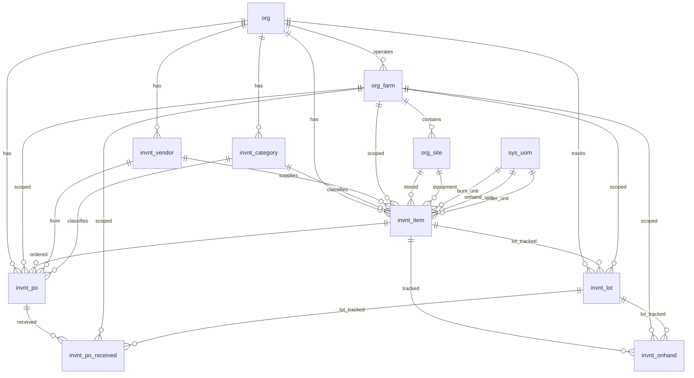

# Inventory Schema

Tables for managing inventory items, categories, and procurement across all farms within an organization. Covers seeds, chemicals, packaging materials, parts, and general supplies.

> **Standard audit fields:** Every table includes `created_at` (TIMESTAMPTZ, default now), `created_by` (TEXT), `updated_at` (TIMESTAMPTZ, default now), `updated_by` (TEXT), and `is_deleted` (BOOLEAN, default false). These are omitted from the column listings below for brevity.

## Entity Relationship Diagram

---

## Table Overview

| Table | Purpose |
|-------|---------|
| invnt_vendor | Organization-level suppliers for procurement. Referenced by inventory items and purchase orders. |
| invnt_category | Two-level category hierarchy. Rows with `sub_category_name IS NULL` are top-level categories; rows with `sub_category_name` set are subcategories under that `category_name`. Both `invnt_category_id` and `invnt_subcategory_id` on `invnt_item` reference this table. |
| invnt_item | The main inventory record for each item. Tracks units and conversions, burn rates for forecasting, reorder settings, and item details (seed variety, manufacturer, part number, etc.) as proper columns. Classification is handled by the two-level invnt_category hierarchy. On-hand and on-order quantities are computed from transaction data, not stored here. |
| invnt_po | Tracks purchase order requests through a workflow: requested → approved/rejected → ordered → partial/received. Snapshots item name, units, and cost at order time. Supports both inventory_item and non_inventory_item purchases. |
| invnt_lot | Tracks unique inventory lots by item and lot number. Lot is active while stock remains; marked inactive when consumed. Referenced by po_received, onhand, and grow tables for traceability. |
| invnt_po_received | Individual deliveries received against a purchase order. References invnt_lot for lot tracking. Multiple records per order enable partial delivery tracking. |
| invnt_onhand | Records on-hand inventory snapshots per item. References invnt_lot for lot tracking. Source of truth for computed totals like current stock, burn-per-week, and weeks-on-hand. |

---

## invnt_vendor

Organization-level suppliers used for procurement across all farms. Stores contact details, address, and payment terms.

| Column         | Type         | Constraints            | Description                        |
|----------------|--------------|------------------------|------------------------------------|
| id             | TEXT         | PK                     | |
| org_id         | TEXT         | NOT NULL, FK → org(id) | |
| name           | TEXT | NOT NULL               | |
| contact_person | TEXT | nullable               | |
| email          | TEXT | nullable               | |
| phone          | TEXT  | nullable               | |
| address        | TEXT         | nullable               | |
| payment_terms  | TEXT  | nullable               | |

Unique constraint on `(org_id, name)` — no duplicate supplier names within an org.

---

## invnt_category

Two-level category hierarchy for inventory items in a single table. A row with `sub_category_name IS NULL` is a top-level category (e.g. Fertilizers). A row with `sub_category_name` set is a subcategory under that `category_name` (e.g. Nitrogen Fertilizers under Fertilizers). Both `invnt_category_id` and `invnt_subcategory_id` in `invnt_item` reference this table.

**Frontend query pattern:**
- Get all categories: `WHERE sub_category_name IS NULL`
- Get subcategories for a category: `WHERE category_name = :name AND sub_category_name IS NOT NULL`

| Column             | Type         | Constraints                    | Description                              |
|--------------------|--------------|-------------------------------|------------------------------------------|
| id                 | TEXT         | PK                             | |
| org_id             | TEXT         | NOT NULL, FK → org(id)         | |
| category_name      | TEXT         | NOT NULL                       | |
| sub_category_name  | TEXT         | nullable                       | NULL when this row represents a top-level category |

**Uniqueness rules:**

PostgreSQL does not treat `NULL = NULL` in standard `UNIQUE` constraints, so a regular `CONSTRAINT UNIQUE (org_id, category_name, sub_category_name)` would allow duplicate top-level category rows where `sub_category_name IS NULL`. To enforce uniqueness correctly at both levels, two partial unique indexes are used instead:

| Index | Columns | Condition | Prevents |
|-------|---------|-----------|---------|
| `uq_invnt_category_top_level` | `(org_id, category_name)` | `WHERE sub_category_name IS NULL` | Duplicate top-level category names within the same org |
| `uq_invnt_category_sub_level` | `(org_id, category_name, sub_category_name)` | `WHERE sub_category_name IS NOT NULL` | Duplicate subcategory names within the same category and org |

These indexes are enforced at the database level and behave identically to a `CONSTRAINT UNIQUE` — any insert or update that violates them will be rejected.

## invnt_item

The main inventory record. Items belong to an organization and optionally to a specific farm. Classification is handled by the category/subcategory structure. All item details are proper columns grouped by logical sections. Seed-specific fields are prefixed `seed_`; maintenance part fields are prefixed `maint_`.

| Column                    | Type         | Constraints                           | Description                              |
|--------------------------|--------------|---------------------------------------|------------------------------------------|
| id                       | TEXT         | PK                                    | |
| org_id                   | TEXT         | NOT NULL, FK → org(id)                | |
| farm_id                  | TEXT         | FK → org_farm(id), nullable               | |
| invnt_category_id        | TEXT         | FK → invnt_category(id), nullable     | References invnt_category rows where sub_category_name IS NULL |
| invnt_subcategory_id     | TEXT         | FK → invnt_category(id), nullable     | References invnt_category rows where sub_category_name IS NOT NULL |
| name                     | TEXT         | NOT NULL                              | |
| qb_account            | TEXT         | nullable                              | |
| description              | TEXT         | nullable                              | |
| burn_uom                 | TEXT         | FK → sys_uom(code), nullable         | Smallest consumption unit used for burn rate tracking (e.g. ml, g, seed) |
| onhand_uom               | TEXT         | FK → sys_uom(code), nullable         | |
| order_uom                | TEXT         | FK → sys_uom(code), nullable         | |
| burn_per_onhand          | NUMERIC      | NOT NULL, default 0                   | |
| burn_per_order           | NUMERIC      | NOT NULL, default 0                   | |
| is_palletized            | BOOLEAN      | NOT NULL, default false               | |
| order_per_pallet         | NUMERIC      | NOT NULL, default 0                   | |
| pallet_per_truckload     | NUMERIC      | NOT NULL, default 0                   | |
| is_frequently_used       | BOOLEAN      | NOT NULL, default false               | |
| burn_per_week            | NUMERIC      | NOT NULL, default 0                   | |
| cushion_weeks            | NUMERIC      | NOT NULL, default 0                   | Safety stock buffer in weeks used in next-order-date calculations |
| is_auto_reorder          | BOOLEAN      | NOT NULL, default false               | |
| reorder_point_in_burn    | NUMERIC      | NOT NULL, default 0                   | Auto-calculated: burn_per_week * cushion_weeks; triggers reorder alert when on-hand falls below this |
| reorder_quantity_in_burn | NUMERIC      | NOT NULL, default 0                   | Auto-calculated: burn_per_week * cushion_weeks; default quantity for auto-reorder in burn units |
| requires_lot_tracking    | BOOLEAN      | NOT NULL, default false               | |
| requires_expiry_date     | BOOLEAN      | NOT NULL, default false               | |
| site_id                  | TEXT         | FK → org_site(id), nullable               | Filtered to org_site where category = storage; the storage location for this item |
| equipment_id             | TEXT         | FK → org_equipment(id), nullable          | |
| invnt_vendor_id          | TEXT         | FK → invnt_vendor(id), nullable       | |
| manufacturer             | TEXT         | nullable                              | |
| grow_variety_id          | TEXT         | FK → grow_variety(id), nullable       | |
| seed_is_pelleted         | BOOLEAN      | nullable                              | Whether seed item is pelleted; null for non-seed items |
| maint_part_type          | TEXT         | nullable                              | Type classification for parts (e.g. electrical, mechanical, plumbing) |
| maint_part_number        | TEXT         | nullable                              | |
| photos                   | JSONB        | NOT NULL, default []                  | Reference photos of the item used for visual identification during ordering |
| is_active                | BOOLEAN      | NOT NULL, default true                | Whether this item is currently active for ordering and tracking; false means inactive but not deleted |

Unique constraint on `(org_id, name)` — no duplicate item names within an org.

## invnt_lot

Tracks unique inventory lots by item and lot number. Created when a new lot is first received. Active while stock remains; marked inactive when fully consumed. Referenced by invnt_po_received, invnt_onhand, and grow module tables for full lot traceability.

| Column         | Type    | Constraints                        | Description |
|----------------|---------|-----------------------------------|-------------|
| id             | TEXT    | PK                                | |
| org_id         | TEXT    | NOT NULL, FK → org(id)            | |
| farm_id        | TEXT    | NOT NULL, FK → org_farm(id)       | Inherited from invnt_item.farm_id when lot is created |
| invnt_item_id  | TEXT    | NOT NULL, FK → invnt_item(id)     | |
| lot_number     | TEXT    | NOT NULL                          | |
| lot_expiry_date | DATE   | nullable                          | |
| is_active      | BOOLEAN | NOT NULL, default true            | Auto-set to false when latest invnt_onhand quantity is zero; can also be manually set to false by user |

Unique constraint on `(org_id, invnt_item_id, lot_number)`.

---

## invnt_po

Tracks purchase order requests through a workflow from request to receipt. Each order snapshots the item name, units, and cost at order time so the record stays accurate even if the item changes later. `request_type` determines whether it's a `non_inventory_item` purchase (classified by `invnt_category_id`) or an `inventory_item` purchase (linked via `invnt_item_id`). `item_name` is always populated either way. 
| Column                | Type         | Constraints                           | Description                              |
|----------------------|--------------|---------------------------------------|------------------------------------------|
| id                   | UUID         | PK, auto-generated                    | |
| org_id               | TEXT         | NOT NULL, FK → org(id)                | |
| farm_id              | TEXT         | FK → org_farm(id), nullable               | |
| request_type         | TEXT         | NOT NULL, default inventory_item, CHECK | non_inventory_item, inventory_item |
| urgency_level        | TEXT         | nullable, CHECK                       | today, 2_days, 7_days, not_urgent |
| invnt_category_id    | TEXT         | NOT NULL, FK → invnt_category(id)     | Pre-filled from invnt_item for inventory_item; user-selected for non_inventory_item |
| invnt_item_id        | TEXT         | FK → invnt_item(id), nullable         | |
| item_name            | TEXT         | NOT NULL                              | Snapshot from invnt_item.name for inventory_item; manually entered for non_inventory_item |
| burn_uom             | TEXT         | NOT NULL, FK → sys_uom(code)         | Snapshot from invnt_item.burn_uom for inventory_item; defaults to order_uom for non_inventory_item |
| order_uom            | TEXT         | NOT NULL, FK → sys_uom(code)         | Snapshot from invnt_item.order_uom for inventory_item; user-selected for non_inventory_item |
| order_quantity       | NUMERIC      | NOT NULL                              | |
| burn_per_order       | NUMERIC      | NOT NULL, default 0                   | Snapshot from invnt_item.burn_per_order for inventory_item; defaults to 1 for non_inventory_item |
| vendor_po_number     | TEXT         | nullable                              | |
| invnt_vendor_id      | TEXT         | FK → invnt_vendor(id), nullable       | Pre-filled from invnt_item.invnt_vendor_id when item is selected; editable |
| total_cost           | NUMERIC      | nullable                              | |
| is_freight_included  | BOOLEAN      | nullable                              | |
| expected_delivery_date | DATE       | nullable                              | |
| tracking_number      | TEXT         | nullable                              | |
| notes                | TEXT         | nullable                              | |
| rejected_reason      | TEXT         | nullable                              | |
| request_photos       | JSONB        | NOT NULL, default []                  | |
| status               | TEXT         | NOT NULL, default requested, CHECK    | requested, approved, rejected, ordered, partial, received, cancelled |
| requested_at         | TIMESTAMPTZ  | NOT NULL, default now                 | |
| requested_by         | TEXT         | NOT NULL, FK → hr_employee(id)        | |
| reviewed_at          | TIMESTAMPTZ  | nullable                              | |
| reviewed_by          | TEXT         | FK → hr_employee(id), nullable        | |
| ordered_at           | TIMESTAMPTZ  | nullable                              | |
| ordered_by           | TEXT         | FK → hr_employee(id), nullable        | |

## invnt_po_received

Individual deliveries received against a purchase order. One order can have multiple received records to handle partial deliveries. Each record captures its own lot number, expiry date, quantity, and acceptance details.

| Column                | Type         | Constraints                           | Description                              |
|----------------------|--------------|---------------------------------------|------------------------------------------|
| id                   | UUID         | PK, auto-generated                    | |
| org_id               | TEXT         | NOT NULL, FK → org(id)                | |
| farm_id              | TEXT         | FK → org_farm(id), nullable               | Inherited from invnt_po.farm_id when receiving against a PO |
| invnt_po_id          | UUID         | NOT NULL, FK → invnt_po(id)           | |
| received_date        | DATE         | NOT NULL                              | |
| received_uom         | TEXT         | NOT NULL, FK → sys_uom(code)         | Pre-filled from invnt_po.order_uom; editable at receive time |
| received_quantity    | NUMERIC      | NOT NULL                              | |
| burn_per_received    | NUMERIC      | NOT NULL, default 0                   | Snapshot from invnt_po.burn_per_order at receive time |
| invnt_lot_id         | TEXT         | FK → invnt_lot(id), nullable          | |
| fsafe_delivery_truck_clean | BOOLEAN      | nullable                              | |
| fsafe_delivery_acceptable  | BOOLEAN      | nullable                              | |
| notes                | TEXT         | nullable                              | |
| received_photos      | JSONB        | NOT NULL, default []                  | Photos taken at delivery for audit and quality verification |
| received_at          | TIMESTAMPTZ  | NOT NULL, default now                 | |
| received_by          | TEXT         | nullable                              | |

## invnt_onhand

Records on-hand inventory snapshots per item. Each record captures the quantity in onhand units with burn unit conversion and optional lot tracking. Source of truth for computed totals like current stock, burn-per-week, and weeks-on-hand.

| Column                | Type         | Constraints                           | Description                              |
|----------------------|--------------|---------------------------------------|------------------------------------------|
| id                   | UUID         | PK, auto-generated                    | |
| org_id               | TEXT         | NOT NULL, FK → org(id)                | |
| farm_id              | TEXT         | FK → org_farm(id), nullable               | Inherited from invnt_item.farm_id when on-hand record is created |
| invnt_item_id        | TEXT         | NOT NULL, FK → invnt_item(id)         | |
| onhand_date          | DATE         | NOT NULL                              | |
| onhand_uom           | TEXT         | FK → sys_uom(code), nullable         | Pre-filled from invnt_item.onhand_uom; editable |
| onhand_quantity      | NUMERIC      | NOT NULL                              | |
| burn_per_onhand      | NUMERIC      | NOT NULL, default 0                   | Snapshot from invnt_item.burn_per_onhand at record creation time |
| invnt_lot_id         | TEXT         | FK → invnt_lot(id), nullable          | |
| notes                | TEXT         | nullable                              | |

## Views

### View Overview

| View | Purpose |
|------|---------|
| invnt_item_summary | Dashboard view combining latest on-hand snapshot, open order totals with received deliveries, and computed forecasts (weeks-on-hand, next-order-date) per active inventory item. |

---

### invnt_item_summary

Dashboard view combining latest on-hand snapshot, open order totals with delivery progress, and computed forecasts. Joins `invnt_item` with the latest `invnt_onhand` record and aggregated open `invnt_po` orders (factoring in `invnt_po_received` deliveries).

| Column                       | Source                              | Description                              |
|------------------------------|-------------------------------------|------------------------------------------|
| org_id                       | invnt_item.org_id                   | The organization                         |
| farm_id                      | invnt_item.farm_id                  | Optional farm scope                      |
| invnt_item_id                | invnt_item.id                       | The item                                 |
| invnt_category_id            | invnt_item.invnt_category_id        | Main category                            |
| invnt_subcategory_id         | invnt_item.invnt_subcategory_id     | Item subcategory                         |
| invnt_vendor_id              | invnt_item.invnt_vendor_id          | Primary vendor                           |
| burn_uom                     | invnt_item.burn_uom                 | Burn unit of measure                     |
| onhand_uom                   | invnt_item.onhand_uom               | On-hand unit of measure                  |
| order_uom                    | invnt_item.order_uom                | Order unit of measure                    |
| burn_per_onhand              | invnt_item.burn_per_onhand          | Burn units per onhand unit               |
| burn_per_order               | invnt_item.burn_per_order           | Burn units per order unit                |
| is_frequently_used           | invnt_item                          | Whether item is used regularly           |
| burn_per_week                | invnt_item                          | Configured weekly burn rate              |
| cushion_weeks                | invnt_item                          | Safety stock buffer in weeks             |
| is_auto_reorder              | invnt_item                          | Whether auto-reorder is enabled          |
| reorder_point_in_burn           | invnt_item                          | Reorder trigger level in burn units      |
| reorder_quantity_in_burn        | invnt_item                          | Reorder quantity in burn units           |
| onhand_quantity              | Latest invnt_onhand                 | Current on-hand in onhand units          |
| onhand_quantity_in_burn                  | Computed                            | Current on-hand in burn units (onhand_quantity × burn_per_onhand) |
| onhand_date                  | Latest invnt_onhand                 | Date of most recent on-hand record       |
| days_since_onhand            | Computed                            | Days since last on-hand record           |
| ordered_quantity_in_burn     | invnt_po (aggregated)               | Total ordered quantity in burn units across open orders (approved, ordered, partial) |
| received_quantity_in_burn    | invnt_po_received (aggregated)      | Total received quantity in burn units against open orders |
| remaining_quantity_in_burn               | Computed                            | Outstanding burn units still on order (ordered − received) |
| weeks_on_hand                | Computed                            | Current stock / burn_per_week            |
| next_order_date              | Computed                            | Estimated date to place next order based on burn rate and cushion weeks |

