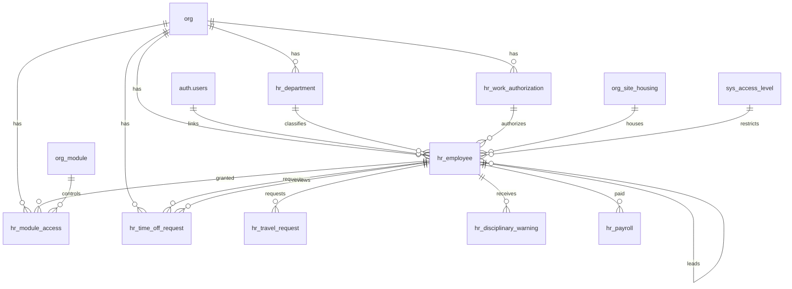

# Human Resources Schema

Tables for managing employees and the lookup tables that support them. Operational activity (task tracking, training, checklists) is covered in the Ops module.

> **Standard audit fields:** Every table includes `created_at` (TIMESTAMPTZ, default now), `created_by` (TEXT), `updated_at` (TIMESTAMPTZ, default now), `updated_by` (TEXT), and `is_deleted` (BOOLEAN, default false). These are omitted from the column listings below for brevity.

## Entity Relationship Diagram



---

## Table Overview

| Table | Purpose |
|-------|---------|
| hr_department | Org-specific department lookup for classifying employees (e.g. GH, PH, Lettuce). TEXT PK is the display name verbatim. |
| hr_work_authorization | Org-specific work authorization type lookup (e.g. Local, FURTE, WFE, H1B). TEXT PK is the display name verbatim. |
| hr_employee | Unified employee register and org membership. Every user with org access has a row here. Tracks employment details, management hierarchy, compensation, and access level. A user can have rows in multiple orgs. |
| hr_module_access | Controls which application modules each employee can access. One row per employee per module; is_enabled toggles access. |
| hr_rba_navigation (view) | Role-based-access navigation view. One row per accessible (org, module, sub_module) for the current auth user. Combines feature toggle + RBAC + ABAC into a single query. Used by the workspace shell sidebar and require\*Access server helpers. |
| hr_time_off_request | Employee time off requests with approval workflow (pending → approved/denied). |
| hr_travel_request | Employee travel requests with trip details and approval workflow (pending → approved/denied). |
| hr_disciplinary_warning | Employee disciplinary warning records with acknowledgment and review workflow. |
| hr_payroll | Merged payroll data imported from external processor. One row per employee per check date with snapshotted employee fields. |
| hr_employee_review | Quarterly performance reviews with four 1-3 ratings (productivity, attendance, quality, engagement) and a generated stored average. |

---

## hr_department

Org-specific departments used to classify employees. Each org defines its own set of departments. `id` is the display name (e.g. `"GH"`, `"PH"`, `"Lettuce"`).

| Column      | Type         | Constraints                     | Description                              |
|------------|--------------|--------------------------------|------------------------------------------|
| id         | TEXT         | PK                             | Display name verbatim |
| org_id     | TEXT         | NOT NULL, FK → org(id)         | Owning organization for RLS filtering    |
| description| TEXT         | nullable                       | |

---

## hr_work_authorization

Org-specific work authorization types used to classify employees. Each org defines its own set of types. `id` is the display name (e.g. `"Local"`, `"FURTE"`, `"WFE"`, `"H1B"`).

| Column      | Type         | Constraints                     | Description                              |
|------------|--------------|--------------------------------|------------------------------------------|
| id         | TEXT         | PK                             | Display name verbatim |
| org_id     | TEXT         | NOT NULL, FK → org(id)         | Owning organization for RLS filtering    |
| description| TEXT         | nullable                       | |

---

## hr_employee

Unified employee register and org membership table. Every employee gets a row here with a required `sys_access_level_id` that defines their role (owner, manager, team_lead, employee). Employees without app access have a null `user_id`. A user can belong to multiple orgs by having one row per org. Tracks employment details, management hierarchy, and compensation.

| Column                   | Type         | Constraints                              | Description                              |
|-------------------------|--------------|------------------------------------------|------------------------------------------|
| id                       | TEXT         | PK                                       | |
| org_id                   | TEXT         | NOT NULL, FK → org(id)                   | |
| first_name               | TEXT         | NOT NULL                                 | |
| last_name                | TEXT         | NOT NULL                                 | |
| preferred_name           | TEXT         | nullable                                 | |
| gender                   | TEXT         | nullable, CHECK                          | male, female |
| date_of_birth            | DATE         | nullable                                 | |
| ethnicity                | TEXT         | nullable, CHECK in ('Caucasian', 'Non-Caucasian') | |
| profile_photo_url        | TEXT         | nullable                                 | |
| phone                    | TEXT         | nullable                                 | |
| email                    | TEXT         | nullable                                 | |
| company_email            | TEXT         | nullable                                 | |
| user_id                  | UUID         | FK → auth.users(id), nullable            | |
| is_primary_org           | BOOLEAN      | NOT NULL, default false                  | When user belongs to multiple orgs, the primary org auto-loads on login; only one row per user_id should be true |
| hr_department_id         | TEXT         | FK → hr_department(id), nullable         | |
| sys_access_level_id      | TEXT         | NOT NULL, FK → sys_access_level(id)      | Sourced from sys_access_level; determines the employee role and module visibility |
| team_lead_id             | TEXT         | FK → hr_employee(id), nullable           | Filtered to employees with sys_access_level_id = team_lead |
| compensation_manager_id  | TEXT         | FK → hr_employee(id), nullable           | Filtered to employees with sys_access_level_id = manager |
| hr_work_authorization_id | TEXT         | FK → hr_work_authorization(id), nullable | |
| start_date               | DATE         | nullable                                 | |
| end_date                 | DATE         | nullable                                 | |
| payroll_id               | TEXT         | nullable                                 | |
| pay_structure            | TEXT         | nullable, CHECK                          | hourly, salary |
| overtime_threshold       | NUMERIC      | nullable                                 | Hours per week before overtime applies; only relevant when pay_structure = hourly |
| wc                       | TEXT         | nullable                                 | Workers compensation code identifying the compensation plan or pay grade |
| payroll_processor        | TEXT         | nullable                                 | |
| pay_delivery_method      | TEXT         | nullable                                 | |
| site_id                  | TEXT         | FK → org_site_housing(id), nullable          | References org_site_housing; the housing facility the employee is assigned to. Null if the employee is not housed |

Unique constraint on `(org_id, first_name, last_name)` — no duplicate employee names within an org.

---

## hr_module_access

Controls which application modules each employee can access. One row per employee per module; is_enabled toggles access without deleting the record.

| Column | Type | Constraints | Description |
|--------|------|-------------|-------------|
| id | UUID | PK, default gen_random_uuid() | |
| org_id | TEXT | NOT NULL, FK → org(id) | |
| hr_employee_id | TEXT | NOT NULL, FK → hr_employee(id) | |
| org_module_id | TEXT | NOT NULL, FK → org_module(id) | Sourced from org_module; identifies which module this access record controls |
| is_enabled | BOOLEAN | NOT NULL, default true | Pre-filled from org_module.is_enabled when employee access is seeded; editable per employee |
| can_edit | BOOLEAN | NOT NULL, default true | Auto-set to true when provisioned; controls whether employee can edit records in this module |
| can_delete | BOOLEAN | NOT NULL, default false | Auto-set to false when provisioned; controls whether employee can delete records in this module |
| can_verify | BOOLEAN | NOT NULL, default false | Auto-set to false when provisioned; controls whether employee can verify/approve records in this module |

Unique constraint on `(hr_employee_id, org_module_id)` — one record per employee per module.

---

## hr_time_off_request

Employee time off requests with PTO and sick leave breakdown and a simple approval workflow.
| Column           | Type         | Constraints                       | Description                              |
|-----------------|--------------|-----------------------------------|------------------------------------------|
| id              | UUID         | PK, auto-generated                | |
| org_id          | TEXT         | NOT NULL, FK → org(id)            | |
| hr_employee_id  | TEXT         | NOT NULL, FK → hr_employee(id)    | |
| start_date      | DATE         | NOT NULL                          | |
| return_date     | DATE         | nullable                          | |
| non_pto_days    | NUMERIC      | nullable                          | Days not charged to PTO or sick leave (e.g. unpaid leave, personal days) |
| pto_days        | NUMERIC      | nullable                          | |
| sick_leave_days | NUMERIC      | nullable                          | |
| request_reason  | TEXT         | nullable                          | |
| denial_reason   | TEXT         | nullable                          | |
| notes           | TEXT         | nullable                          | |
| status          | TEXT         | NOT NULL, default pending, CHECK  | pending, approved, denied |
| requested_at    | TIMESTAMPTZ  | NOT NULL, default now             | |
| requested_by    | TEXT         | NOT NULL, FK → hr_employee(id)    | Auto-set to the logged-in employee when the request is created |
| reviewed_at     | TIMESTAMPTZ  | nullable                          | |
| reviewed_by     | TEXT         | FK → hr_employee(id), nullable    | |

---

## hr_travel_request

Employee travel requests with trip details and a simple approval workflow.

| Column             | Type         | Constraints                       | Description |
|-------------------|--------------|-----------------------------------|-------------|
| id                | UUID         | PK, auto-generated                | |
| org_id            | TEXT         | NOT NULL, FK → org(id)            | |
| hr_employee_id    | TEXT         | NOT NULL, FK → hr_employee(id)    | |
| request_type      | TEXT         | nullable                          | |
| travel_purpose    | TEXT         | nullable                          | |
| travel_from       | TEXT         | nullable                          | |
| travel_to         | TEXT         | nullable                          | |
| travel_start_date | DATE         | nullable                          | |
| travel_return_date| DATE         | nullable                          | |
| denial_reason     | TEXT         | nullable                          | |
| notes             | TEXT         | nullable                          | |
| status            | TEXT         | NOT NULL, default pending, CHECK  | pending, approved, denied |
| requested_at      | TIMESTAMPTZ  | NOT NULL, default now             | |
| requested_by      | TEXT         | NOT NULL, FK → hr_employee(id)    | |
| reviewed_at       | TIMESTAMPTZ  | nullable                          | |
| reviewed_by       | TEXT         | FK → hr_employee(id), nullable    | |

---

## hr_disciplinary_warning

Employee disciplinary warning records. Tracks the offense, action plan, and employee acknowledgment alongside a pending → reviewed workflow.

| Column                          | Type         | Constraints                       | Description |
|--------------------------------|--------------|-----------------------------------|-------------|
| id                             | UUID         | PK, auto-generated                | |
| org_id                         | TEXT         | NOT NULL, FK → org(id)            | |
| hr_employee_id                 | TEXT         | NOT NULL, FK → hr_employee(id)    | |
| warning_date                   | DATE         | nullable                          | |
| warning_type                   | TEXT         | CHECK                             | verbal_warning, written_warning, final_warning |
| offense_type                   | TEXT         | nullable                          | |
| offense_description            | TEXT         | nullable                          | |
| plan_for_improvement           | TEXT         | nullable                          | |
| further_infraction_consequences| TEXT         | nullable                          | |
| notes                          | TEXT         | nullable                          | |
| is_acknowledged                | BOOLEAN      | NOT NULL, default false           | |
| acknowledged_at                | TIMESTAMPTZ  | nullable                          | |
| employee_signature_url         | TEXT         | nullable                          | |
| status                         | TEXT         | NOT NULL, default pending, CHECK  | pending, reviewed |
| reported_at                    | TIMESTAMPTZ  | NOT NULL, default now             | |
| reported_by                    | TEXT         | FK → hr_employee(id), nullable    | |
| reviewed_at                    | TIMESTAMPTZ  | nullable                          | |
| reviewed_by                    | TEXT         | FK → hr_employee(id), nullable    | |

---

## hr_payroll

Merged payroll data imported from external payroll processor. One row per employee per check date. Employee fields are snapshotted at time of processing to preserve historical accuracy.

| Column | Type | Constraints | Description |
|--------|------|-------------|-------------|
| id | UUID | PK, auto-generated | |
| org_id | TEXT | NOT NULL, FK → org(id) | |
| hr_employee_id | TEXT | NOT NULL, FK → hr_employee(id) | |
| payroll_id | TEXT | NOT NULL | Employee ID as it appears in the payroll processor system; used to match records during import |
| pay_period_start | DATE | NOT NULL | |
| pay_period_end | DATE | NOT NULL | |
| check_date | DATE | NOT NULL | |
| invoice_number | TEXT | nullable | |
| payroll_processor | TEXT | NOT NULL | Payroll processor identifier (e.g. HRB, HF) |
| is_standard | BOOLEAN | NOT NULL, default true | Auto-set: true if invoice total hours > 5000; false for off-cycle or adjustment runs |
| employee_name | TEXT | NOT NULL | Name as it appears in the payroll processor data; hr_employee_id is matched by the import script |
| hr_department_id | TEXT | FK → hr_department(id), nullable | Snapshot from hr_employee.hr_department_id at time of import |
| hr_work_authorization_id | TEXT | FK → hr_work_authorization(id), nullable | Snapshot from hr_employee.hr_work_authorization_id at time of import |
| wc | TEXT | nullable | Snapshot from hr_employee.wc at time of import |
| pay_structure | TEXT | nullable | Snapshot from hr_employee.pay_structure at time of import |
| hourly_rate | NUMERIC | nullable | Snapshot from payroll processor NetPay data |
| overtime_threshold | NUMERIC | nullable | Snapshot from hr_employee.overtime_threshold at time of import |
| regular_hours | NUMERIC | NOT NULL, default 0 | |
| overtime_hours | NUMERIC | NOT NULL, default 0 | |
| holiday_hours | NUMERIC | NOT NULL, default 0 | |
| pto_hours | NUMERIC | NOT NULL, default 0 | |
| sick_hours | NUMERIC | NOT NULL, default 0 | |
| funeral_hours | NUMERIC | NOT NULL, default 0 | |
| total_hours | NUMERIC | NOT NULL, default 0 | |
| pto_hours_accrued | NUMERIC | NOT NULL, default 0 | |
| regular_pay | NUMERIC | NOT NULL, default 0 | |
| overtime_pay | NUMERIC | NOT NULL, default 0 | |
| holiday_pay | NUMERIC | NOT NULL, default 0 | |
| pto_pay | NUMERIC | NOT NULL, default 0 | |
| sick_pay | NUMERIC | NOT NULL, default 0 | |
| funeral_pay | NUMERIC | NOT NULL, default 0 | |
| other_pay | NUMERIC | NOT NULL, default 0 | |
| bonus_pay | NUMERIC | NOT NULL, default 0 | |
| auto_allowance | NUMERIC | NOT NULL, default 0 | |
| per_diem | NUMERIC | NOT NULL, default 0 | |
| salary | NUMERIC | NOT NULL, default 0 | |
| gross_wage | NUMERIC | NOT NULL, default 0 | |
| fit | NUMERIC | NOT NULL, default 0 | Federal Income Tax withheld |
| sit | NUMERIC | NOT NULL, default 0 | State Income Tax withheld |
| social_security | NUMERIC | NOT NULL, default 0 | |
| medicare | NUMERIC | NOT NULL, default 0 | |
| comp_plus | NUMERIC | NOT NULL, default 0 | |
| hds_dental | NUMERIC | NOT NULL, default 0 | |
| pre_tax_401k | NUMERIC | NOT NULL, default 0 | |
| auto_deduction | NUMERIC | NOT NULL, default 0 | |
| child_support | NUMERIC | NOT NULL, default 0 | |
| program_fees | NUMERIC | NOT NULL, default 0 | |
| net_pay | NUMERIC | NOT NULL, default 0 | |
| labor_tax | NUMERIC | NOT NULL, default 0 | |
| other_tax | NUMERIC | NOT NULL, default 0 | |
| workers_compensation | NUMERIC | NOT NULL, default 0 | |
| health_benefits | NUMERIC | NOT NULL, default 0 | |
| other_health_charges | NUMERIC | NOT NULL, default 0 | |
| admin_fees | NUMERIC | NOT NULL, default 0 | |
| hawaii_get | NUMERIC | NOT NULL, default 0 | Hawaii General Excise Tax |
| other_charges | NUMERIC | NOT NULL, default 0 | |
| tdi | NUMERIC | NOT NULL, default 0 | Temporary Disability Insurance — employer portion |
| total_cost | NUMERIC | NOT NULL, default 0 | |

---

## hr_rba_navigation (view)

Role-based-access navigation view. One row per accessible `(org, module, sub_module)` for the currently authenticated user. Powers the workspace shell sidebar plus the `requireModuleAccess()` / `requireSubModuleAccess()` server helpers.

### Columns returned

| Column | Type | Source | Description |
|--------|------|--------|-------------|
| org_id | TEXT | org_module.org_id | |
| module_id | TEXT | org_module.id | |
| module_slug | TEXT | sys_module.id | Human-readable slug (e.g. `hr`, `grow`, `pack`) |
| module_display_name | TEXT | org_module.display_name | Org-specific label |
| module_display_order | INTEGER | org_module.display_order | Sidebar ordering |
| sub_module_id | TEXT | org_sub_module.id | |
| sub_module_slug | TEXT | sys_sub_module.id | |
| sub_module_display_name | TEXT | org_sub_module.display_name | |
| sub_module_display_order | INTEGER | org_sub_module.display_order | |
| can_edit | BOOLEAN | hr_module_access.can_edit | ABAC flag surfaced to the frontend so it can render / hide edit buttons |
| can_delete | BOOLEAN | hr_module_access.can_delete | Same pattern for delete buttons |
| can_verify | BOOLEAN | hr_module_access.can_verify | Same pattern for verify / approve buttons |

### Access control: three layers combined in one view

- **Layer 1 — feature toggle**: `org_module.is_enabled = true AND org_sub_module.is_enabled = true`. Lets an org turn off a whole module or sub-module without deleting rows.
- **Layer 2 — RBAC**: `emp_al.level >= req_al.level`, where `emp_al` is the employee's `sys_access_level` and `req_al` is the sub-module's required access level. Blocks lower-tier roles from reaching admin-only screens.
- **Layer 3 — ABAC**: `hr_module_access.is_enabled = true` for the current employee + module pair, plus the `can_edit / can_delete / can_verify` flags surfaced per row.

A row only appears if **all three layers pass**.

### Tenant scoping

The view is `GRANTed SELECT TO authenticated` but the `WHERE` clause filters every row by `e.user_id = auth.uid()`, so each caller only sees rows joined to their own `hr_employee` record(s). Multi-org users see one row per `(org, module, sub_module)` across every org they belong to.

> ⚠️ Do not remove the `auth.uid()` filter from the view body. It is the entire access control — there is no separate RLS policy on the view.

### Underlying joins

```text
hr_employee e
  ↳ sys_access_level emp_al         (employee's role tier)
  ↳ org_sub_module osm              (scoped to employee's org)
       ↳ org_module om              (same org + sys_module_id)
       ↳ sys_module sm              (canonical module id)
       ↳ sys_sub_module ssm         (canonical sub-module id)
       ↳ sys_access_level req_al    (required role tier)
  ↳ hr_module_access ma             (employee × org_module ABAC)
```

### Consumers

- **Workspace loader** (`loadOrgWorkspace`): selects all rows for the current user, groups by `module_slug` to build the sidebar.
- **`requireModuleAccess()`**: `WHERE org_id = :org AND module_slug = :slug` — any returned row means the user has access to that module.
- **`requireSubModuleAccess()`**: adds `sub_module_slug = :sub_slug` to the above.

All three consume the `can_*` columns directly rather than re-querying `hr_module_access`.

---

## Auth trigger: link auth.users → hr_employee

When a user signs up, Supabase inserts a row into `auth.users`. A schema-level trigger then matches that row's email to an existing `hr_employee.company_email` and populates `hr_employee.user_id` so RLS policies that key on `auth.uid()` start returning data for the new user.

**File**: `supabase/migrations/20260401000201_auth_auto_link_employee.sql` — lives at the very end of the migration chain because it depends on the RLS policies (slot 200) having been installed first.

### `handle_new_auth_user()` function

- Fires after an `INSERT` on `auth.users` when `NEW.email_confirmed_at IS NOT NULL` (OAuth providers like Google confirm at INSERT time).
- Also fires after an `UPDATE` on `auth.users` when `email_confirmed_at` transitions from `NULL` to a value (the email/password confirmation flow).
- Runs an `UPDATE hr_employee SET user_id = NEW.id WHERE lower(company_email) = lower(NEW.email) AND user_id IS NULL`.
- Case-insensitive email match. Rows that already have a `user_id` are left alone.

### Security model

- `SECURITY DEFINER` — the trigger updates `hr_employee` on behalf of the new auth user, who has no direct write access.
- `GRANT EXECUTE ... TO service_role` — only the Supabase auth system (which runs as `supabase_auth_admin` / `service_role`) can invoke it. The `authenticated` role cannot call the function directly.

### Why the re-link step in migration 003

`_clear_transactional.py` truncates `hr_employee` every night, which wipes the `user_id` column the trigger set. Migration 003 (`20260401000003_hr.py`) therefore includes a final `relink_auth_users()` step that re-runs the same match (`UPDATE hr_employee SET user_id = au.id FROM auth.users au WHERE lower(he.company_email) = lower(au.email)`) after the fresh insert. Without it, every logged-in user would lose app access nightly until they re-signed in.
