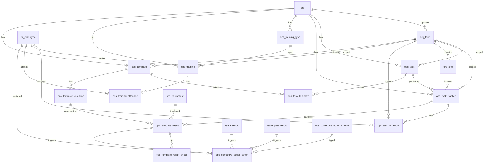

# Operations Schema

Tables for day-to-day operational activity across the organization. Covers task tracking and labor scheduling, staff training, and food safety checklists with corrective actions. These tables represent operational events — things that happened — rather than standing employee or configuration data.

> **Standard audit fields:** Every table includes `created_at` (TIMESTAMPTZ, default now), `created_by` (TEXT), `updated_at` (TIMESTAMPTZ, default now), `updated_by` (TEXT), and `is_deleted` (BOOLEAN, default false). These are omitted from the column listings below for brevity.

## Entity Relationship Diagram

---

## Table Overview

| Table | Purpose |
|-------|---------|
| ops_task | Flat task catalog for labor tracking. Defines all tasks employees can perform at the org or farm level. |
| ops_task_tracker | Header record for a task event. Captures the task, farm, site, date, start/stop times, and verification status. |
| ops_task_schedule | Lists the employees scheduled for a task event with individual start/stop times and units completed. |
| **ops_task_weekly_schedule** (view) | **Pivoted weekly schedule. One row per employee per task per week with Sun–Sat time columns, total hours, and OT threshold flag.** |
| ops_training_type | Org-specific training type lookup (e.g. GMP, Food Safety, HACCP). TEXT PK derived from name. |
| ops_training | Staff training session records. Each row is one training event covering a specific topic for a group of employees. |
| ops_training_attendee | Individual attendance and certification records for each employee per training session. One row per employee per training. |
| ops_template | Master checklist template definition. Defines the checklist and the questions employees answer during a task event. |
| ops_task_template | Many-to-many link between tasks and templates. When a user creates an activity, the app loads all templates linked to that task. |
| ops_corrective_action_choice | Org-defined reusable corrective action options available for dropdown selection when logging a corrective action. |
| ops_template_question | Questions within a checklist template. Ordered by display_order; each question has a response type (boolean, numeric, enum). |
| ops_template_result | Employee responses to checklist questions. One row per question per task tracker session. Each result targets either a site or equipment, never both. |
| ops_template_result_photo | Photos attached to a checklist response. One row per photo. Only used when ops_template_question.include_photo = true. |
| ops_corrective_action_taken | Corrective actions raised against a failing checklist response, EMP test result, or pest trap inspection. Tracks assignment, due date, and resolution. |

---

## ops_task

Flat task catalog for labor tracking. Tasks can be org-wide or scoped to a specific farm.

| Column      | Type         | Constraints                     | Description                              |
|------------|--------------|--------------------------------|------------------------------------------|
| id         | TEXT         | PK                             | Human-readable identifier derived from task name (lowercase trimmed) |
| org_id     | TEXT         | NOT NULL, FK → org(id)         | Owning organization for RLS filtering    |
| farm_id    | TEXT         | FK → org_farm(id), nullable        | Optional farm scope; NULL if task applies to all farms |
| name       | TEXT         | NOT NULL                       | |
| description| TEXT         | nullable                       | |

Unique constraint on `(org_id, name)`.

---

## ops_task_tracker

Header record for a task event. One record per task session — captures what task was done, where, when, and its verification status. `site_id` links each task event to a single site directly.

| Column             | Type         | Constraints                        | Description                              |
|-------------------|--------------|-----------------------------------|------------------------------------------|
| id                | UUID         | PK, auto-generated                | |
| org_id            | TEXT         | NOT NULL, FK → org(id)            | |
| farm_id           | TEXT         | FK → org_farm(id), nullable           | Pre-filled from ops_task.farm_id when task is selected; editable |
| site_id           | TEXT         | FK → org_site(id), nullable           | |
| sales_product_id  | TEXT         | FK → sales_product(id), nullable      | The product being packed; set for packing activities, null for all other task types |
| ops_task_id       | TEXT         | NOT NULL, FK → ops_task(id)       | |
| start_time        | TIMESTAMPTZ  | NOT NULL                          | |
| stop_time         | TIMESTAMPTZ  | nullable                          | |
| is_completed      | BOOLEAN      | NOT NULL, default false           | Auto-set to true when stop_time is entered and activity is submitted |
| number_of_people  | INTEGER      | nullable                          | Crew size for this activity session; used when individual employee assignments are not tracked via ops_task_schedule |
| notes             | TEXT         | nullable                          | |
| verified_at       | TIMESTAMPTZ  | nullable                          | |
| verified_by       | TEXT         | FK → hr_employee(id), nullable    | |

---

## ops_task_schedule

Employee task assignments for both planning and execution. When `ops_task_tracker_id` is null, the row is a planned schedule entry. When set, it is an executed activity. `ops_task_id` is always set — derived from the tracker when linked, or selected by the user for planned entries.

| Column                 | Type         | Constraints                               | Description                              |
|-----------------------|--------------|------------------------------------------|------------------------------------------|
| id                    | UUID         | PK, auto-generated                       | |
| org_id                | TEXT         | NOT NULL, FK → org(id)                   | |
| farm_id               | TEXT         | FK → org_farm(id), nullable              | Inherited from ops_task_tracker.farm_id when linked to a tracker; user-selected for planned entries |
| ops_task_id           | TEXT         | NOT NULL, FK → ops_task(id)              | Inherited from ops_task_tracker.ops_task_id when linked to a tracker; user-selected for planned entries |
| ops_task_tracker_id   | UUID         | FK → ops_task_tracker(id), nullable      | |
| hr_employee_id        | TEXT         | NOT NULL, FK → hr_employee(id)           | |
| start_time            | TIMESTAMPTZ  | NOT NULL                                 | Inherited from ops_task_tracker.start_time when linked to a tracker; user-selected for planned entries |
| stop_time             | TIMESTAMPTZ  | nullable                                 | Inherited from ops_task_tracker.stop_time when linked to a tracker; user-selected for planned entries |

Partial unique indexes: `(ops_task_tracker_id, hr_employee_id)` for executed entries; `(ops_task_id, hr_employee_id, start_time)` for planned entries.

---

## ops_task_weekly_schedule (view)

Pivoted weekly schedule view. One row per employee per task per week. Day columns are formatted as `HH:MM - HH:MM` strings from the schedule start/stop times. Null when the employee did not work that day. Only completed schedule entries (with a `stop_time`) contribute to `total_hours`.

| Column                  | Type         | Description                                                                 |
|-----------------------|--------------|-----------------------------------------------------------------------------|
| week_start_date         | DATE         | Sunday of the scheduled week                                                |
| full_name               | TEXT         | Employee first and last name                                                |
| hr_employee_id          | TEXT         | Employee identifier                                                         |
| org_id                  | TEXT         | Organization                                                                |
| hr_department_id        | TEXT         | Employee department identifier                                              |
| hr_work_authorization_id| TEXT         | Employee work authorization identifier                                      |
| task                    | TEXT         | Task name from ops_task catalog                                             |
| sunday                  | TEXT         | Formatted time range for Sunday, or null                                    |
| monday                  | TEXT         | Formatted time range for Monday, or null                                    |
| tuesday                 | TEXT         | Formatted time range for Tuesday, or null                                   |
| wednesday               | TEXT         | Formatted time range for Wednesday, or null                                 |
| thursday                | TEXT         | Formatted time range for Thursday, or null                                  |
| friday                  | TEXT         | Formatted time range for Friday, or null                                    |
| saturday                | TEXT         | Formatted time range for Saturday, or null                                  |
| total_hours             | NUMERIC      | Total hours worked for the week (sum of completed schedule entries)         |
| ot_threshold_weekly     | NUMERIC      | Weekly OT threshold derived from `hr_employee.overtime_threshold / 2`; null if not set |
| is_over_ot_threshold    | BOOLEAN      | True when `total_hours > ot_threshold_weekly`; false if threshold not set   |

---

## ops_training_type

Org-specific training types used to classify training sessions. Each org defines its own set of types.

| Column      | Type         | Constraints                     | Description                              |
|------------|--------------|--------------------------------|------------------------------------------|
| id         | TEXT         | PK                             | Human-readable identifier derived from name (trimmed lowercase, e.g. gmp, food_safety, haccp) |
| org_id     | TEXT         | NOT NULL, FK → org(id)         | Owning organization for RLS filtering    |
| name       | TEXT         | NOT NULL                       | |
| description| TEXT         | nullable                       | |

Unique constraint on `(org_id, name)`.

---

## ops_training

Staff training session records. Each row is one training event covering a specific topic for a group of employees.

| Column                  | Type         | Constraints                              | Description                              |
|------------------------|--------------|------------------------------------------|------------------------------------------|
| id                     | UUID         | PK, auto-generated                       | |
| org_id                 | TEXT         | NOT NULL, FK → org(id)                   | |
| farm_id                | TEXT         | FK → org_farm(id), nullable                  | |
| ops_training_type_id   | TEXT         | FK → ops_training_type(id), nullable     | |
| training_date          | DATE         | nullable                                 | |
| topics_covered         | JSONB        | NOT NULL, default '[]'                   | JSON array of topic strings covered during the training session |
| trainer_id             | TEXT         | FK → hr_employee(id), nullable           | Sourced from hr_employee; the employee who conducted the training session |
| materials_url          | TEXT         | nullable                                 | |
| notes                  | TEXT         | nullable                                 | |
| verified_at            | TIMESTAMPTZ  | nullable                                 | |
| verified_by            | TEXT         | FK → hr_employee(id), nullable           | |

---

## ops_training_attendee

Individual attendance and certification records for each employee per training session. One row per employee per training.

| Column                   | Type         | Constraints                           | Description                              |
|-------------------------|--------------|---------------------------------------|------------------------------------------|
| id                      | UUID         | PK, auto-generated                    | |
| org_id                  | TEXT         | NOT NULL, FK → org(id)                | |
| farm_id                 | TEXT         | FK → org_farm(id), nullable               | Inherited from ops_training.farm_id when attendee record is created |
| ops_training_id         | UUID         | NOT NULL, FK → ops_training(id)       | |
| hr_employee_id          | TEXT         | NOT NULL, FK → hr_employee(id)        | |
| signed_at               | TIMESTAMPTZ  | nullable                              | |
| certification_number    | TEXT         | nullable                              | |
| certificate_issuer      | TEXT         | nullable                              | |
| certification_issued_on | DATE         | nullable                              | |
| certification_expires_on| DATE         | nullable                              | |
| certificate_url         | TEXT         | nullable                              | |
| notes                   | TEXT         | nullable                              | |

Unique constraint on `(ops_training_id, hr_employee_id)`.

---

## ops_template

Master checklist template. Defines the checklist and the questions employees answer during a task event.

| Column                    | Type         | Constraints                                   | Description                              |
|--------------------------|--------------|----------------------------------------------|------------------------------------------|
| id                       | TEXT         | PK                                           | Human-readable identifier derived from name (trimmed lowercase) |
| org_id                   | TEXT         | NOT NULL, FK → org(id)                       | Owning organization for RLS filtering    |
| farm_id                  | TEXT         | FK → org_farm(id), nullable                      | Optional farm scope; null if the template applies to all farms |
| name                     | TEXT         | NOT NULL                                     | |
| org_module_id            | TEXT         | FK → org_module(id), nullable                | |
| description              | TEXT         | nullable                                     | |
| display_order            | INTEGER      | NOT NULL, default 0                          | |

Partial unique indexes: `(org_id, name)` where `farm_id IS NULL` for org-level templates; `(org_id, farm_id, name)` where `farm_id IS NOT NULL` for farm-level templates.

---

## ops_task_template

Many-to-many link between tasks and checklist templates. When a user creates an activity for a task, the app loads all templates linked to that task. Templates without a task link are standalone.

| Column | Type | Constraints | Description |
|--------|------|-------------|-------------|
| id | UUID | PK, default gen_random_uuid() | |
| org_id | TEXT | NOT NULL, FK → org(id) | |
| farm_id | TEXT | FK → org_farm(id), nullable | Inherited from ops_task.farm_id or ops_template.farm_id when the link is created |
| ops_task_id | TEXT | NOT NULL, FK → ops_task(id) | |
| ops_template_id | TEXT | NOT NULL, FK → ops_template(id) | |

Unique constraint on `(ops_task_id, ops_template_id)`.

---

## ops_corrective_action_choice

Org-defined reusable corrective action options available for selection when logging a corrective action. Users pick from this dropdown; if the action isn't listed they provide a custom description instead.

| Column      | Type         | Constraints                     | Description                              |
|------------|--------------|--------------------------------|------------------------------------------|
| id         | TEXT         | PK                             | Human-readable identifier derived from name (trimmed lowercase) |
| org_id     | TEXT         | NOT NULL, FK → org(id)         | Owning organization for RLS filtering    |
| name       | TEXT         | NOT NULL                       | |
| description| TEXT         | nullable                       | |

Unique constraint on `(org_id, name)`.

---

## ops_template_question

Questions within a checklist template. Ordered by `display_order` within each template.

| Column                              | Type         | Constraints                           | Description                              |
|------------------------------------|--------------|---------------------------------------|------------------------------------------|
| id                                 | UUID         | PK, auto-generated                    | |
| org_id                             | TEXT         | NOT NULL, FK → org(id)                | |
| farm_id                            | TEXT         | FK → org_farm(id), nullable               | Inherited from ops_template.farm_id when question is created |
| ops_template_id                    | TEXT         | NOT NULL, FK → ops_template(id)       | |
| question_text                      | TEXT         | NOT NULL                              | |
| response_type                      | TEXT         | NOT NULL, CHECK                       | boolean, numeric, enum |
| is_required                        | BOOLEAN      | NOT NULL, default true                | |
| boolean_pass_value                 | BOOLEAN      | nullable                              | The boolean value that constitutes a pass |
| minimum_value              | NUMERIC      | nullable                              | |
| maximum_value              | NUMERIC      | nullable                              | |
| enum_options                       | JSONB        | nullable                              | JSON array of available options when response_type is enum |
| enum_pass_options                  | JSONB        | nullable                              | JSON array of enum values that constitute a pass |
| warning_message                    | TEXT         | nullable                              | |
| ops_corrective_action_choice_ids   | JSONB        | nullable                              | JSON array of suggested corrective action choice IDs when this question fails |
| include_photo                      | BOOLEAN      | NOT NULL, default false               | |
| display_order                      | INTEGER      | NOT NULL, default 0                   | |
| is_deleted                         | BOOLEAN      | NOT NULL, default false               | True for retired/legacy questions kept for historical results but no longer asked of users. Active queries filter is_deleted = false. |

> `is_deleted` is listed here (unlike other tables) because it carries non-default semantics: retired questions remain in the table so historical `ops_template_result` rows can still join back to a question. Active template edit screens filter `is_deleted = false`.

---

## ops_template_result

Employee responses to checklist questions. One row per question per task tracker session. Each result targets either a site or equipment, never both. The linked `ops_task_tracker` record acts as the header (who completed the checklist, when).

| Column                | Type         | Constraints                               | Description                              |
|----------------------|--------------|------------------------------------------|------------------------------------------|
| id                   | UUID         | PK, auto-generated                       | |
| org_id               | TEXT         | NOT NULL, FK → org(id)                   | |
| farm_id              | TEXT         | FK → org_farm(id), nullable                  | Inherited from ops_task_tracker.farm_id when response is created |
| ops_task_tracker_id  | UUID         | NOT NULL, FK → ops_task_tracker(id)      | |
| ops_template_id      | TEXT         | NOT NULL, FK → ops_template(id)          | Sourced from ops_task_template; identifies which template this response belongs to |
| ops_template_question_id      | UUID         | NOT NULL, FK → ops_template_question(id)          | Sourced from ops_template_question |
| site_id              | TEXT         | FK → org_site(id), nullable                  | The site this checklist was completed for; null for equipment-specific checklists or standard responses without a site |
| equipment_id         | TEXT         | FK → org_equipment(id), nullable             | The equipment this checklist was completed for; null for site-specific checklists |
| response_boolean     | BOOLEAN      | nullable                                 | |
| response_numeric     | NUMERIC      | nullable                                 | |
| response_enum        | TEXT         | nullable                                 | |
| response_text        | TEXT         | nullable                                 | |

Partial unique indexes:
- **Site-scoped responses** (the common case) are unique per `(ops_task_tracker_id, ops_template_question_id)` where `equipment_id IS NULL`.
- **Equipment-scoped responses** (e.g. calibration logs where one tracker contains multiple readings of the same question against different equipment) are unique per `(ops_task_tracker_id, ops_template_question_id, equipment_id)` where `equipment_id IS NOT NULL`.

---

## ops_template_result_photo

Photos attached to a checklist response. One row per photo. Only used when `ops_template_question.include_photo = true`.

| Column                     | Type         | Constraints                               | Description                              |
|---------------------------|--------------|------------------------------------------|------------------------------------------|
| id                        | UUID         | PK, auto-generated                       | |
| org_id                    | TEXT         | NOT NULL, FK → org(id)                   | |
| farm_id                   | TEXT         | FK → org_farm(id), nullable                  | |
| ops_template_result_id    | UUID         | NOT NULL, FK → ops_template_result(id)   | |
| photo_url                 | TEXT         | NOT NULL                                 | |
| caption                   | TEXT         | nullable                                 | |

---

## ops_corrective_action_taken

Corrective actions raised against a failing checklist response, EMP test result, or pest trap inspection. Tracks the action required, who is responsible, and the resolution status.

| Column                              | Type         | Constraints                                          | Description                              |
|------------------------------------|--------------|-----------------------------------------------------|------------------------------------------|
| id                                 | UUID         | PK, auto-generated                                  | |
| org_id                             | TEXT         | NOT NULL, FK → org(id)                              | |
| farm_id                            | TEXT         | FK → org_farm(id), nullable                             | |
| ops_template_id                    | TEXT         | FK → ops_template(id), nullable                     | Inherited from ops_template_result.ops_template_id when sourced from a failing checklist response |
| ops_template_result_id                    | UUID         | FK → ops_template_result(id), nullable                     | Sourced from the failing ops_template_result that triggered this corrective action |
| fsafe_result_id                    | UUID         | FK → fsafe_result(id), nullable                     | Sourced from the failing fsafe_result that triggered this corrective action |
| fsafe_pest_result_id               | UUID         | FK → fsafe_pest_result(id), nullable                | Sourced from the failing fsafe_pest_result that triggered this corrective action |
| ops_corrective_action_choice_id    | TEXT         | FK → ops_corrective_action_choice(id), nullable     | |
| other_action                       | TEXT         | nullable                                            | |
| assigned_to                        | TEXT         | FK → hr_employee(id), nullable                      | |
| due_date                           | DATE         | nullable                                            | |
| completed_at                       | TIMESTAMPTZ  | nullable                                            | |
| is_resolved                        | BOOLEAN      | NOT NULL, default false                             | |
| notes                              | TEXT         | nullable                                            | |
| result_description                 | TEXT         | nullable                                            | |
| verified_at                        | TIMESTAMPTZ  | nullable                                            | |
| verified_by                        | TEXT         | FK → hr_employee(id), nullable                      | |

> `ops_template_result_id`, `fsafe_result_id`, and `fsafe_pest_result_id` are mutually exclusive — exactly one is set per row.
