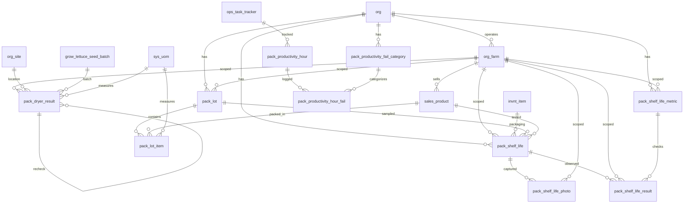

# Pack Schema

Tables for tracking production lots of packed products and shelf life trials. A lot header captures the lot number and pack date, while line items record each product packed within that lot with its best-by date and quantity. Lot numbers are system-generated from the pack date and shared across all products packed on the same day.

Shelf life trials test how long a product remains viable. Each trial links to a product and optionally a lot and packaging type. Observations are recorded per check per date, with typed responses and automatic termination criteria.

Moisture checks capture environmental conditions (temperatures, moisture loss, belt speed) during packing to monitor product quality through the dryer process.

> **Standard audit fields:** Every table includes `created_at` (TIMESTAMPTZ, default now), `created_by` (TEXT), `updated_at` (TIMESTAMPTZ, default now), `updated_by` (TEXT), and `is_deleted` (BOOLEAN, default false). These are omitted from the column listings below for brevity.

## Entity Relationship Diagram

---

## Table Overview

| Table | Purpose |
|-------|---------|
| pack_lot | Production lot header. One row per lot. Lot numbers are system-generated from the pack date but can be overridden by the user. |
| pack_lot_item | Individual products packed within a lot. One row per product per lot. |
| pack_shelf_life_metric | Defines what gets checked during a shelf life trial observation (e.g. color, texture, moisture, physical damage). |
| pack_shelf_life | Shelf life trial header. Tracks the product, lot, packaging type, target shelf life, and trial outcome. |
| pack_shelf_life_result | Individual observation responses for a shelf life trial. One row per check per observation date per trial. |
| pack_shelf_life_photo | Photos taken during a shelf life trial observation. Multiple photos per observation date per trial. |
| pack_productivity_fail_category | Lookup for pack line fail categories (e.g. film, tray, printer, leaves, ridges). |
| pack_productivity_hour | Hourly pack line snapshot with crew counts by role, cases packed, and metal detection flag. Derived: total_trays, trays_per_packer_per_minute, packed_pounds. |
| pack_productivity_hour_fail | Fail counts per category per hour. |
| pack_dryer_result | Environmental and moisture readings taken during packing. Tracks temperature and moisture conditions before and after the dryer. |

---

## pack_lot

Production lot header. One row per lot. Lot numbers are system-generated from the pack date but can be overridden by the user. The same lot number is shared across all products packed on the same day.

| Column | Type | Constraints | Description |
|--------|------|-------------|-------------|
| id | UUID | PK, auto-generated | Unique identifier for the pack lot |
| org_id | TEXT | NOT NULL, FK → org(id) | Owning organization for RLS filtering |
| farm_id | TEXT | NOT NULL, FK → org_farm(id) | Farm (crop line) this pack lot belongs to |
| lot_number | TEXT | NOT NULL | System-generated from pack_date; editable by user |
| harvest_date | DATE | nullable | Optional; user-selected to track which harvest this lot came from |
| pack_date | DATE | NOT NULL | |

Unique constraint on `(org_id, lot_number)` — one lot per lot number per org.

---

## pack_lot_item

Individual products packed within a lot. One row per product per lot. `pack_quantity` is always in the product `sale_uom`.

| Column | Type | Constraints | Description |
|--------|------|-------------|-------------|
| id | UUID | PK, auto-generated | |
| org_id | TEXT | NOT NULL, FK → org(id) | |
| farm_id | TEXT | NOT NULL, FK → org_farm(id) | |
| pack_lot_id | UUID | NOT NULL, FK → pack_lot(id) | |
| sales_product_id | TEXT | NOT NULL, FK → sales_product(id) | |
| best_by_date | DATE | NOT NULL | Auto-calculated: pack_lot.pack_date plus sales_product.shelf_life_days |
| pack_quantity | NUMERIC | NOT NULL | Always in the sale_uom defined on the associated sales_product |

Unique constraint on `(pack_lot_id, sales_product_id)` — one product per lot.

---

## pack_shelf_life_metric

Defines what gets checked during a shelf life trial observation (e.g. color, texture, moisture, physical damage). Each check specifies a response type and optional termination criteria.

| Column | Type | Constraints | Description |
|--------|------|-------------|-------------|
| id | TEXT | PK | Human-readable identifier derived from name (trimmed lowercase) |
| org_id | TEXT | NOT NULL, FK → org(id) | Owning organization for RLS filtering |
| farm_id | TEXT | FK → org_farm(id), nullable | Optional farm scope; null if the check applies to all farms |
| name | TEXT | NOT NULL | |
| description | TEXT | nullable | |
| response_type | TEXT | NOT NULL, CHECK | boolean, numeric, enum |
| enum_options | JSONB | nullable | JSON array of allowed observation values when response_type is enum (e.g. ["Green", "Yellow", "Brown"]) |
| fail_boolean | BOOLEAN | nullable | Boolean value that triggers trial termination when matched; null if response_type is not boolean |
| fail_enum_values | JSONB | nullable | JSON array of enum values that trigger trial termination; null if response_type is not enum |
| fail_minimum_value | NUMERIC | nullable | Reading below this value triggers termination; use alone, with max for a range, or null if not numeric |
| fail_maximum_value | NUMERIC | nullable | Reading above this value triggers termination; use alone, with min for a range, or null if not numeric |
| display_order | INTEGER | NOT NULL, default 0 | |
| is_active | BOOLEAN | NOT NULL, default true | |

Partial unique indexes on `(org_id, name)` where `farm_id IS NULL` and `(org_id, farm_id, name)` where `farm_id IS NOT NULL`.

---

## pack_shelf_life

Shelf life trial header. One row per trial. Tracks the product, lot, packaging type, target shelf life, and trial outcome.

| Column | Type | Constraints | Description |
|--------|------|-------------|-------------|
| id | UUID | PK, auto-generated | |
| org_id | TEXT | NOT NULL, FK → org(id) | |
| farm_id | TEXT | FK → org_farm(id), nullable | |
| pack_lot_id | UUID | FK → pack_lot(id), nullable | |
| sales_product_id | TEXT | FK → sales_product(id), nullable | |
| invnt_item_id | TEXT | FK → invnt_item(id), nullable | Pre-filled from sales_product.invnt_item_id; filtered to packaging items in inventory |
| trial_number | INTEGER | nullable | |
| trial_purpose | TEXT | nullable | |
| target_shelf_life_days | INTEGER | nullable | Pre-filled from sales_product.shelf_life_days; editable |
| site_id | TEXT | FK → org_site(id), nullable | Filtered to org_site where category = storage; the storage location for this trial |
| notes | TEXT | nullable | |
| is_terminated | BOOLEAN | NOT NULL, default false | |
| termination_reason | TEXT | nullable | |

---

## pack_shelf_life_result

Individual observation responses for a shelf life trial. One row per check per observation date per trial.

| Column | Type | Constraints | Description |
|--------|------|-------------|-------------|
| id | UUID | PK, auto-generated | |
| org_id | TEXT | NOT NULL, FK → org(id) | |
| farm_id | TEXT | FK → org_farm(id), nullable | |
| pack_shelf_life_id | UUID | NOT NULL, FK → pack_shelf_life(id) | |
| pack_shelf_life_metric_id | TEXT | NOT NULL, FK → pack_shelf_life_metric(id) | |
| observation_date | DATE | NOT NULL | |
| shelf_life_day | INTEGER | NOT NULL | Auto-calculated: observation_date minus pack_lot.pack_date |
| response_boolean | BOOLEAN | nullable | Used when pack_shelf_life_metric.response_type is boolean |
| response_numeric | NUMERIC | nullable | Used when pack_shelf_life_metric.response_type is numeric |
| response_enum | TEXT | nullable | Used when pack_shelf_life_metric.response_type is enum; value from metric enum_options |
| response_text | TEXT | nullable | |
| notes | TEXT | nullable | |

Unique constraint on `(pack_shelf_life_id, pack_shelf_life_metric_id, observation_date)` — one response per check per date per trial.

---

## pack_shelf_life_photo

Photos taken during a shelf life trial observation. Multiple photos per observation date per trial.

| Column | Type | Constraints | Description |
|--------|------|-------------|-------------|
| id | UUID | PK, auto-generated | |
| org_id | TEXT | NOT NULL, FK → org(id) | |
| farm_id | TEXT | FK → org_farm(id), nullable | |
| pack_shelf_life_id | UUID | NOT NULL, FK → pack_shelf_life(id) | |
| observation_date | DATE | NOT NULL | |
| shelf_life_day | INTEGER | NOT NULL | Auto-calculated: observation_date minus pack_lot.pack_date |
| side | TEXT | NOT NULL, CHECK | top, side, bottom |
| photo_url | TEXT | NOT NULL | |
| caption | TEXT | nullable | |

---

## pack_productivity_fail_category

Lookup for pack line fail categories. Used to classify fails per hour in pack_productivity_hour_fail.

| Column | Type | Constraints | Description |
|--------|------|-------------|-------------|
| id | TEXT | PK | |
| org_id | TEXT | NOT NULL, FK → org(id) | |
| farm_id | TEXT | FK → org_farm(id), nullable | |
| name | TEXT | NOT NULL | |
| description | TEXT | nullable | |
| display_order | INTEGER | NOT NULL, default 0 | |
| is_active | BOOLEAN | NOT NULL, default true | |

---

## pack_productivity_hour

Hourly pack line productivity snapshot. One row per hour per packing session. Crew counts track role assignments for that hour.

Derived metrics (not stored):
- `total_trays` = SUM(cases_packed × sales_product.pack_per_case)
- `trays_per_packer_per_minute` = total_trays / (packers × 60)
- `packed_pounds` = SUM(cases_packed × sales_product.case_net_weight)

| Column | Type | Constraints | Description |
|--------|------|-------------|-------------|
| id | UUID | PK, auto-generated | |
| org_id | TEXT | NOT NULL, FK → org(id) | |
| farm_id | TEXT | NOT NULL, FK → org_farm(id) | |
| ops_task_tracker_id | UUID | NOT NULL, FK → ops_task_tracker(id) | |
| pack_end_hour | TIMESTAMPTZ | NOT NULL | The hour being recorded (e.g. 2026-03-26 11:00); one row per clock hour |
| catchers | INTEGER | NOT NULL, default 0 | |
| packers | INTEGER | NOT NULL, default 0 | |
| mixers | INTEGER | NOT NULL, default 0 | |
| boxers | INTEGER | NOT NULL, default 0 | |
| cases_packed | INTEGER | NOT NULL, default 0 | |
| leftover_pounds | NUMERIC | NOT NULL, default 0 | |
| fsafe_metal_detected_at | TIMESTAMPTZ | nullable | Timestamp of food safety metal detection check during this packing hour; null means no detection was recorded |
| notes | TEXT | nullable | |

Unique constraint on `(ops_task_tracker_id, pack_end_hour)`.

---

## pack_productivity_hour_fail

Fail counts per category per hour. Total fails for an hour = SUM(fail_count) across all categories.

| Column | Type | Constraints | Description |
|--------|------|-------------|-------------|
| id | UUID | PK, auto-generated | |
| org_id | TEXT | NOT NULL, FK → org(id) | |
| farm_id | TEXT | NOT NULL, FK → org_farm(id) | |
| pack_productivity_hour_id | UUID | NOT NULL, FK → pack_productivity_hour(id) | |
| pack_productivity_fail_category_id | TEXT | NOT NULL, FK → pack_productivity_fail_category(id) | |
| fail_count | INTEGER | NOT NULL, default 0 | Number of fails for this category in this hour |
| notes | TEXT | nullable | |

Unique constraint on `(pack_productivity_hour_id, pack_productivity_fail_category_id)`.

---

## pack_dryer_result

Environmental and moisture readings taken during the packing process. One row per check at a specific time, tracking temperature and moisture conditions before and after the dryer.

| Column | Type | Constraints | Description |
|--------|------|-------------|-------------|
| id | UUID | PK, auto-generated | |
| org_id | TEXT | NOT NULL, FK → org(id) | |
| farm_id | TEXT | NOT NULL, FK → org_farm(id) | |
| site_id | TEXT | NOT NULL, FK → org_site(id) | |
| grow_seed_batch_id | UUID | FK → grow_lettuce_seed_batch(id), nullable | |
| invnt_item_id | TEXT | FK → invnt_item(id), nullable | |
| check_at | TIMESTAMPTZ | NOT NULL | |
| temperature_uom | TEXT | NOT NULL, FK → sys_uom(code) | |
| dryer_temperature | NUMERIC | nullable | |
| greenhouse_temperature | NUMERIC | nullable | |
| packhouse_temperature | NUMERIC | nullable | |
| pre_packing_leaf_temperature | NUMERIC | nullable | |
| moisture_uom | TEXT | NOT NULL, FK → sys_uom(code) | |
| moisture_before_dryer | NUMERIC | nullable | |
| moisture_after_dryer | NUMERIC | nullable | |
| belt_speed | NUMERIC | nullable | |
| tracking_code | TEXT | nullable | Human-readable code identifying this check for re-tracking |
| pack_dryer_result_id_original | UUID | FK → pack_dryer_result(id), nullable | Self-referencing FK to the original check when this row is a re-check |
| notes | TEXT | nullable | |
