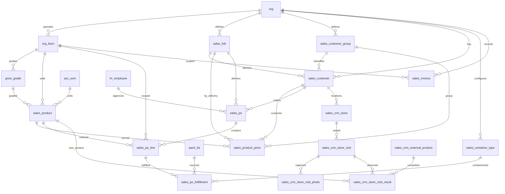

# Sales Schema

Tables for the product catalog, tiered pricing, customer orders, and order fulfillment against pack lots. Orders follow a workflow from draft through approval to fulfillment, with snapshot pricing captured at time of order. Standing orders support automatic recurrence.

Store visit CRM tracks field intelligence — retail store locations, visit observations, and per-product shelf data for both own products and competitor products.

> **Standard audit fields:** Every table includes `created_at` (TIMESTAMPTZ, default now), `created_by` (TEXT), `updated_at` (TIMESTAMPTZ, default now), `updated_by` (TEXT), and `is_deleted` (BOOLEAN, default false). These are omitted from the column listings below for brevity.

## Entity Relationship Diagram



---

## Table Overview

| Table | Purpose |
|-------|---------|
| sales_fob | Defines each organization's available delivery methods (e.g. Farm Pick-up, Local Delivery, Distributor). |
| sales_customer_group | Allows each organization to classify customers into groups for reporting and group-based pricing. |
| sales_customer | Stores an organization's customers with group classification, preferred delivery method, and billing address. |
| sales_product | The sellable products from each farm with full packaging hierarchy and product specifications. |
| sales_product_price | Manages product pricing with three tiers of specificity and date ranges to track price changes over time. |
| sales_po | Customer order header with approval workflow and optional recurring frequency for standing orders. |
| sales_po_line | Individual products within an order with snapshot pricing at time of order. |
| sales_container_type | Lookup table for shipping container types with maximum pallet space capacity. |
| sales_crm_external_product | Competitor products observed during store visits with farm/brand, variety, size, and packaging. |
| sales_crm_store | Physical retail locations linked to customers, with chain, location, island, and contact info. |
| sales_crm_store_visit | Store visit records with notes, customer feedback, and action flags. |
| sales_crm_store_visit_photo | Photos taken during store visits. One row per photo. |
| sales_crm_store_visit_result | Per-product observations (price, best-by, stock level, velocity) for own and competitor products. |
| sales_po_fulfillment | Fulfillment records linking order lines to pack lots, with shipping traceability fields set during containerization. |
| sales_invoice | QuickBooks invoice line items (nightly-synced from the invoices spreadsheet today, moving to direct QB API later). One row per line item; a single invoice_number spans multiple rows when it has multiple product/variety/grade combinations. |
| sales_invoice_v (view) | `sales_invoice` filtered by `is_deleted = false` plus derived `year`, `month`, `iso_year`, `iso_week`, `dow` columns. Dashboards read from this view rather than the underlying table. |

---

## sales_product

The sellable products from each farm. Combines a grade with a full packaging hierarchy (item → pack → case → pallet). The sale unit is always a case; the shipping unit is always a pallet. All net weight values share `weight_uom`, all dimensions share `dimension_uom`, and all temperatures share `temperature_uom`.

| Column                      | Type         | Constraints                        | Description                              |
|-----------------------------|--------------|------------------------------------|------------------------------------------|
| id                          | TEXT         | PK                                 | Human-readable identifier derived from product name (lowercase trimmed) |
| org_id                      | TEXT         | NOT NULL, FK → org(id)             | Owning organization for RLS filtering    |
| farm_id                     | TEXT         | NOT NULL, FK → org_farm(id)            | Farm (crop line) this product belongs to |
| grow_grade_id                    | TEXT         | FK → grow_grade(id), nullable      | |
| code                        | TEXT         | NOT NULL                           | |
| name                        | TEXT         | NOT NULL                           | |
| description                 | TEXT         | nullable                           | |
| invnt_item_id          | TEXT         | FK → invnt_item(id), nullable      | Filtered to packaging items in inventory |
| item_uom                    | TEXT         | FK → sys_uom(code), nullable      | Smallest countable unit of the product (e.g. count, lb, oz) |
| pack_uom                    | TEXT         | FK → sys_uom(code), nullable      | Intermediate packaging unit (e.g. bag, tray) |
| item_per_pack               | NUMERIC      | nullable                           | Number of items per pack unit |
| pack_per_case               | NUMERIC      | nullable                           | Number of pack units per case |
| maximum_case_per_pallet     | NUMERIC      | nullable                           | Maximum number of cases that fit on a pallet |
| weight_uom                  | TEXT         | FK → sys_uom(code), nullable      | Unit for all net weight fields (e.g. lb, kg) |
| pack_net_weight             | NUMERIC      | nullable                           | |
| case_net_weight             | NUMERIC      | nullable                           | |
| pallet_net_weight           | NUMERIC      | nullable                           | |
| dimension_uom               | TEXT         | FK → sys_uom(code), nullable      | Unit for all case dimension fields (e.g. in, cm) |
| case_length                 | NUMERIC      | nullable                           | |
| case_width                  | NUMERIC      | nullable                           | |
| case_height                 | NUMERIC      | nullable                           | |
| manufacturer_storage_method | TEXT         | nullable                           | |
| temperature_uom             | TEXT         | FK → sys_uom(code), nullable      | Unit for storage temperature fields (e.g. °F, °C) |
| minimum_storage_temperature | NUMERIC      | nullable                           | |
| maximum_storage_temperature | NUMERIC      | nullable                           | |
| shelf_life_days             | INT          | nullable                           | Expected shelf life in days from pack date; used to auto-calculate best_by_date on pack_lot_item |
| pallet_ti                   | NUMERIC      | nullable                           | Pallet tier — number of cases per layer on pallet |
| pallet_hi                   | NUMERIC      | nullable                           | Pallet high — number of layers stacked on pallet |
| shipping_requirements       | TEXT         | nullable                           | |
| is_catch_weight             | BOOLEAN      | NOT NULL, default false            | Whether sold by actual weight rather than fixed unit count |
| is_hazardous                | BOOLEAN      | NOT NULL, default false            | |
| is_fsma_traceable           | BOOLEAN      | NOT NULL, default false            | Whether this product requires FSMA traceability documentation |
| gtin                        | TEXT         | nullable                           | Global Trade Item Number for supply chain identification |
| upc                         | TEXT         | nullable                           | Universal Product Code for retail scanning |
| photos                      | JSONB        | NOT NULL, default []               | |
| display_order               | INTEGER      | NOT NULL, default 0                | |
| is_active                   | BOOLEAN      | NOT NULL, default true             | |

Unique constraints on `(farm_id, code)` and `(farm_id, name)`.

---

## sales_product_price

Manages product pricing with three tiers of specificity and date ranges to track price changes over time. When a price changes, the current row gets an effective_to date and a new row is created. Currency always uses the org default from org.currency.

| Column            | Type        | Constraints                         | Description                              |
|-------------------|-------------|-------------------------------------|------------------------------------------|
| id                | UUID        | PK, auto-generated                  | Unique identifier for the price record   |
| org_id            | TEXT        | NOT NULL, FK → org(id)              | Owning organization for RLS filtering    |
| farm_id           | TEXT        | NOT NULL, FK → org_farm(id)         | |
| sales_product_id  | TEXT        | NOT NULL, FK → sales_product(id)    | Product this price applies to            |
| sales_fob_id      | TEXT        | NOT NULL, FK → sales_fob(id)        | FOB delivery point this price applies to |
| sales_customer_group_id | TEXT  | FK → sales_customer_group(id), nullable | |
| sales_customer_id | TEXT        | FK → sales_customer(id), nullable   | |
| price_per_case    | NUMERIC     | NOT NULL                            | |
| effective_from    | DATE        | NOT NULL                            | |
| effective_to      | DATE        | nullable                            | |

Pricing lookup priority: customer price (tier 1) → group price (tier 2) → default price (tier 3), filtered by `effective_from <= today AND (effective_to IS NULL OR effective_to > today)`.

---

## sales_fob

Defines each organization's available delivery methods (e.g. Farm Pick-up, Local Delivery, Distributor). Used in customer setup to set a preferred delivery and in pricing to set delivery-specific prices.

| Column | Type | Constraints | Description |
|--------|------|-------------|-------------|
| id | TEXT | PK | Human-readable identifier derived from FOB name (lowercase trimmed) |
| org_id | TEXT | NOT NULL, FK → org(id) | Owning organization for RLS filtering |
| name | TEXT | NOT NULL | |

Unique constraint on `(org_id, name)` — no duplicate delivery methods within an org.

---

## sales_customer_group

Allows each organization to classify customers into groups for reporting and group-based pricing (e.g. Wholesale, Retail, Restaurant).

| Column | Type | Constraints | Description |
|--------|------|-------------|-------------|
| id | TEXT | PK | Human-readable identifier derived from group name (lowercase trimmed) |
| org_id | TEXT | NOT NULL, FK → org(id) | Owning organization for RLS filtering |
| name | TEXT | NOT NULL | |

Unique constraint on `(org_id, name)` — no duplicate group names within an org.

---

## sales_customer

Stores an organization's customers with their group classification, preferred delivery method, billing address, and a link to external accounting software via qb_account. Additional contact emails are stored in cc_emails.

| Column | Type | Constraints | Description |
|--------|------|-------------|-------------|
| id | TEXT | PK | Human-readable identifier derived from customer name (lowercase trimmed) |
| org_id | TEXT | NOT NULL, FK → org(id) | Owning organization for RLS filtering |
| sales_customer_group_id | TEXT | FK → sales_customer_group(id), nullable | Cascades to sales_po.sales_customer_group_id when an order is created for this customer |
| sales_fob_id | TEXT | FK → sales_fob(id), nullable | Default FOB delivery point; cascades to sales_po.sales_fob_id when an order is created for this customer |
| qb_account | TEXT | nullable | QuickBooks account identifier for accounting integration |
| name | TEXT | NOT NULL | |
| email | TEXT | nullable | |
| cc_emails | JSONB | NOT NULL, default [] | |
| billing_address | TEXT | nullable | |
| is_active | BOOLEAN | NOT NULL, default true | |

Unique constraint on `(org_id, name)` — no duplicate customer names within an org.

---

## sales_po

Customer order header. One row per order. Tracks customer, FOB, dates, approval workflow, and optional recurring frequency for standing orders.

| Column | Type | Constraints | Description |
|--------|------|-------------|-------------|
| id | UUID | PK, auto-generated | |
| org_id | TEXT | NOT NULL, FK → org(id) | |
| sales_customer_group_id | TEXT | FK → sales_customer_group(id), nullable | Auto-set from sales_customer.sales_customer_group_id; read-only |
| sales_customer_id | TEXT | NOT NULL, FK → sales_customer(id) | |
| sales_fob_id | TEXT | FK → sales_fob(id), nullable | Auto-set from sales_customer.sales_fob_id; read-only |
| po_number | TEXT | nullable | |
| order_date | DATE | NOT NULL | |
| invoice_date | DATE | nullable | |
| recurring_frequency | TEXT | nullable, CHECK | weekly, biweekly, monthly; null means not recurring; auto-creates a new order after status is marked fulfilled |
| notes | TEXT | nullable | |
| status | TEXT | NOT NULL, default draft, CHECK | draft → approved → fulfilled/unfulfilled; auto-set to past_due when order_date passes without fulfillment; unfulfilled means product was unavailable |
| approved_at | TIMESTAMPTZ | nullable | |
| approved_by | TEXT | FK → hr_employee(id), nullable | |
| qb_uploaded_at | TIMESTAMPTZ | nullable | |
| qb_uploaded_by | TEXT | FK → hr_employee(id), nullable | |

---

## sales_po_line

Individual products within an order. One row per product per order with snapshot pricing at time of order.

| Column | Type | Constraints | Description |
|--------|------|-------------|-------------|
| id | UUID | PK, auto-generated | |
| org_id | TEXT | NOT NULL, FK → org(id) | |
| farm_id | TEXT | NOT NULL, FK → org_farm(id) | |
| sales_po_id | UUID | NOT NULL, FK → sales_po(id) | |
| sales_product_id | TEXT | NOT NULL, FK → sales_product(id) | |
| order_quantity | NUMERIC | NOT NULL | |
| price_per_case | NUMERIC | NOT NULL | Snapshot from sales_product_price; resolved by customer_id first, then customer_group_id, then default fob price; read-only |
| notes | TEXT | nullable | |

Unique constraint on `(sales_po_id, sales_product_id)` — one product per order.

---

## sales_container_type

Lookup table for shipping container types. Defines the available container types and their maximum pallet space capacity.

| Column | Type | Constraints | Description |
|--------|------|-------------|-------------|
| id | TEXT | PK | |
| org_id | TEXT | NOT NULL, FK → org(id) | |
| name | TEXT | NOT NULL | |
| maximum_spaces | INTEGER | NOT NULL | |
| is_active | BOOLEAN | NOT NULL, default true | |

Unique constraint on `(org_id, name)`.

---

## sales_po_fulfillment

Fulfillment records linking order lines to pack lots. One row per lot per order line, supporting partial fulfillment across multiple lots. Shipping traceability fields are bulk-set during containerization and cascaded from a form filtered by invoice date and farm.

| Column | Type | Constraints | Description |
|--------|------|-------------|-------------|
| id | UUID | PK, auto-generated | |
| org_id | TEXT | NOT NULL, FK → org(id) | |
| farm_id | TEXT | NOT NULL, FK → org_farm(id) | |
| sales_po_id | UUID | NOT NULL, FK → sales_po(id) | |
| sales_po_line_id | UUID | NOT NULL, FK → sales_po_line(id) | |
| pack_lot_id | UUID | FK → pack_lot(id), nullable | Sourced from pack_lot; links fulfilled quantity to a specific production lot |
| fulfilled_quantity | NUMERIC | NOT NULL | |
| sales_container_type_id | TEXT | FK → sales_container_type(id), nullable | Container type used for shipping; set during containerization |
| container_id | TEXT | nullable | Physical shipping container number; cascaded from containerization form |
| booking_id | TEXT | nullable | Shipping line booking reference; cascaded from containerization form |
| pallet_number | TEXT | nullable | Pallet identifier assigned during palletization (e.g. CP01, LP02) |
| container_space | TEXT | nullable | Container space position assigned during containerization (e.g. C01, L02) |
| notes | TEXT | nullable | |

---

## sales_crm_external_product

Competitor products observed during store visits. Simple name-based lookup (e.g. Nalo 14oz, Mainland 16oz, Sensei 4oz).

| Column | Type | Constraints | Description |
|--------|------|-------------|-------------|
| id | TEXT | PK | |
| org_id | TEXT | NOT NULL, FK → org(id) | |
| name | TEXT | NOT NULL | |
| display_order | INTEGER | NOT NULL, default 0 | |
| is_active | BOOLEAN | NOT NULL, default true | |

Unique constraint on `(org_id, name)`.

---

## sales_crm_store

Physical retail locations where products are sold. Each store belongs to a chain and optionally links to a sales_customer for order tracking.

| Column | Type | Constraints | Description |
|--------|------|-------------|-------------|
| id | TEXT | PK | |
| org_id | TEXT | NOT NULL, FK → org(id) | |
| sales_customer_id | TEXT | FK → sales_customer(id), nullable | |
| chain | TEXT | nullable | |
| name | TEXT | NOT NULL | |
| location | TEXT | nullable | |
| island | TEXT | nullable | |
| contact_name | TEXT | nullable | |
| contact_title | TEXT | nullable | |
| contact_email | TEXT | nullable | |
| contact_phone | TEXT | nullable | |
| is_active | BOOLEAN | NOT NULL, default true | |

Unique constraint on `(org_id, name)`.

---

## sales_crm_store_visit

Store visit records capturing field observations, notes from store managers, and action items.

| Column | Type | Constraints | Description |
|--------|------|-------------|-------------|
| id | UUID | PK, auto-generated | |
| org_id | TEXT | NOT NULL, FK → org(id) | |
| sales_crm_store_id | TEXT | NOT NULL, FK → sales_crm_store(id) | |
| visit_date | DATE | NOT NULL | |
| notes | TEXT | nullable | |
| visited_by | TEXT | FK → hr_employee(id), nullable | |

---

## sales_crm_store_visit_photo

Photos taken during a store visit. One row per photo.

| Column | Type | Constraints | Description |
|--------|------|-------------|-------------|
| id | UUID | PK, auto-generated | |
| org_id | TEXT | NOT NULL, FK → org(id) | |
| sales_crm_store_visit_id | UUID | NOT NULL, FK → sales_crm_store_visit(id) | |
| photo_url | TEXT | NOT NULL | |
| caption | TEXT | nullable | |

---

## sales_crm_store_visit_result

Per-product observations collected during a store visit. Each row captures shelf price, best-by date, stock level, and weekly velocity for either an own product or a competitor product.

| Column | Type | Constraints | Description |
|--------|------|-------------|-------------|
| id | UUID | PK, auto-generated | |
| org_id | TEXT | NOT NULL, FK → org(id) | |
| sales_crm_store_visit_id | UUID | NOT NULL, FK → sales_crm_store_visit(id) | |
| sales_product_id | TEXT | FK → sales_product(id), nullable | |
| sales_crm_external_product_id | TEXT | FK → sales_crm_external_product(id), nullable | |
| shelf_price | NUMERIC | nullable | |
| best_by_date | DATE | nullable | |
| stock_level | TEXT | nullable, CHECK | zero, low, medium, full |
| cases_per_week | NUMERIC | nullable | |
| notes | TEXT | nullable | |

CHECK constraint: exactly one of sales_product_id or sales_crm_external_product_id must be set.

---

## sales_invoice

QuickBooks invoice line items. Nightly-synced from the invoices spreadsheet (fed by QB) today; moving to direct QB API later. One row per line item — a single `invoice_number` can appear across multiple rows when the invoice lists several product / variety / grade combinations. There is intentionally no uniqueness constraint until QB line-item numbers make it into the sync, at which point `(org_id, invoice_number, line_number)` will become unique.

| Column | Type | Constraints | Description |
|--------|------|-------------|-------------|
| id | UUID | PK, default gen_random_uuid() | |
| org_id | TEXT | NOT NULL, FK → org(id) | |
| farm_id | TEXT | FK → org_farm(id), nullable | Derived from the Farm column in the sheet (e.g. "Cuke" → cuke, "Lettuce" → lettuce) |
| invoice_number | TEXT | NOT NULL | QB invoice number; not unique on its own because one invoice spans multiple line items |
| invoice_date | DATE | NOT NULL | Date the invoice was issued |
| customer_name | TEXT | NOT NULL | Customer display name from QB |
| customer_group | TEXT | nullable | Broader grouping used by sales dashboards (e.g. "Safeway Inc.", "Armstrong Produce", "Small") |
| product_code | TEXT | nullable | Short product code as it appears on the invoice line (e.g. OK, OJ, LF, LR) |
| variety | TEXT | nullable | One-letter variety code pulled from the line (K, J, E, L, W, etc.). Free-text to allow future variations |
| grade | TEXT | nullable | Quality grade on the line (e.g. 1, 2) |
| cases | NUMERIC | nullable | Case count on the invoice line |
| pounds | NUMERIC | nullable | Weight in pounds on the invoice line |
| dollars | NUMERIC | NOT NULL | Line total in dollars |
| notes | TEXT | nullable | |

Indexes on `org_id`, `farm_id`, `invoice_date`, `invoice_number`, `customer_name`.

### sales_invoice_v (view)

```sql
SELECT *, EXTRACT(YEAR FROM invoice_date)::INT AS year,
          EXTRACT(MONTH FROM invoice_date)::INT AS month,
          EXTRACT(ISOYEAR FROM invoice_date)::INT AS iso_year,
          EXTRACT(WEEK FROM invoice_date)::INT AS iso_week,
          EXTRACT(DOW FROM invoice_date)::INT AS dow
FROM sales_invoice
WHERE is_deleted = false;
```

Dashboards should always query `sales_invoice_v` — it applies the soft-delete filter and pre-computes the date parts dashboards need most often.
