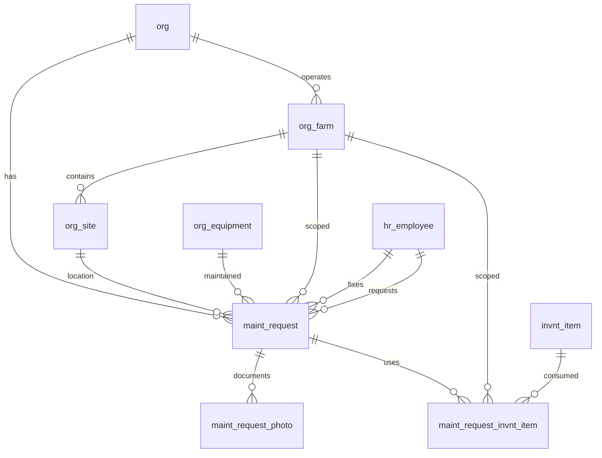

# Maintenance Schema

Standalone maintenance work order module for tracking site repairs, preventive maintenance tasks, parts used, and before/after photo documentation.

> **Standard audit fields:** Every table includes `created_at` (TIMESTAMPTZ, default now), `created_by` (TEXT), `updated_at` (TIMESTAMPTZ, default now), `updated_by` (TEXT), and `is_deleted` (BOOLEAN, default false). These are omitted from the column listings below for brevity.

## Entity Relationship Diagram

---

## Table Overview

| Table | Purpose |
|-------|---------|
| maint_request | Standalone maintenance work order. Tracks site issues, preventive tasks, scheduling, fixer assignment, and completion details. |
| maint_request_invnt_item | Inventory items consumed during a maintenance request. One row per item per request. |
| maint_request_photo | Photos attached to a maintenance request. One row per photo with before/after classification. |

---

## maint_request

Standalone maintenance work order requests. Each request targets either a site or equipment, never both. Equipment location is derived from org_equipment.site_id. Preventive maintenance is indicated by recurring_frequency being set.

| Column                   | Type         | Constraints                           | Description                              |
|--------------------------|--------------|---------------------------------------|------------------------------------------|
| id                        | UUID         | PK, auto-generated                    | |
| org_id                    | TEXT         | NOT NULL, FK → org(id)                | |
| farm_id                   | TEXT         | FK → org_farm(id), nullable               | |
| site_id                   | TEXT         | FK → org_site(id), nullable               | Any org_site regardless of category; set for site-specific requests, null for equipment requests |
| equipment_id              | TEXT         | FK → org_equipment(id), nullable          | The equipment needing maintenance; set for equipment requests, null for site requests |
| status                    | TEXT         | NOT NULL, default new, CHECK          | new, pending, priority, done |
| request_description       | TEXT         | nullable                              | |
| recurring_frequency       | TEXT         | nullable, CHECK                       | daily, weekly, monthly, quarterly, semi_annually, annually; null means not recurring; non-null implies preventive maintenance; auto-creates a new request after status is marked done |
| due_date                  | DATE         | nullable                              | |
| completed_at              | TIMESTAMPTZ  | nullable                              | |
| fixer_id                  | TEXT         | FK → hr_employee(id), nullable        | |
| fixer_description         | TEXT         | nullable                              | |
| requested_at              | TIMESTAMPTZ  | NOT NULL, default now                 | |
| requested_by              | TEXT         | NOT NULL, FK → hr_employee(id)        | |

---

## maint_request_invnt_item

Inventory items consumed during a maintenance request. One row per item per request.

| Column            | Type         | Constraints                           | Description                              |
|-------------------|--------------|---------------------------------------|------------------------------------------|
| id                | UUID         | PK, auto-generated                    | Unique identifier for the record         |
| org_id            | TEXT         | NOT NULL, FK → org(id)                | Owning organization for RLS filtering    |
| farm_id           | TEXT         | FK → org_farm(id), nullable               | Optional farm scope; inherited from parent maint_request |
| maint_request_id  | UUID         | NOT NULL, FK → maint_request(id)      | Maintenance request this inventory item usage belongs to |
| invnt_item_id     | TEXT         | NOT NULL, FK → invnt_item(id)         | Inventory item used during the maintenance |
| uom               | TEXT         | FK → sys_uom(code), nullable         | |
| quantity_used     | NUMERIC      | nullable                              | |

Unique constraint on `(maint_request_id, invnt_item_id)` — one entry per item per request.

---

## maint_request_photo

Photos attached to a maintenance request. One row per photo with before/after classification.

| Column            | Type         | Constraints                           | Description                              |
|-------------------|--------------|---------------------------------------|------------------------------------------|
| id                | UUID         | PK, auto-generated                    | |
| org_id            | TEXT         | NOT NULL, FK → org(id)                | |
| farm_id           | TEXT         | FK → org_farm(id), nullable               | |
| maint_request_id  | UUID         | NOT NULL, FK → maint_request(id)      | |
| photo_type        | TEXT         | NOT NULL, CHECK                       | before, after |
| photo_url         | TEXT         | NOT NULL                              | |
| caption           | TEXT         | nullable                              | |
