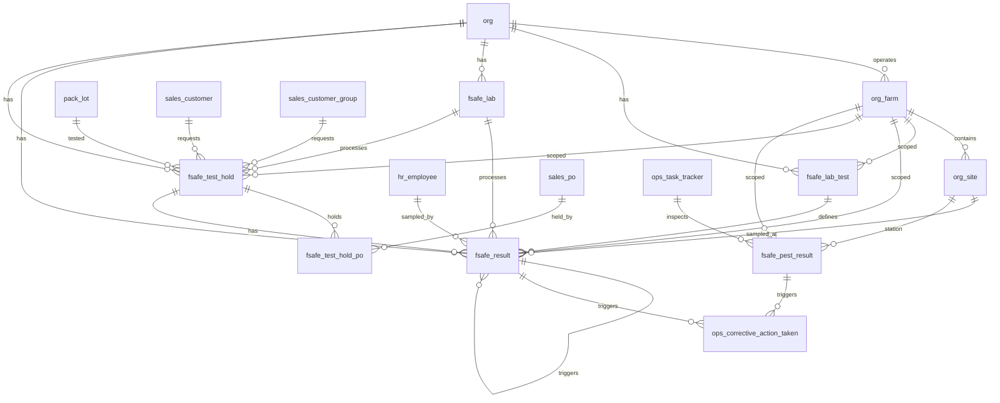

# Food Safety Schema

Tables for food safety testing. Covers EMP (Environmental Monitoring Program) test definitions and results, laboratory management, and test-and-hold testing for pack lots. Checklist-based food safety (templates, questions, responses, corrective actions) is covered in the Operations module.

> **Standard audit fields:** Every table includes `created_at` (TIMESTAMPTZ, default now), `created_by` (TEXT), `updated_at` (TIMESTAMPTZ, default now), `updated_by` (TEXT), and `is_deleted` (BOOLEAN, default false). These are omitted from the column listings below for brevity.

## Entity Relationship Diagram

---

## Table Overview

| Table | Purpose |
|-------|---------|
| fsafe_lab_test | Catalog of EMP test definitions, result configuration, and retest/vector test thresholds. |
| fsafe_result | Unified food safety test results for both EMP and test-and-hold testing. One row per test event; retests and vector tests link back to the original failing test. Water tests and test-and-hold results are recorded here using named definitions. |
| fsafe_lab | Catalog of laboratories used for food safety test submissions. |
| fsafe_test_hold | Test-and-hold header. One record per pack lot per lab; tracks sample collection, lab submission, and test timeline. |
| fsafe_test_hold_po | Links a test-and-hold record to one or more sales purchase orders on hold pending results. |
| fsafe_pest_result | Per-station pest trap inspection result. One row per trap station per inspection event. The ops_task_tracker acts as the inspection header with date, farm, and verification. |

---

## fsafe_lab_test

Catalog of EMP test definitions and their result configuration. Defines how results are evaluated and how many retests or vector tests are required on a fail.

| Column                  | Type         | Constraints                     | Description                              |
|------------------------|--------------|--------------------------------|------------------------------------------|
| id                     | TEXT         | PK                             | Human-readable unique identifier derived from org and test name |
| org_id                 | TEXT         | NOT NULL, FK → org(id)         | Owning organization for RLS filtering    |
| farm_id                | TEXT         | FK → org_farm(id), nullable        | Optional farm scope; null if the test applies to all farms |
| test_name              | TEXT         | NOT NULL                       | Name of the test or pathogen being tested for (e.g. Listeria, Salmonella) |
| test_methods           | JSONB        | NOT NULL, default []           | JSON array of available testing methods; fsafe_result.test_method is selected from this list |
| test_description       | TEXT         | nullable                       | |
| result_type            | TEXT         | NOT NULL, CHECK                | enum, numeric |
| enum_options           | JSONB        | nullable                       | JSON array of allowed result values when result_type is enum (e.g. ["Positive", "Negative"]) |
| enum_pass_options      | JSONB        | nullable                       | Subset of enum_options that indicate a passing result; used to auto-set fsafe_result.result_pass |
| minimum_value  | NUMERIC      | nullable                       | Numeric result at or above this value passes; used to auto-set fsafe_result.result_pass when result_type is numeric |
| maximum_value  | NUMERIC      | nullable                       | Numeric result at or below this value passes; used to auto-set fsafe_result.result_pass when result_type is numeric |
| atp_site_count | INTEGER      | nullable                       | Number of zone_1 sites to randomly select for ATP testing; null means this test is not ATP |
| required_retests       | INTEGER      | NOT NULL, default 0            | Number of retest results to auto-create in fsafe_result when a result fails |
| required_vector_tests  | INTEGER      | NOT NULL, default 0            | Number of vector test results to auto-create in fsafe_result when a result fails |

Unique constraint on `(org_id, test_name)`.

---

## fsafe_result

Unified food safety test results for both EMP and test-and-hold testing. One row per test event. Retests and vector tests link back to the original failing test via `fsafe_result_id_original`, forming a clear chain of why each test was created. Detection limit values (e.g. `<1`, `>2419`) are converted to numeric values by the frontend before submission.

| Column                       | Type         | Constraints                           | Description                              |
|-----------------------------|--------------|---------------------------------------|------------------------------------------|
| id                          | UUID         | PK, auto-generated                    | |
| org_id                      | TEXT         | NOT NULL, FK → org(id)                | |
| farm_id                     | TEXT         | NOT NULL, FK → org_farm(id)               | |
| site_id                     | TEXT         | FK → org_site(id), nullable               | Food safety site (org_site where category = food_safety or zone = water); set for EMP and water results, null for test-and-hold |
| fsafe_test_hold_id          | UUID         | FK → fsafe_test_hold(id), nullable    | |
| fsafe_lab_id                | TEXT         | FK → fsafe_lab(id), nullable          | Pre-filled from fsafe_test_hold.fsafe_lab_id for test-and-hold results; editable |
| fsafe_lab_test_id           | TEXT         | NOT NULL, FK → fsafe_lab_test(id)     | |
| test_method                 | TEXT         | nullable                              | Pre-filled from fsafe_lab_test.test_methods; editable |
| initial_retest_vector       | TEXT         | nullable, CHECK                       | initial, retest, vector |
| status                      | TEXT         | NOT NULL, default pending, CHECK      | pending, in_progress, completed |
| result_enum                 | TEXT         | nullable                              | |
| result_numeric              | NUMERIC      | nullable                              | |
| result_pass                 | BOOLEAN      | nullable                              | Auto-set by evaluating result against fsafe_lab_test pass/fail criteria |
| fail_code                   | TEXT         | nullable                              | |
| fsafe_result_id_original    | UUID         | FK → fsafe_result(id), nullable       | Sourced from the original fsafe_result when initial_retest_vector is retest or vector |
| notes                       | TEXT         | nullable                              | |
| sampled_at                  | TIMESTAMPTZ  | nullable                              | |
| sampled_by                  | TEXT         | FK → hr_employee(id), nullable        | |
| started_at             | TIMESTAMPTZ  | nullable                              | |
| completed_at                | TIMESTAMPTZ  | nullable                              | |
| verified_at                 | TIMESTAMPTZ  | nullable                              | |
| verified_by                 | TEXT         | FK → hr_employee(id), nullable        | |

---

## fsafe_lab

Catalog of laboratories used for food safety test submissions (e.g. test-and-hold pathogen testing).

| Column      | Type    | Constraints              | Description                              |
|-------------|---------|--------------------------|------------------------------------------|
| id          | TEXT    | PK                       | Human-readable unique identifier derived from org and lab name |
| org_id      | TEXT    | NOT NULL, FK → org(id)   | Owning organization for RLS filtering    |
| name        | TEXT    | NOT NULL                 | |
| description | TEXT    | nullable                 | |

Unique constraint on `(org_id, name)`.

---

## fsafe_test_hold

Test-and-hold header. One record per pack lot per lab. If the same lot is sent to a different lab, a separate entry is created. Tracks sample collection, lab submission, and test timeline. Results are stored in the unified `fsafe_result` table with `fsafe_test_hold_id` linking back to this record.

| Column                  | Type         | Constraints                              | Description                              |
|------------------------|--------------|------------------------------------------|------------------------------------------|
| id                     | UUID         | PK, auto-generated                       | |
| org_id                 | TEXT         | NOT NULL, FK → org(id)                   | |
| farm_id                | TEXT         | NOT NULL, FK → org_farm(id)                  | |
| pack_lot_id            | UUID         | NOT NULL, FK → pack_lot(id)              | |
| sales_customer_group_id| TEXT         | FK → sales_customer_group(id), nullable  | Pre-filled from sales_customer.sales_customer_group_id; editable |
| sales_customer_id      | TEXT         | FK → sales_customer(id), nullable        | Pre-filled from the linked sales_po customer; editable |
| fsafe_lab_id           | TEXT         | FK → fsafe_lab(id), nullable             | |
| lab_test_id            | TEXT         | nullable                                 | |
| notes                  | TEXT         | nullable                                 | |
| delivered_to_lab_on    | DATE         | nullable                                 | |

---

## fsafe_test_hold_po

Links a test-and-hold record to one or more sales purchase orders.

| Column             | Type | Constraints                              | Description                              |
|--------------------|------|------------------------------------------|------------------------------------------|
| id                 | UUID | PK, auto-generated                       | Unique identifier for the test-hold-to-PO link |
| org_id             | TEXT | NOT NULL, FK → org(id)                   | Owning organization for RLS filtering    |
| farm_id            | TEXT | NOT NULL, FK → org_farm(id)                  | Farm this record belongs to; inherited from parent test-and-hold |
| fsafe_test_hold_id | UUID | NOT NULL, FK → fsafe_test_hold(id)       | Parent test-and-hold record              |
| sales_po_id        | UUID | NOT NULL, FK → sales_po(id)              | |

Unique constraint on `(fsafe_test_hold_id, sales_po_id)`.

---

## fsafe_pest_result

Per-station pest trap inspection result. One row per trap station per inspection event. The `ops_task_tracker` acts as the inspection header with date, farm, and verification.

| Column | Type | Constraints | Description |
|--------|------|-------------|-------------|
| id | UUID | PK, auto-generated | |
| org_id | TEXT | NOT NULL, FK → org(id) | |
| farm_id | TEXT | NOT NULL, FK → org_farm(id) | |
| ops_task_tracker_id | UUID | NOT NULL, FK → ops_task_tracker(id) | |
| site_id | TEXT | NOT NULL, FK → org_site(id) | The specific trap station (org_site where category = pest_trap); distinct from ops_task_tracker.site_id which is the parent building |
| pest_type | TEXT | nullable, CHECK | mouse, rat; null means no activity at this station |
| photo_url | TEXT | nullable | |
| notes | TEXT | nullable | |
